|  |
| :----------------------------------------------------------: |

| 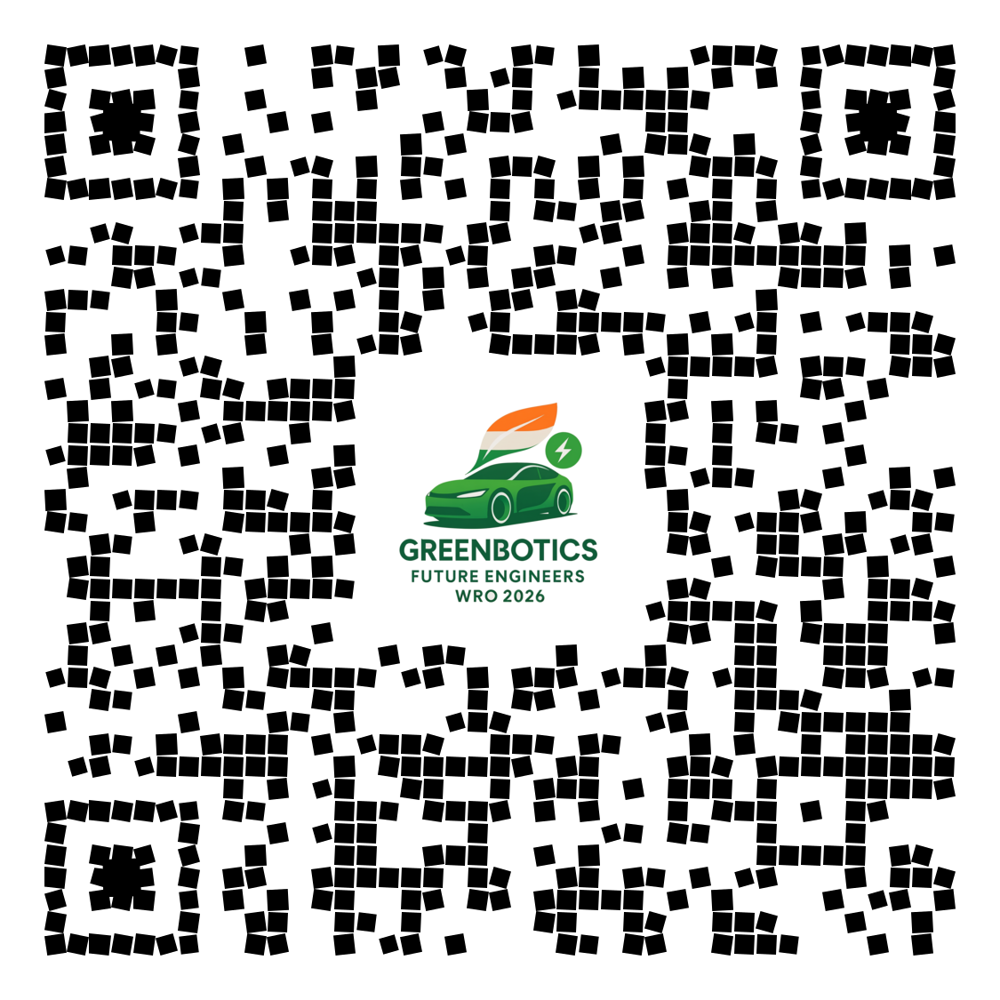 | 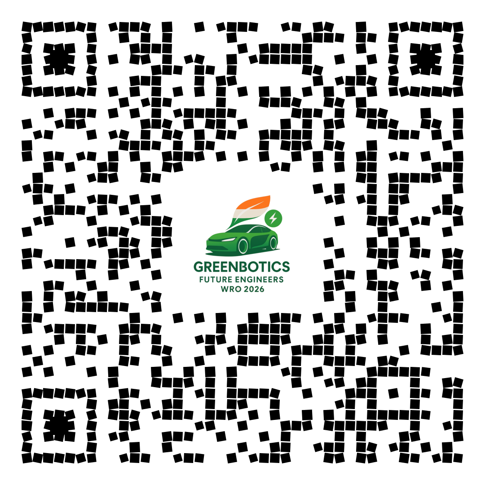 |
| :----------------------------------------------------------- | -----------------------------------------------------------: |
| Scan QR to open Github repo                                  |                                Scan QR to open YouTube video |


# Table of Contents

1. [Introduction](#1-introduction)
   - 1.1 [Summary and Performance Video](#11-summary-and-performance-video)
   - 1.2 [Vision](#12-vision)
   - 1.3 [The Team](#13-the-team)
   - 1.4 [Vehicle photos](#14-vehicle-photos)
2. [Mobility & Mechanical Design](#2-mobility--mechanical-design)
   - 2.1 [Drivetrain selection](#21-drivetrain-selection)
   - 2.2 [Steering selection](#22-steering-selection)
   - 2.3 [Vehicle dimensions](#23-vehicle-dimensions)
   - 2.4 [Differential assembly selection](#24-differential-assembly-selection)
   - 2.5 [Wheel selection](#25-wheel-selection)
   - 2.6 [Speed Torque Calculation (Drive Motor Selection)](#26-speed-torque-calculation-drive-motor-selection)
   - 2.7 [Steering Motor selection](#27-steering-motor-selection)
   - 2.8 [3D printed parts](#28-3d-printed-parts)
   - 2.9 [Experiments](#29-experiments)
3. [Power & Sensor Architecture](#3-power--sensor-architecture)
   - 3.1 [Power Budget](#31-power-budget)
   - 3.2 [Power Strategy](#32-power-strategy)
   - 3.3 [Power Verification](#33-power-verification)
   - 3.4 [Wiring Diagram and PCB](#34-wiring-diagram-and-pcb)
   - 3.5 [Sensors](#35-sensors)
   - 3.6 [Microcontroller — Raspberry Pi 5 as Single Controller](#36-microcontroller--raspberry-pi-5-as-single-controller)
   - 3.7 [Calibration Procedures](#37-calibration-procedures)
   - 3.8 [Failure Point Analysis](#38-failure-point-analysis)
   - 3.9 [Iteration Evidence](#39-iteration-evidence)
4. [Software Architecture & Obstacle Strategy](#4-software-architecture--obstacle-strategy)
   - 4.1 [Design Philosophy](#41-design-philosophy)
   - 4.2 [System Architecture](#42-system-architecture)
   - 4.3 [Open Challenge Flow Chart and Algorithm](#43-open-challenge-flow-chart-and-algorithm)
   - 4.4 [Obstacle Challenge — State Machine & Algorithms](#44-obstacle-challenge--state-machine--algorithms)
   - 4.5 [Edge Cases](#45-edge-cases)
   - 4.6 [Parameter Tuning](#46-parameter-tuning)
   - 4.7 [RPM Control — PI Controller with Feed-Forward](#47-rpm-control--pi-controller-with-feed-forward)
   - 4.8 [Testing Results](#48-testing-results)
   - 4.9 [Performance Optimizations](#49-performance-optimizations)
   - 4.10 [Troubleshooting and Debugging](#410-troubleshooting-and-debugging)
5. [Systems Thinking & Engineering Decisions](#5-systems-thinking--engineering-decisions)
   - 5.1 [System Overview](#51-system-overview)
   - 5.2 [Shared Constraints](#52-shared-constraints)
   - 5.3 [Cross-Subsystem Decision Case Studies](#53-cross-subsystem-decision-case-studies)
   - 5.4 [Risk & Failure Modes](#54-risk--failure-modes)
   - 5.5 [Iteration and Testing Cycle Summary](#55-iteration-and-testing-cycle-summary)
6. [Reproducibility & GitHub Organization](#6-reproducibility--github-organization)
   - 6.1 [Repository Structure & Module Map](#61-repository-structure--module-map)
   - 6.2 [Robot Build Instructions](#62-robot-build-instructions)
   - 6.3 [Software Setup & Running the Robot](#63-software-setup--running-the-robot)
   - 6.4 [Testing Workflow](#64-testing-workflow)   
   - 6.5 [Parts List (Bill of Materials)](#65-parts-list-bill-of-materials)
   - 6.6 [Engineering Journal](#66-engineering-journal)

---

# 1 Introduction 
We are team Greenbotics and are competing in WRO 2026 Future Engineers category. This is our second year after a successful participation in WRO 2025, where we were one of the 5 teams to hit a full score(https://scoring.wro-association.org/en/event/scoring/293) in all 4 rounds. You can find our documentation from 2025 here (https://github.com/Devansh-awat/greenbotics).

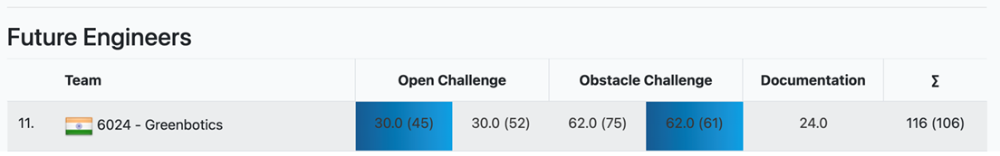


## 1.1 Summary and Performance Video
Here is a quick 5 min video that summarizes the essence of our robot and documentation. We recommend you watch it to get a quick understanding of our project!


| [](https://m.youtube.com/playlist?list=PLMdippUF4xxo) | [](https://m.youtube.com/playlist?list=PLMdippUF4xxo) <br />Scan QR code to open in YouTube |
| ------------------------------------------------------------ | ------------------------------------------------------------ |

* [Summary Video](https://youtu.be/YS-oyNQQUGs) 
* [Open Challenge Performance Video](https://youtu.be/OW5V_LRIKNU)
* [Obstacle Challenge Performance Video](https://youtu.be/RbtGV2t9GcI)

## 1.2 Vision
Even though we had a robot from WRO 2025 that performed perfectly across all rounds, we decided to make the most of the 6 months we had to prepare for WRO 2026 by redesigning our robot in every aspect and building it from scratch. This experience gave us tremendous learning.

## 1.3 The Team

<table style="width: 100%; text-align: center; border-collapse: collapse;">
   <tr>
    <td style="padding: 10px;">
      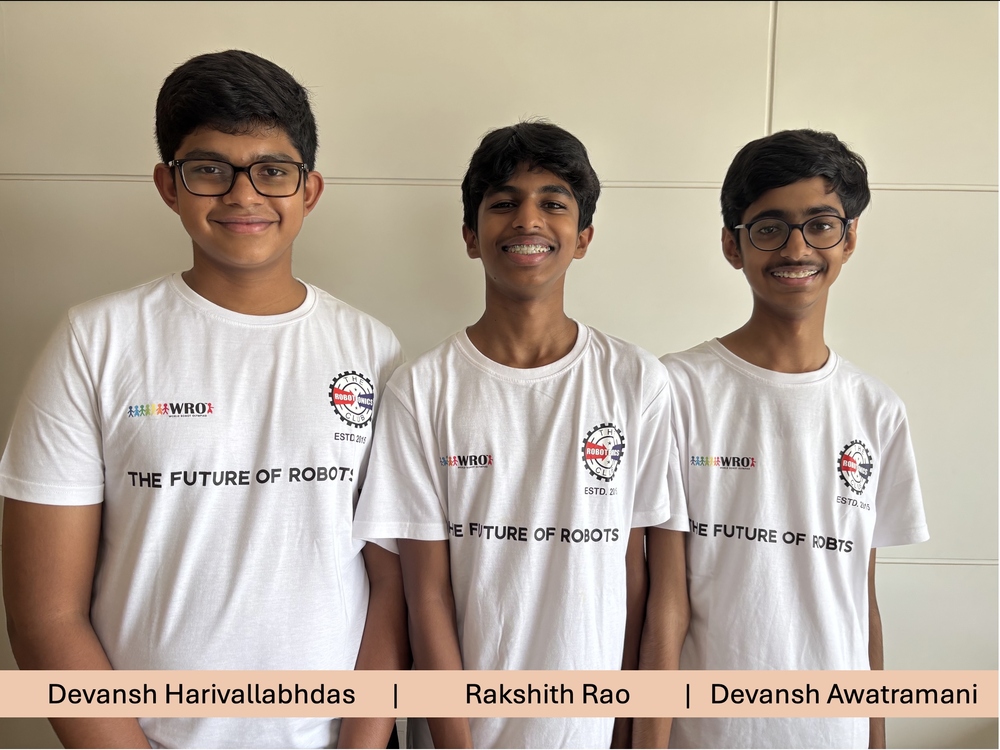
    </td>
    <td style="padding: 10px;">
     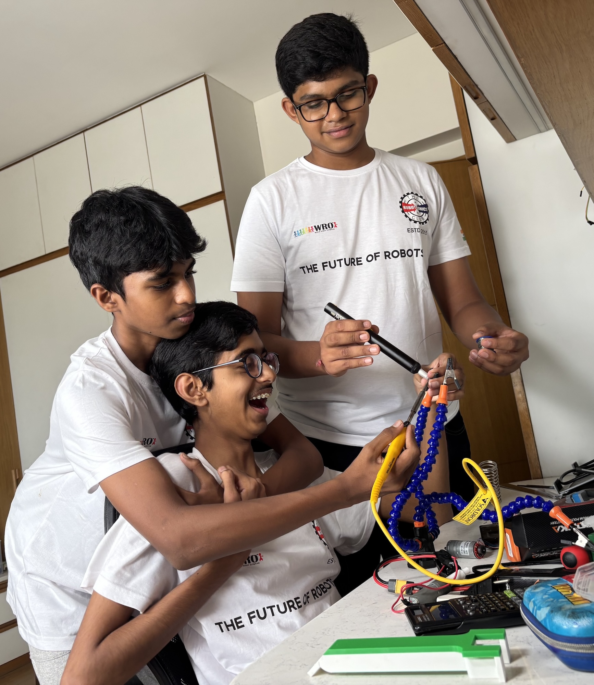
    </td>
  </tr>
</table>


Devansh Awatramani and Rakshith Rao are Grade 10 students at The Riverside School, Ahmedabad. Devansh Harivallabhdas is a Grade 11 student at Ahmedabad International School, Ahmedabad.


Paresh Gambhava is our coach from The Robotronics Club, Ahmedabad

## 1.4 Vehicle photos

<table>
  <tr>
    <td align="center">
      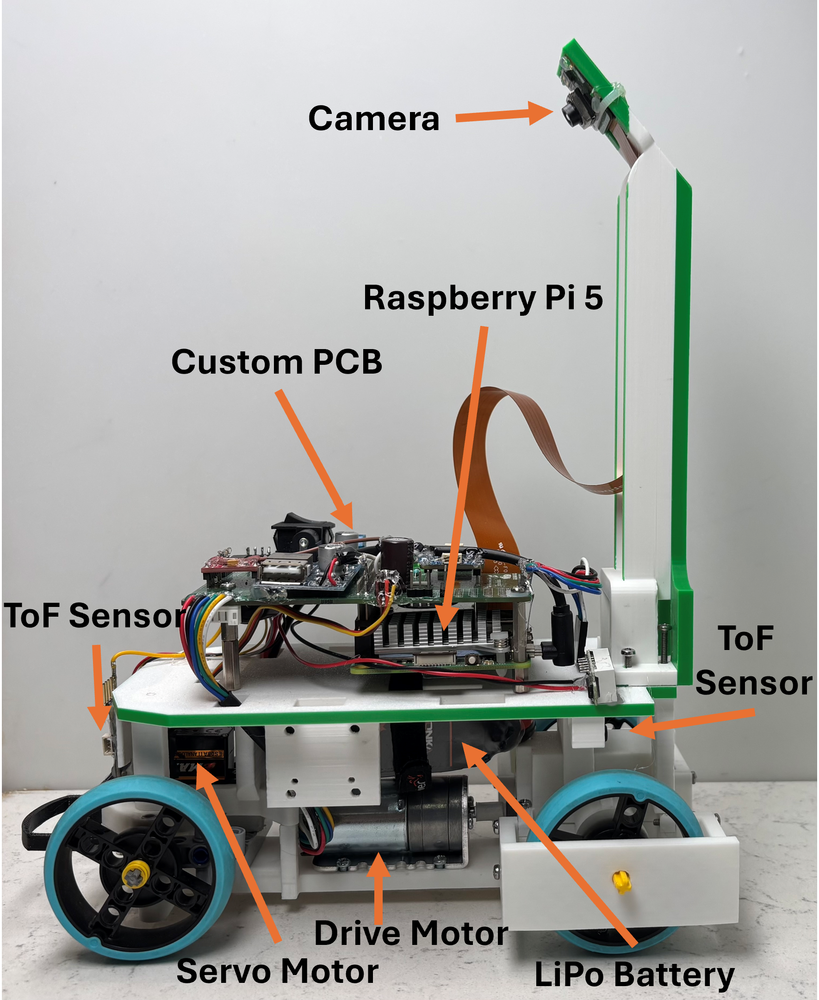<br>
      <b>Left</b>
    </td>
       <td align="center">
      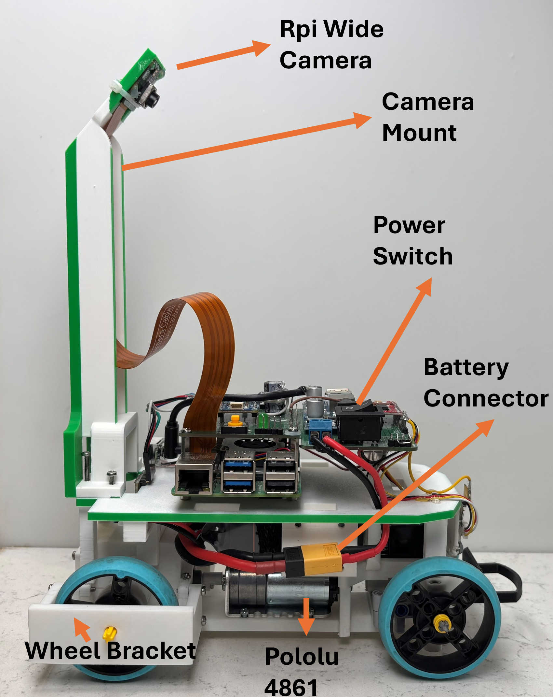<br>
      <b>Right</b>
    </td> 
    <td align="center">
      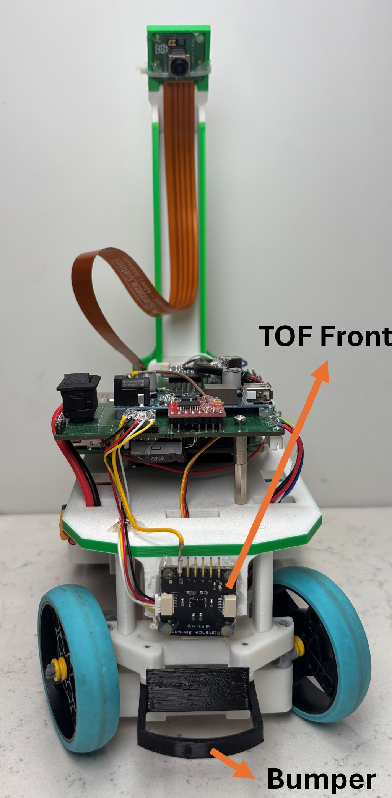<br>
      <b>Front</b>
    </td>
    <td align="center">
      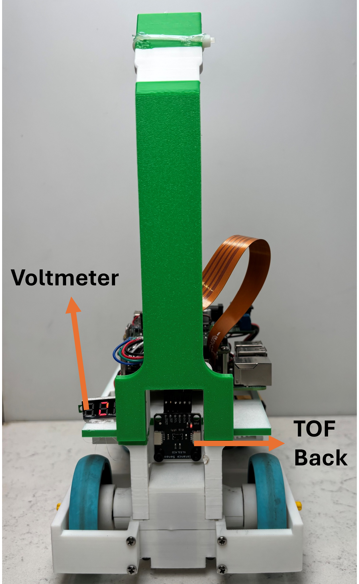<br>
      <b>Back</b>
    </td>
   </tr>
</table>

<table>
  <tr>
   <td align="center">
      <br>
      <b>Top</b>
    </td>
    <td align="center">
      <br>
      <b>Bottom</b>
    </td> 
  </tr>
</table>

# 2 Mobility & Mechanical Design

This section describes the Mecahnical design of the robot including its chassis, drivetrain and gearbox. It also mentions our experiments, speed & torque calculations, component selection criteria , 3-D designed parts and vehicle photos.

---

## 2.1 Drivetrain selection

WRO rules do not allow a differential drive robot. This steers us towards a real vehicle like design that consists of a front wheel steering. These vehicles have multiple drive options

|  | All Wheel Drive | Front Wheel Drive | Rear Wheel Drive |
| :---- | :---- | :---- | :---- |
|  Driving power | All wheels | Front wheels | Rear wheels |
| Physical complexity | Transfer rotational force to a wheel that is changing its angles with respect to chassis | Transfer rotational force to a wheel that is changing its angles with respect to chassis | Simpler design. Rear axis \- rotational force. Front axis \- turning force |
| Mechanical complexity | Drive motor mounted on steering mechanism. Requires powerful servo due to extra weight | Drive motor mounted on steering mechanism. Requires powerful servo due to extra weight | **Separates mechanical responsibilities.** Steering and Drive motors mounted on separate axis |
| Highlights | Off roading, steep inclines, muddy road | Pulling over obstacles  | Smooth roads, better turns |

We chose RWD for its simpler design and smoother turns.   

<table>
  <thead>
    <tr>
      <th>Differential Gear</th>
      <th>Diagram</th>
    </tr>
  </thead>
  <tbody>
    <tr>
      <td>The rear wheels have a differential gear to prevent inner wheels from skidding when turning. As shown in the diagram, during turns, the outer wheel covers more distance(wo) than inner wheels (wi). In absence of differential gear, the inner wheels would skid.
      </td>
      <td >
       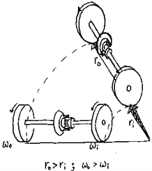
      </td>
    </tr>
  </tbody>
 </table>   


---

## 2.2 Steering selection

**Ackermann vs Parallel**  
We used Parallel steering in our last year's robot. We realised certain manoeuvres such as entering parking space and tight turns between two inner blocks and inner walls caused tyre slip. We improved upon this aspect for this year's robot by using Ackermann steering. In Ackerman steering, the inner wheel turns slightly more than the outer wheel, so the robot stays on the same arc without tyre slip. This improves maneuverability especially during cornering.

| Ackermann Steering Concept |Our Robot Design | Our Steering Geometry for Ackermann Steering |
| :---: | :---: | :---: |
| 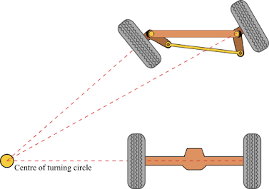 |  | 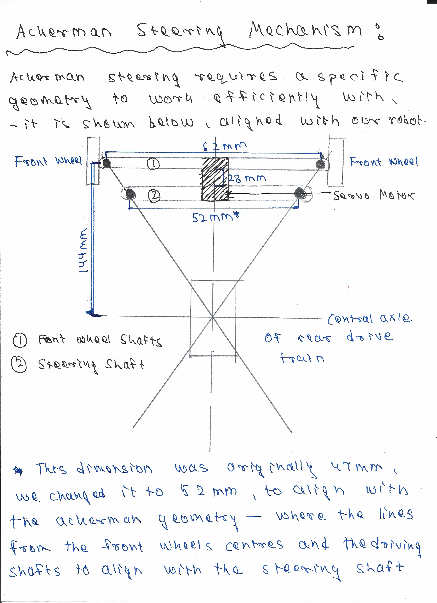 |

---

## 2.3 Vehicle dimensions

The defining constraint in this vehicle is its turning radius for its parallel parking. The turning radius is defined by the dimensions of the vehicle.

<table>
  <thead>
    <tr>
      <th>Length Impact & Formula</th>
      <th>Length Visual</th>
      <th>Width Impact & Formula</th>
      <th>Width Visual</th>
    </tr>
  </thead>
  <tbody>
    <tr>
      <td>
        <strong>Length Impact</strong><br>
        <em>R = L / sin(θ)</em><br>
        Turning Radius(R) scales proportionally with the Length(L) of the vehicle.
      </td>
      <td>
        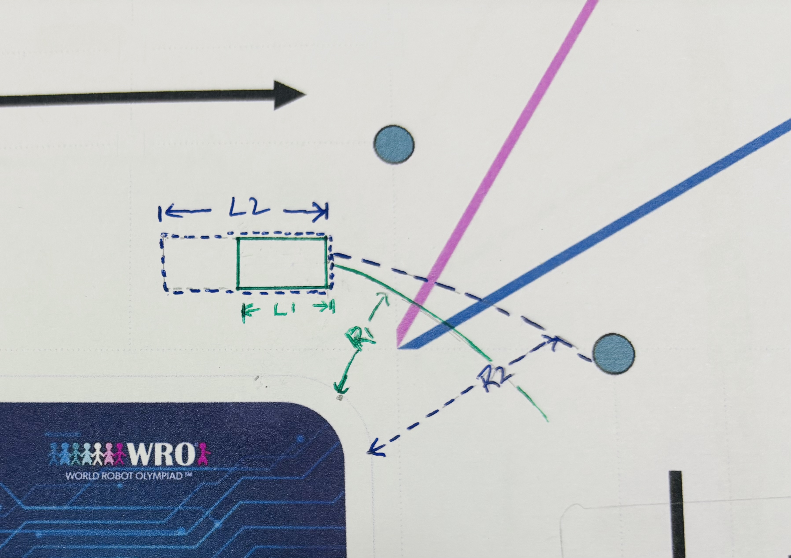
      </td>
      <td>
        <strong>Width Impact</strong><br>
        <em>R(outer) = R(center) + W/2</em><br>
        Width does not change the turning radius, but increases the outer clearance radius.
      </td>
      <td>
        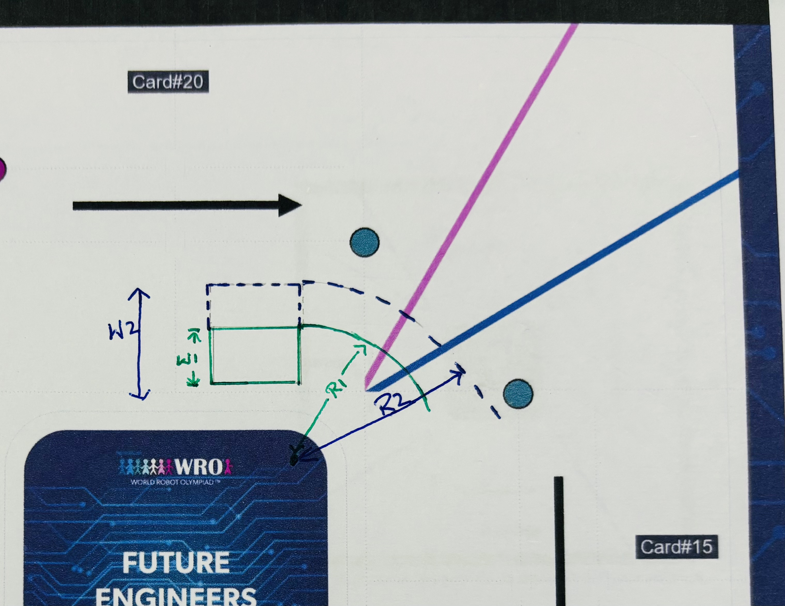
      </td>
    </tr>
  </tbody>
</table>

We strive to keep both the Length and Width as minimum as possible.  
Length is the minimum length to accommodate the differential gear assembly, drive motor and the steering assembly back to back.  
Width is the minimum width for the differential assembly, couplings and the wheels attached back to back.  
This results into a 23 cm long and 12 cm wide vehicle.

---

## 2.4 Differential assembly selection

We used Lego differential gear assembly in our last year's robot. While this gave us adequate performance, there were few drawbacks to it

1) Gear damage: Plastic gears chip away after continued use..  
2) Backlash: When the robot makes micro adjustments during parking switching from forward to reverse, the motor rotates slightly before the wheels actually move. This makes software control of the robot inconsistent. If we move the motor a bit more, the robot sometimes hits the walls, if we make the motor move a bit less, it doesn't move.

Both these problems can be resolved with metal differential gears. To allow for precise control, we chose the largest possible gear ratio that could fit in the chassis. We chose a metal differential gear with a 38:13 ratio of ring gear to pinion gear. This gear ratio gives higher torque providing reliable transmission even at lower speeds. There is loss of top speed, but we do not need to race the car so that is fine.

| Feature | Plastic Differential (e.g., LEGO) | Metal Differential |
| :---- | :---- | :---- |
| **Backlash**  | High (Rough control at low speed during parking) | Low (Precise control at low speed during parking) |
| **Friction** | Plastic-plastic \- higher friction (Prone to low-speed jerky motion) | Metal-metal \- lower friction (Smooth low-speed crawl) |
| **Rigidity / Prone to damage** | Teeth Chip away after continued usage | Rigid and stable |
| **Robot Image with Gear** ||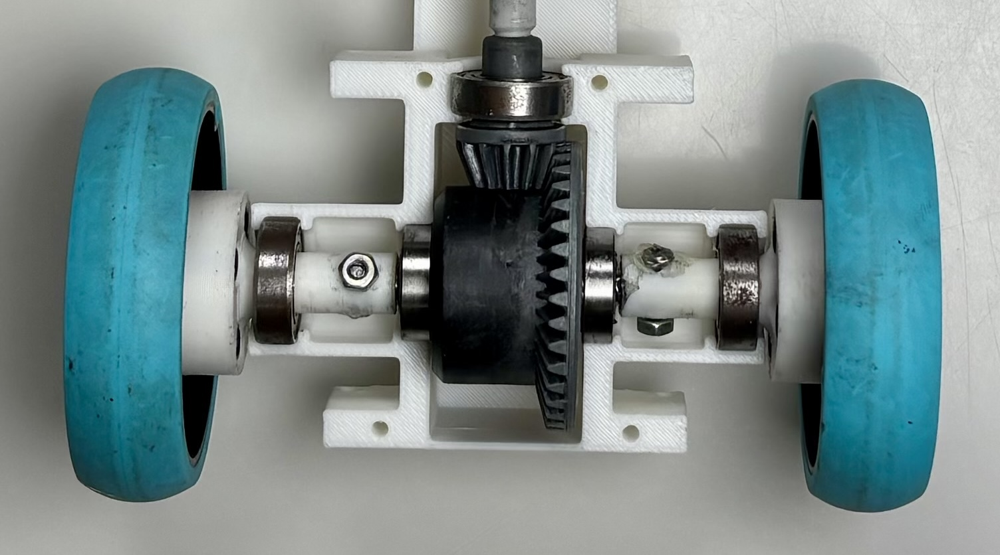|

---

## 2.5 Wheel selection

We used lego spike prime medium wheels with 56mm diameter and 14 mm wide. These are narrow bicycle like wheels giving smoother turns. A bigger wheel would amplify the backlash causing imprecise movements during parking.

We also tried 3D printing our own custom wheels, and coating it with a cricket bat's rubber grip. But we realised we couldn't match the fit and finish of a pre-fabricated Lego wheel.

[For Wheel Attempts refer Section 5.5.1 3D Iterations](#551-3d-chassis-iterations)

---

## 2.6 Speed Torque Calculation (Drive Motor Selection) 

We used a Lego EV3 medium motor in our last year's robot and its speed was the limiting factor for our robot. We were running the motor at 100% speed and couldn't go faster.   
Old robot rpm at wheel

```
rpm_wheel_old = rpm_motor_old / differential_gear_ratio_old

rpm_wheel_old = 250 / (28 / 20) = 250 / 1.4 = 179
```

We wanted the new robot to go at least 50% faster with enough headroom so we aimed for 100% higher rpm at wheel

```
rpm_wheel_new = rpm_motor_new / differential_gear_ratio_new

rpm_wheel_new = 2 * rpm_wheel_old = 2 * 179 = 358

358 = rpm_motor_new / (38 / 13)
rpm_motor_new = 358 * (38 / 13) = 358 * 2.92 = 1045
```

We explored different motors from [Pololu](https://www.pololu.com/product/4861) as they offer a wide range of gear ratios. We ran below Speed Torque calculations with some motors and shortlisted Pololu 4861 that provides 0.71 kg·cm torque @ 1800 rpm. This motor runs at 12V removing the need for a step down converter and associated efficiency losses.

| Criteria | LEGO EV3 Medium Motor | Pololu 4861 |
| :---- | :---- | :---- |
| Power supply match | Needs buck converter (12 V → 9V), small conversion loss | Runs directly off 12 V LiPo, no converter required |
| Mechanical reliability | Plastic gears —  can slip or chip away and has higher backlash | All-metal gearbox — More reliable and has lower backlash |
| No load speed | 250 rpm | 1800 rpm |
| Stall torque | 1.22 kg·cm | 0.71 kg·cm |
| Rated stall current | 0.8 A | 1.8 A |

The Pololu motor natively matches the power source and has better mechanical reliability.

### 2.6.1 Speed Torque calculations

| Symbol | Meaning | Value |
| :---- | :---- | :---- |
| m | Robot mass | 0.8 kg |
| g | Gravitational acceleration | 9.81 m/s² |
| W | Robot weight \= m × g | 7.85 N |
| D\_w , r\_w | Wheel diameter / radius | 0.056 m / 0.028 m |
| N\_nl | Motor no-load speed at gearbox output (12 V) | 1800 RPM |
| T\_stall\_gb | Stall torque at gearbox output (extrapolated) | 0.71 kg·cm \= 0.0696 N·m |
| I\_stall | Stall current | 1.8 A |
| G\_ext | External gear ratio (13:38 metal differential) | 38 / 13 \= 2.923 |
| μ | Wheel-to-mat friction coefficient (assumed) | 0.6 (rubber-type wheel on flex banner) |
| C\_rr | Rolling resistance coefficient (assumed) | 0.03 |
| C\_rr,static | Higher than C\_rr due to stiction | 0.05 |
| T\_cont\_gb | Recommended continuous torque at gearbox output | 25% of T\_stall\_gb (manufacturer guideline: keep current ≤ 25% of stall) |

**No load speed**

```
v_nl = (π × D_w × N_nl) / (60 × G_ext)

v_nl = (π × 0.056 × 1800) / (60 × 2.923) = 1.81 m/s
```

**A) Starting Torque v/s Stall Torque rating**

Can the motor move the robot from a dead stop? The motor is in stall condition at the moment it starts and the stall torque should exceed the initial resistance(static friction) that the robot needs to begin moving.

**B) Running Torque v/s Continuous Torque rating**

Is the torque required for continuous driving comfortably within motor's output to avoid constantly overloading the motor that could result in motor breakdown


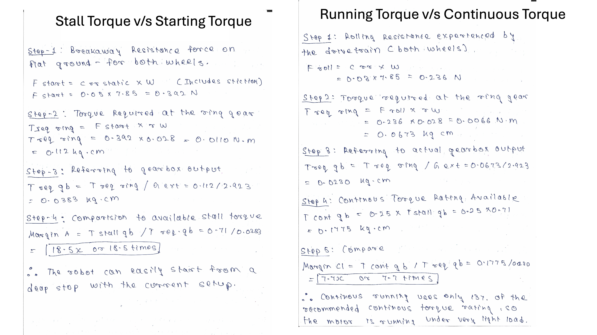

**C) Running speed v/s No load speed**

The Pololu 4861 datasheet ([https://www.pololu.com/file/0J1829/pololu-25d-metal-gearmotors-rev-2-0.pdf](https://www.pololu.com/file/0J1829/pololu-25d-metal-gearmotors-rev-2-0.pdf)) shows that torque and speed are linearly related. 

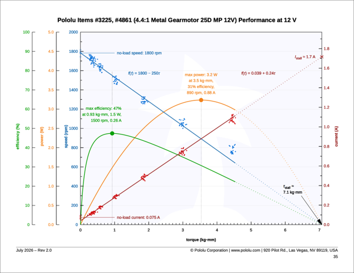

Using the fraction of stall torque with the running torque from (b) 

```
N_gb = N_nl × (1 − T_req,gb / T_stall_gb)

N_gb = 1800 × (1 − 0.0230/0.71) = 1800 × 0.9676 = 1741.7 RPM

N_wheel = N_gb / G_ext = 1741.7 / 2.923 = 595.8 RPM

v = π × D_w × N_wheel / 60 = π × 0.056 × 595.8 / 60 = 1.75 m/s
```

*Conclusion:* The running speed (1.75 m/s) should be very close to the no load speed (1.81 m/s).

**Experiment Metrics**
|Theortical No Load Speed| Theoritical Running Speed |Observed Running Speed|
|---|---|--|
|1.81 m/s|1.75 m/s|1.54 m/s|

**Assumptions**

Our calculations assumed no loss at differential gear. However a differential gear would have efficiency of **η=85%** due to frictional losses. But, its impact wouldn't be of concern to us as we have a very high margin.

**Summary**

| Check | Question answered | Torque req'd at gearbox (kg·cm) | Torque available (kg·cm) | Margin |
| :---- | :---- | :---- | :---- | :---- |
| A: Starting Torque v/s Stall Torque rating | Can it start moving from rest? | 0.0383 | 0.71 (stall) | 18.5× |
| B: Running Torque v/s Continuous Torque rating | Can it sustain cruising without overheating? | 0.0230 | 0.1775 (25% cont.) | 7.7× |

The Pololu motor has adequate torque margin to start the robot from rest, sustain cruising without overheating and to provide the max speed we could possibly use.

---

## 2.7 Steering Motor selection

For our last year's robot, we used an SG90 servo motor for front wheel steering for precise steering control. While it was adequate, we explored other alternatives.

| SG90 | EMAX ES08A II |
| :---- | :---- |
| Softer Plastic gears prone to wear and stripping | Higher Grade Plastic and Robust Motor |
| deadband drift \- steering drifts over time | tighter deadband \- precise steering positioning |
| speed \- 0.10 sec/60° | speed \- 0.10 sec/60° |
| torque \- 1.6 kgf·cm | torque \- 2.0 kgf·cm |

We did have one instance of SG90 breaking last year so we chose the EMAX servo motor primarily for higher durability and secondarily for similar or better steering precision.

---

## 2.8 3D printed parts
Our robot structure is entirely 3-D designed. Here is how the various 3-D parts connect together to give structure to our robot. 
[Click Here to see how we iterated to reach these final parts](#551-3d-chassis-iterations)

  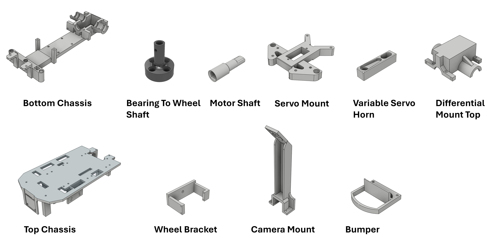

**[Link for all 3-D modelled parts photos ](schemes/)**

**[Link for all 3-D parts  STL files](models/chassis/)**

---

## 2.9 Experiments

We ran some experiments to determine our robot precision. This data helps us calibrate robot speed for various scenarios like open challenge, obstacle challenge and parking section.

### 2.9.1 Detection distance v/s speed

We ran the robot in a straight line until it found an obstacle 20 cm in front of it. The robot started breaking at the point the sensor triggered. This measures the time taken by the robot to come to a complete halt. This helps us determine how slowly the robot should move at critical points e.g. parking section.

<table>
  <tr>
    <!-- Left Column: Data Table -->
    <td valign="top">
      <table border="1" cellpadding="5" cellspacing="0">
        <thead>
          <tr>
            <th>Speed (m/s)</th>
            <th>Stopping Time (ms)</th>
            <th>Stopping Distance (cm)</th>
          </tr>
        </thead>
        <tbody>
          <tr><td align="center">0.199</td><td align="center">111</td><td align="center">0.51</td></tr>
          <tr><td align="center">0.265</td><td align="center">237.5</td><td align="center">1.65</td></tr>
          <tr><td align="center">0.334</td><td align="center">266.6</td><td align="center">2.57</td></tr>
          <tr><td align="center">0.396</td><td align="center">256.2</td><td align="center">2.76</td></tr>
          <tr><td align="center">0.456</td><td align="center">301</td><td align="center">3.59</td></tr>
          <tr><td align="center">0.523</td><td align="center">335</td><td align="center">4.6</td></tr>
          <tr><td align="center">0.588</td><td align="center">370</td><td align="center">5.8</td></tr>
          <tr><td align="center">0.653</td><td align="center">410</td><td align="center">7.1</td></tr>
          <tr><td align="center">0.719</td><td align="center">450</td><td align="center">8.6</td></tr>
          <tr><td align="center">0.784</td><td align="center">490</td><td align="center">10.2</td></tr>
        </tbody>
      </table>
    </td>
    <!-- Right Column: Chart Image -->
    <td valign="top" style="padding-left: 20px;">
      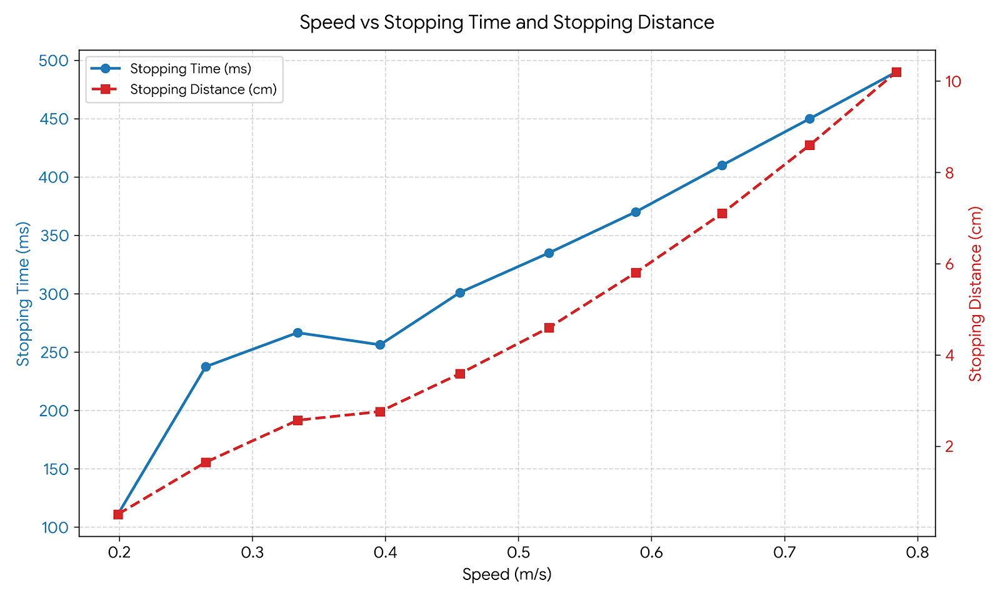
    </td>
  </tr>
</table>

**Conclusion** This experiment proves that at higher speed the time taken to come to a full stop as well as distance covered before it actually stop increases, so we need to ensure robot is moving at the right speed for it to stop and turn accurately in parking or while avoiding obstacles.

### 2.9.2 Encoder precision and tuning

We used the encoder specifications and gear ratio to tune the encoder. Then we measured the actual distance travelled when it was given a particular instruction to verify its accuracy.

| Run # | Encoder measured distance (cm) | Observed distance practically (cm) | Δ distance (cm) |
| :---: | :---: | :---: | :---: |
| 1 | 100 | 92 | 8 |
| 2 | 50 | 47 | 3 |

**Conclusion** We designed our software to be able to handle the accuracy that the actual encoder can provide. 

---

# 3 Power & Sensor Architecture

A 11.1V 1500mAh 16.65 Wh LiPo battery powers all the electronics on our robot. It drives a 25W power converter providing 5.2V to the Raspberry Pi 5 and the Servo motor, while the battery directly provides 11.1V to the Drive motor. The RPi 5 further powers the camera and sensors via its 3.3V GPIO rail.

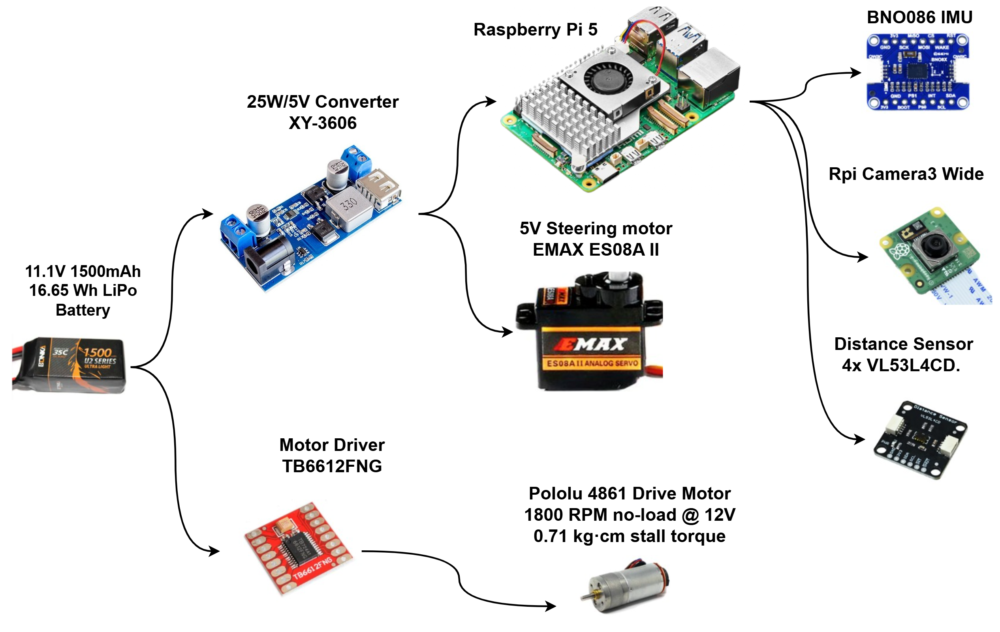

---

## 3.1 Power Budget

We referred to components documentation to find out their voltage and current specifications.

| Devices on 5V power bus | Volts (V) | Idle Current (A) | Typical Current (A) |
| :---- | :---- | :---- | :---- |
| Raspberry Pi 5 | 5.0 | 0.600 | 0.750 |
| Servo - EMAX ES08A II | 5.0 | 0.010 | 0.200 |
| Camera module 3 wide | 5.0 | 0.250 | 0.280 |
| BNO086 IMU | 3.3 | 0.008 | 0.012 |
| VL53L4CD ToF sensor (x4) | 3.3 | 0.020 | 0.080 |
| Total load on 5V power bus | 5.0 | 0.888 | 1.322 |

| Devices on 11V power bus | Volts (V) | Idle (A) | Typical (A) |
| :---- | :---- | :---- | :---- |
| Motor driver - TB6612 FNG (Logic/VCC) | 5.0 | 0.001 | 0.002 |
| Motor - Pololu 4861 | 11.1 | 0.000 | 0.400 |
| Total load on 11V power bus | 11.1 | 0.001 | 0.402 |

\* Current values sourced from component datasheets and other sources.

Using values from the above table, we did **calculation for the need of current and power for our robot**, considering all circuit components.

| Calculation | Idle Current | Typical Current|
| :---- | :---- | :---- |
| **5V Bus** | | |
| Output power = Voltage × Current | 5V × 0.888A = 4.44W | 5V × 1.322A = 6.61W |
| Input power = Output power / Efficiency (95%) | 4.44W / 0.95 = 4.67W | 6.61W / 0.95 = 6.96W |
| **11V Bus** | | |
| Output power = Voltage × Current | 11.1V × 0.001A = 0.011W | 11.1V × 0.402A = 4.462W |
| Input power = Output power / Efficiency (97.5%) | 0.011W / 0.975 = 0.011W | 4.462W / 0.975 = 4.577W |
| **Battery Total** | | |
| Power drawn = 5V input + 12V input | 4.67 W + 0.011W = **4.68W** | 6.96W + 4.577W = **11.537** |
| Current drawn = Power / Battery voltage (11.1V) | 4.68W / 11.1V = **0.422A** | 11.537W / 11.1V = **1.039A** |

---

## 3.2 Power Strategy

### 3.2.1 Battery Runtime Estimation
 
```
Battery specifications 
Nominal voltage = 11.1V  
Full charge voltage = 12.6V  
Capacity             = 1500mAh  
Discharge rating = 35C  
Max discharge current = capacity * C rating  
                                     = 1.5Ah * 35  
                                     = 52.5A  
Headroom v/s C rating = max discharge current / current drawn from battery  
                                     = 52.5A / 1.039A  
                                     = 50.53 x (burst that the battery can handle)

Total energy stored = capacity * nominal voltage  
                                = 1.5Ah * 11.1V  
                                = 16.65Wh

Estimated runtime = Total energy / Power drawn from battery (typical)  
                              = 16.65Wh / 11.537W  
                              = 1.44 hours
```
Applying a safety margin of 30% to avoid over discharging the battery, we comfortably get a runtime of over an hour for typical power consumption.
Moreover, we have added a **Battery Level Indicator**(Voltmeter) which allows us to be aware of the battery voltage at all times and we can ensure the battery doesn’t discharge deeply during practice and that it’s fully charged before the competition. 

### 3.2.2 Voltage Converter

The 25W/5V converter provides USB compatible output suited for RPi 5's USB power input.  
```
RPi's operational power requirement = 6.96W     	Converter's output power = 25W  
```
This is **more than 3X the required power** to account for spikes.  


---

## 3.3 Power Verification

### 3.3.1 Full Circuit Loop Measurement

A multimeter was put in series in the LiPo battery path and the robot run on a raised platform to measure the typical operating current.

| Condition | Measured current (A) | Theoretical current (A) |
| :---- | :---- | :---- |
| Idle operation | 0.350 to 0.420 (across multiple readings) | 0.422 |
| Typical operation | 0.780 to 0.990 (across multiple readings) | 1.039 |


### 3.3.2 5V Power Bus — Onboard Telemetry

We used pmic_read_adc diagnostic command from Raspberry Pi 5 to read real-time voltage and current measurements from its built-in Power Management IC. The telemetry total power almost matches the theoretically calculated power for RPi and sensors connected to it.

[For Telemetry- See Power Profile Script](src/tools/power_profile.py)

<table>
  <thead>
    <tr>
      <th>Multimeter Measurement</th>
      <th>Telemetry Output</th>
    </tr>
  </thead>
  <tbody>
    <tr>
      <td align="center">
        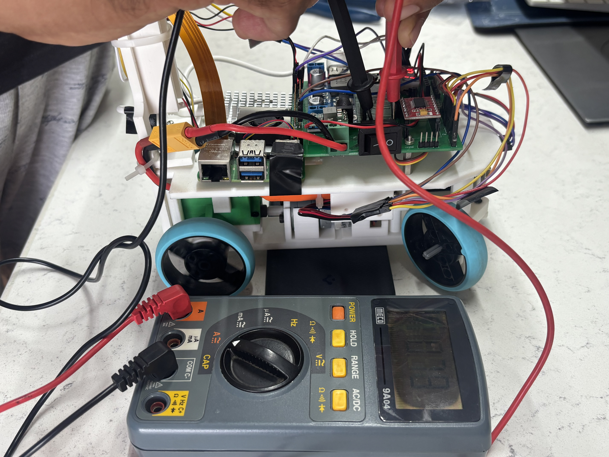
      </td>
      <td align="center">
        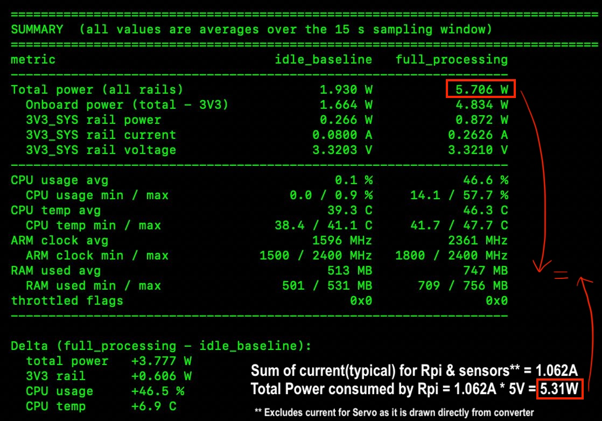
      </td>
    </tr>
  </tbody>
</table>

---

## 3.4 Wiring Diagram and PCB

In our first draft of the robot, there were many criss-crossing wires between many different components. A lack of clean arrangement for the wires made the robot very messy to handle. During practice runs, wires would routinely get loose, making it difficult to troubleshoot errors.

To solve this, we designed a PCB which cleanly connected all of our components together, making the robot far cleaner and reliable.
Here's  simplified pin layout diagram for the wiring.

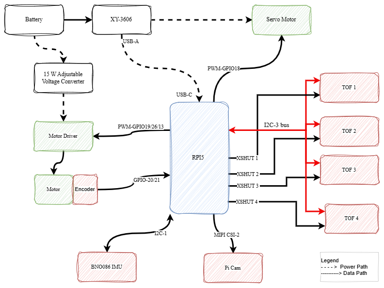

The complete Circuit diagram below shows all power and signal connections between the battery, voltage converters, Raspberry Pi 5, motor driver, servo, camera, IMU, and ToF sensors.

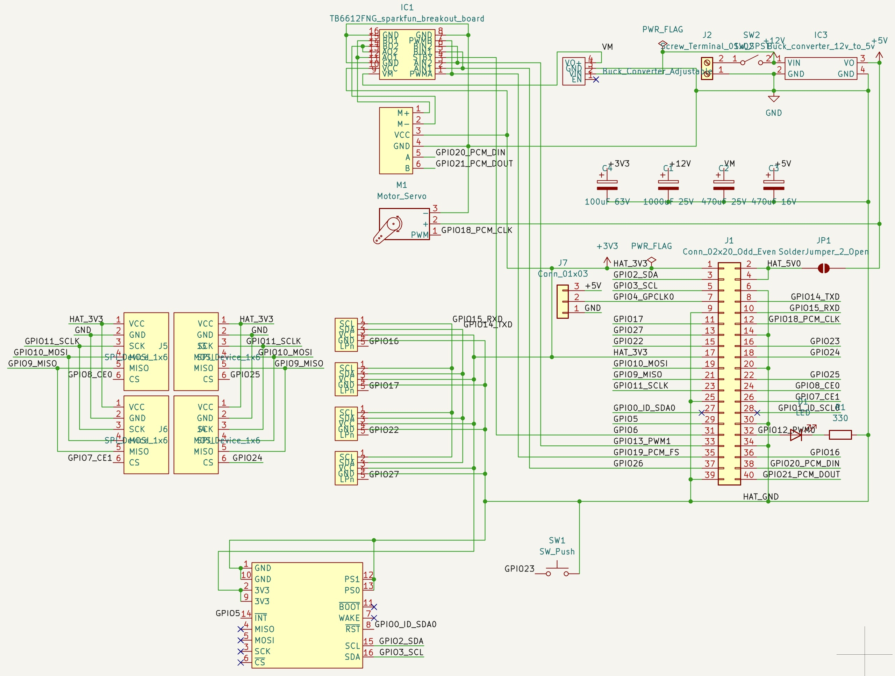

[Link For Complete Circuit Diagram](schemes/CircuitDiagram.png) 

[Link for all PCB KiCAD files](models/PCB)

---

## 3.5 Sensors

### 3.5.1 Sensor Placement Summary

| Sensor | Position | Height | Angle | Mounting Method | Justification |
|---|---|---|---|---|---|
| Camera Module 3 Wide | Rear-center, on pillar | 26 cm | 40 ° down | 3D-printed bracket on rear post | Forward view over chassis; avoids front blind spots; short CSI cable to RPi |
| VL53L4CD #1 | Front | 5.5 cm | 0° (horizontal, forward) | Recessed inside chassis body | Detects front parking wall at short range |
| VL53L4CD #2 | Rear | 6.7 cm | 180° (horizontal, backward) | Recessed inside chassis body | Detects rear parking wall at short range |
| VL53L4CD #3 | Left side | 5.5 cm | 90° left | Recessed inside chassis body | Left wall distance for lane positioning |
| VL53L4CD #4 | Right side | 5.5 cm | 90° right | Recessed inside chassis body | Right wall distance for lane positioning |
| BNO086 IMU | Center chassis | 11.6 cm | Flat  | PCB-mounted, close to center of gravity | Minimum vibration; accurate heading readings |


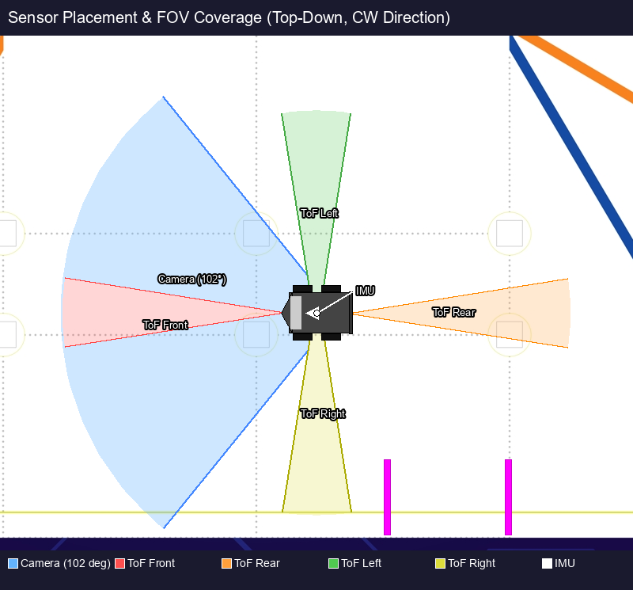

---

### 3.5.2 Camera

**Specification Comparison**

| Specification | Raspberry Pi Camera Module 3 Wide | Raspberry Pi HQ Camera + 180° Fish Eye lens |
| :---- | :---- | :---- |
| Resolution | 11.9 MP | 12.3 MP |
| Focusing | Auto | Manual |
| Field of View (FOV) | 120° Diagonal (102° Horizontal) | 180° Diagonal (180° Horizontal) |
| HDR support | Up to 3 MP, 30 fps | No |
| Aspect ratio | 16:9 (wider, optimized for videos) | 4:3 (squarish, optimized for still pictures) |

**Why We Chose Camera Module 3 Wide**

- The Camera Module 3 Wide provides auto focus which keeps moving targets sharp.
- The 120° FOV is sufficiently wide and at the same time gives zero edge distortion.
- The HDR would be useful for low light conditions if encountered.

**Experimentation**
- In the HQ Camera, objects towards the edges become curved and stretched, causing occasional failures in object contour detection. The distortion can be corrected, but the process is computationally intensive, reducing the control loop speed and slows down reaction time.
- In the HQ Camera, objects towards the edges seem compressed and smaller, causing contour area to drop below the detection threshold.
- The HQ camera was too heavy to be mounted at the rear top. Mounting it in the front lower center still covers the field due to its higher FOV, but it reduces the perception of depth as when mounted high, further objects appear higher up in the image but when mounted in front, all objects appear at a similar height.

|Camera Image from FishyEye Camera|Camera Image from RPi5 Wide Camera|
| :---: | :---:
|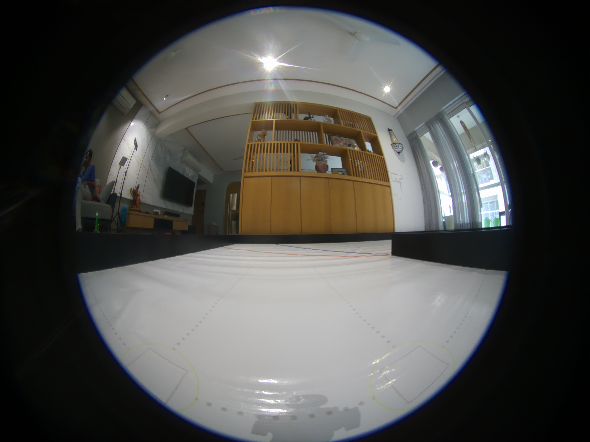|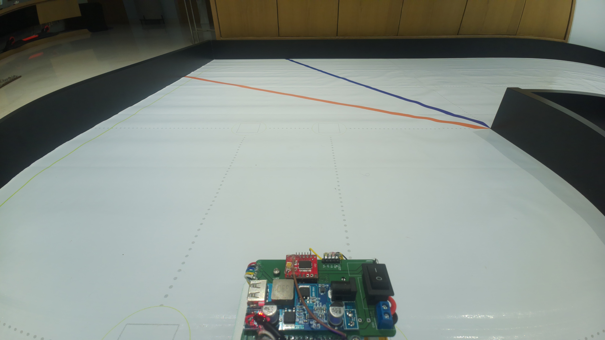|

**Placement**

1) Mount the camera on the pillar
2) Adjust the camera angle so that the front edge of the robot is visible in the camera. This is essential to avoid blind spots in the front.
  
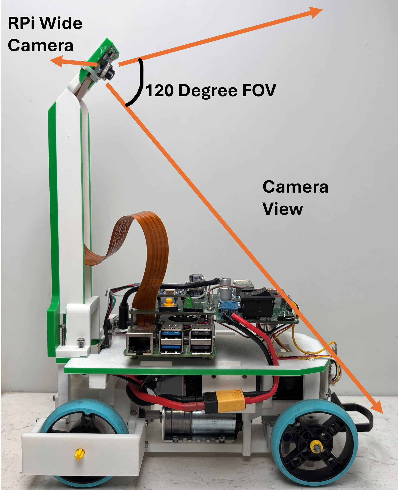

---

### 3.5.3 Distance Sensor

**Specification Comparison**

| Specification | VL53L4CD | VL53L1X | VL53L8CX |
| :---- | :---- | :---- | :---- |
| **Zone Architecture** | Single Zone | Single Zone *(Programmable ROI)* | **Multi-Zone (4x4 or 8x8 grid)** |
| **Maximum Range** | Up to 1.3 meters (1300 mm) | **Up to 4.0 meters (4000 mm)** | **Up to 4.0 meters (4000 mm)** |
| **Minimum Range** | **Down to 1 mm** | ~40 mm | ~20 mm |
| **Field of View (FoV)** | 18° Diagonal | 15° to 27° (Adjustable via ROI) | **65° Diagonal** (Wide angle) |
| **Max Sampling Rate** | **Up to 100 Hz** | Up to 50 Hz | Up to 60 Hz |
| **Ambient Light Immunity** | Moderate | Standard | **Excellent** (Uses histogram processing) |
| **Primary Focus** | Ultra-short range precision & speed | Mid-to-Long range point sensing | Scene mapping, multi-target tracking |

**Why We Chose VL53L4CD**

- Our robot uses distance sensors for parallel parking — it must detect parking walls at very short range to avoid collision.
- We need high precision and accuracy at short ranges (down to 1mm minimum range).
- This model has a high 100 Hz update rate, providing faster reaction times compared to VL53L1X (50 Hz) and VL53L8CX (60 Hz).
- Its only disadvantage is its max range is 1.3m unlike others, but that is sufficient for our purpose since we only need to detect walls within parking distance.

**Experimentation**

To figure out the accuracy of our sensor at various distances, we measured its reading vs actual physical distance measurements.

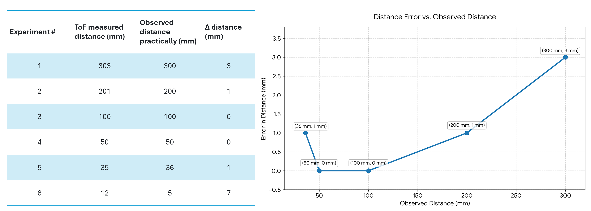

**Conclusion** The accuracy of the ToF sensor reduces as the distance reduces with a possible blind spot. As a result, we refined our design by placing our sensors inside of the robot chassis to account for the measured blind spot.

**Placement**
Even though the VL53L4CD's datasheet mentions a minimum range of 1mm, its ranging error is higher at short distances of < 20mm. To avoid this issue altogether, we have mounted the sensor recessed inside the robot body on all sides, as much as we physically could. This ensures that the closest distance it needs to measure is more than 15 to 20 mm.

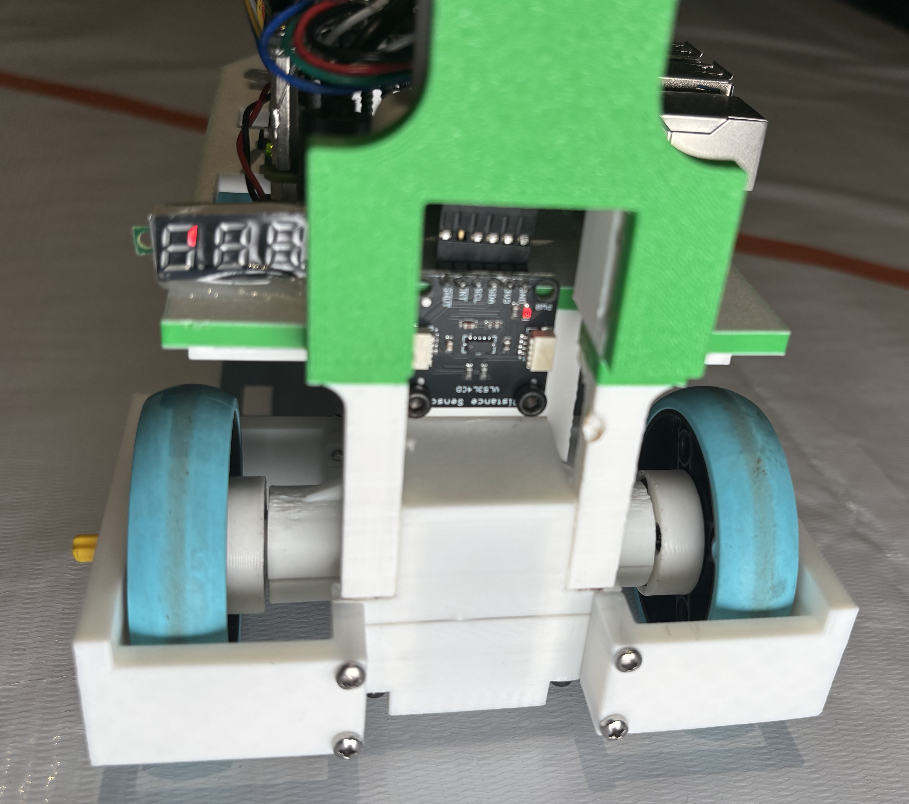

---

### 3.5.4 IMU

**Specification Comparison**

| Specification / Feature | BNO055 | BNO086 |
| :---- | :---- | :---- |
| **Heading Drift** | High (drifts significantly; loses calibration by the 3rd lap) | Very low drift of 0.5° per minute with dynamic calibration |
| **Dedicated "Game Rotation Vector"** | No | **Yes** (6-DOF: Gyro + Accel) |
| **Hardware Tare (Zeroing)** | No *(Must manually calculate offset)* | **Yes** *(Native firmware command)* |
| **Calibration Architecture** | Continuous Background | **Initial Calibration + Runtime Stillness calibration** |

**Why We Chose BNO086**

- **Accuracy:** Very low drift of 0.5° per minute means the robot can make accurate parking maneuvers even in the 3rd lap.
- **Magnetic Immunity:** The Game Rotation Vector disables the magnetometer. This prevents the robot's heading from "jumping" when parking next to metal walls.
- **Alignment Ease:** Can issue a Tare command once the car is straight in the lane, instantly resetting heading to zero without manual offset calculation.
- **Field Adaptability:** BNO086 lets the host device tell the sensor its exact motion state to improve sensor accuracy by calibrating it for stillness before parking.

**Placement**

IMU is best placed at the center of the robot. We have tried to place it as close to the center as possible given the chassis and PCB limitations.

---

## 3.6 Microcontroller — Raspberry Pi 5 as Single Controller

We used Raspberry Pi 5 as the master brain for our robot. It single handedly manages the navigation loop and using the following important features we have eliminated the need for a co-processor.

* **Used RP1 Southbridge Chip as Hardware Co-Processor to Avoid OS Delays:** A standard Linux OS constantly pauses programs to switch between threads, which can cause skipped encoder pulses or stuttering motor signals. We solved this by offloading our low-level tasks to the Pi 5's built-in RP1 chip, which handles them at the hardware level.

* **Used RP1's Native Hardware PWM Channels for Stable Motor Control:** We connected our motor drivers directly to the RP1's built-in PWM channels. Because these signals are generated by dedicated hardware, they stay perfectly stable and jitter-free for smooth speed control without relying on the busy main CPU.

* **Zero Dropped Encoder Pulses:** We wired our wheel encoders into the RP1's Programmable I/O (PIO) blocks. These are independent hardware counters that run completely outside the main CPU, meaning they track every single pulse in the background with microsecond precision.

This design gave us the following **benefits**

* **Less Wiring and No Communication Lag:** By running everything on a single Raspberry Pi 5 instead of adding a secondary board like an ESP32, we simplified our electronics and saved space. This completely eliminated the data lag that usually happens when two different systems try to talk to each other.

* **Accurate Tracking Under Heavy Load:** Because the PIO silicon continuously counts and stores pulses in hardware buffers, we never lose track of our distance. Even when the main processor is heavily loaded with intense image processing tasks, the robot's navigation loop can just read the exact counts whenever it needs them.
---

## 3.7 Calibration Procedures

This section documents how each sensor is calibrated.

### 3.7.1 Camera HSV Threshold Calibration
We use [color_tuning.py](src/tools/color_tuning.py) for live trackbar-based HSV picker:
1. Power up robot on the actual mat under actual lighting
2. Run the tool — a window shows H/S/V sliders per color
3. Pan the robot across the mat so each pillar and line passes through the camera at real angles
4. Adjust bounds until the mask for each target is contiguous and black everywhere else
5. Copy final values into the `HSV_RANGES` dict in [tuning.py](src/obstacle_challenge/tuning.py) used by the main code.

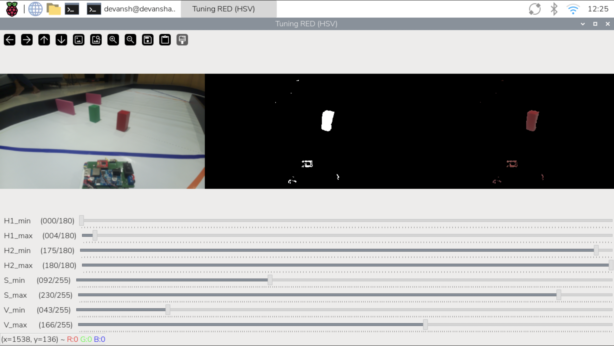

**Key rule for BLACK tuning:** Keep S (saturation) low, not V. If you let S go wide, the dark blue mat and dark sides of red pillars get classified as wall, causing non existent walls in mid-corridor.

[Link for HSV Color Calibration Code](src/tools/color_tuning.py)

### 3.7.2 IMU Calibration
To calibrate the BNO086, we start by calibrating the gyroscope by keeping the robot still for 1 min. Then to calibrate the magnetometer, we rotate the robot in figure 8 shape. Lastly to calibrate the accelerometer, we keep it in 6 different position with each face pointing down.

[Link for IMU Calibration Code](src/tools/calibrate_bno.py)

### 3.7.3 Distance Sensor Calibration
For Distance calibration, we measure the distance of an object kept 20 cm away. The difference between actual and measured is used as offset in the code, so that software can handle the error created by the sensor reading. 

[Link To Experiment to measure Sensor Accuracy](#353-distance-sensor)


### 3.7.4 Encoder Calibration
Encoder was initially configured with a theoretical multiplier as per wheel diameter, gear ratio, pulses per rotation (ppm) to convert the encoder pulses to distance. This was slightly off so we adjusted the multiplier after running the robot for a fixed distance.

---

## 3.8 Failure Point Analysis 

This section details what can go wrong and what we do about it.

| Scenario | Impact | Mitigation |
| :--- | :--- | :--- |
| Lighting variations | Robot crashes into obstacles or wall | HSV tuning to adapt to new surroundings |
| Battery voltage drops | Robot slows down unexpectedly, LiPo could become permanently damaged if it goes below 3V/cell | Voltmeter added to make sure the robot voltage doesn’t go too low |
| ToF sensor dusty | Sensor gives false readings and increase in blind spot | Clean the sensor surface |
| IMU drift | Slanted parking or slanted path when going towards parking blocks | Magnetometer is turned off in IMU to reduce drift occurrences. Recalibrate IMU if it still drifts as per process described in this doc. |

---

## 3.9 Iteration Evidence

This section shows how the power/sensor design changed over time based on testing.

|Component|Iteration|Details|
|---|--|--|
|Camera|Mounting angle and height changed|[For Camera Mounts Iteration refer 3D Iterations](#551-3d-chassis-iterations)|
|TOF Selection| VL53L1X changed to VL53L4CD to reduce blind spot|[For TOF comparison refer section 3.5.3](#353-distance-sensor)|
|TOF Sensor|Mount position changed to recessed|[For TOF placement reasoning refer Section 3.5.3](#353-distance-sensor)|
|Battery|Lipo 11.1V 2100mAh changed to Lipo 11.1V 1500mAh after Power Budget calculation|[For Power Budget Calculation Refer to Section 3.1 ](#31-power-budget)|


---

# 4 Software Architecture & Obstacle Strategy

The WRO Future Engineers competition has two challenge rounds. Our software architecture handles both using common sensor and motor modules, with the obstacle challenge code being a superset of the open challenge.

| Mode | Entry Point | Purpose |
|------|-------------|---------|
| **Open Challenge** | `src/open_challenge/main.py` | Three full laps on an empty track |
| **Obstacle Challenge** | `src/obstacle_challenge/main.py` | Three laps obeying red/green traffic signs + parallel parking |

Both modes share the same hardware-abstraction modules (`src/sensors/*`, `src/motors/*`) and follow the same architectural template — a multi-threaded sense/think/act loop running at ~50 fps on the Raspberry Pi 5. The obstacle code adds pillar-aware steering and parking on top of the same wall-following base.

**The arena:** A 3 x 3 m mat with movable inner walls, orange and blue floor lines marking each section boundary, and (in obstacle mode) red and green traffic sign pillars that must be passed on a fixed side, passing right from red,  and left from green. A magenta parking block marks the parking corridor where the robot must parallel-park after 3 laps.

---

## 4.1 Design Philosophy

We chose a **camera-first approach** for obstacle detection, a **multi-threaded architecture** for responsiveness, and **proportional control everywhere** for smooth driving.

- **Why camera-first:** The WRO track has colored pillars (red and green) that the robot must pass on specific sides. Only a camera can detect color at a distance. ToF sensors tell us how far walls are, but cannot tell us pillar color.
- **Why multi-threaded:** Reading the camera, IMU, and ToF sensors sequentially would slow the loop to ~15 fps. By reading them in parallel threads, the main loop gets fresh data every frame without waiting.
- **Why single RPi 5:** Instead of using a separate microcontroller for motor control, we use the RPi 5's RP1 hardware PWM and PIO blocks. This eliminates communication lag between two boards (see [Power & Sensor Architecture Section 3.6 for details](#36-microcontroller--raspberry-pi-5-as-single-controller)).
- **Why proportional control (not lane-switching):** Our earlier code in WRO 2025 used discrete lane-switching such as "if red pillar, move to right lane." This was brittle because gyro drift accumulates over 3 laps, and what the robot thought was "right lane" gradually drifted sideways. Our current code drives everything off camera-derived geometric error with proportional gains. Steering changes smoothly with the visual error, adapts continuously instead of waiting for a state change, and works regardless of where exactly a pillar is positioned.

### 4.1.1 Why We Rejected YOLO / Neural Networks

We considered training a YOLO classifier for shadow-robust pillar detection. We decided against it because:
- Annotation cost : even a few hundred labeled frames is several hours of work across lighting conditions
- Inference speed : YOLO on Pi 5 CPU will not hit our 50+ fps budget without adding a Hailo/Coral AI HAT (extra hardware, cost, power)

Instead we rely on tight HSV ranges, carefully placed ROIs, and the priority state machine, so classifier-grade discrimination is rarely needed.

---

## 4.2 System Architecture

### 4.2.1 Threading Model

Our software runs 4 background threads so the main navigation loop never waits on hardware. Each thread continuously reads one sensor and the main loop grabs the latest value whenever it needs it.

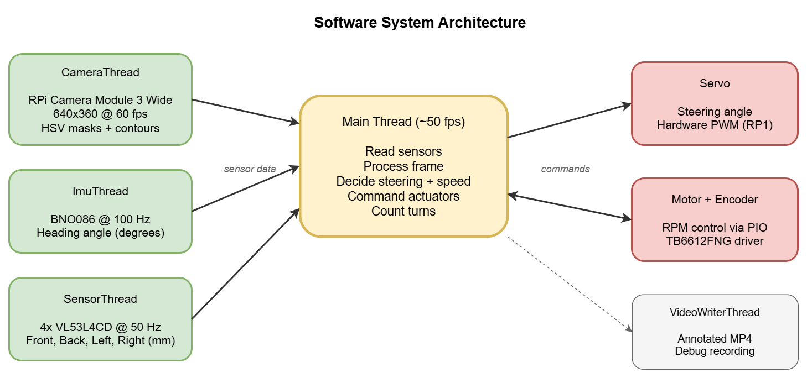

### 4.2.2 Code Module Map
This is a high-level map of how files are organized within src folder.

```
src/
├── experiments/          # Standalone data-collection scripts for tuning/characterizing robot behavior
├── logs/                 # Logging setup/configuration for run logs
├── motors/               # Drive motor and steering servo control (PWM, RPM closed-loop)
├── obstacle_challenge/   # Obstacle Challenge entry point, config, and decision/control logic (includes a legacy subfolder)
├── open_challenge/       # Open Challenge entry point and config
├── sensors/              # Hardware-abstraction drivers for camera, IMU, distance sensors, and encoder (includes legacy subfolder)
├── threads/              # Background hardware-sensor thread management
├── tools/                # Calibration and diagnostic utilities (HSV tuning, capture pipelines, sensor tests)
└── vision/               # Shared frame-processing pipeline and worker pool
```

---

## 4.3 Open Challenge Flow Chart and Algorithm

The open challenge uses only the WALL FOLLOW and CORNER TURN behaviours from our architecture. With no traffic signs on the track, the robot drives three laps using the wall-following controller to stay centered, detects corners via the close-black ROI, and counts orange lines to know when 3 laps are complete.

The flow is 

1. **Initialize** : start camera and IMU threads, wait for button press, lock starting heading
2. **Drive** : motor at full speed
3. **Every frame (~60 fps):**
   - **Sense** : capture frame, detect walls on left/right and orange floor lines
   - **Decide** : balance wall areas to stay centered; if wall ahead, force a hard turn
   - **Act** : apply smoothed steering angle; count orange lines for lap tracking
4. **Stop** : after 12 orange lines (= 3 laps) and heading aligned with start → coast 0.8 s → brake

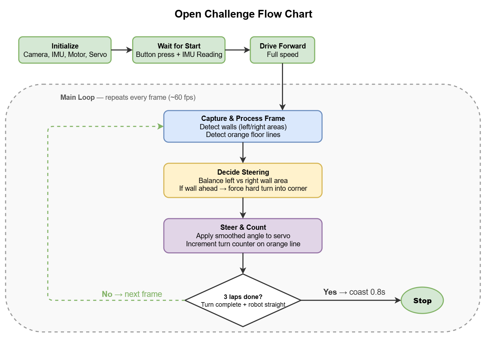

The same direction detection, turn counting, and performance optimizations described in later sections apply to both modes. The obstacle challenge code is a superset, adding pillar-aware steering (Sec 4.4.5) and parking (Sec 4.4.8) on top of this same wall-following base.

---

## 4.4 Obstacle Challenge — State Machine & Algorithms

The following sections describe the obstacle challenge, which builds on the open challenge core by adding a priority state machine for pillar avoidance and a parking routine.

**State Machine**

We implement a **flat priority state machine** that is evaluated fresh every frame. We chose this design because it makes the robot's behavior fully predictable from a single frame's sensor data — if you know what the camera and sensors see right now, you know exactly what the robot will do next.

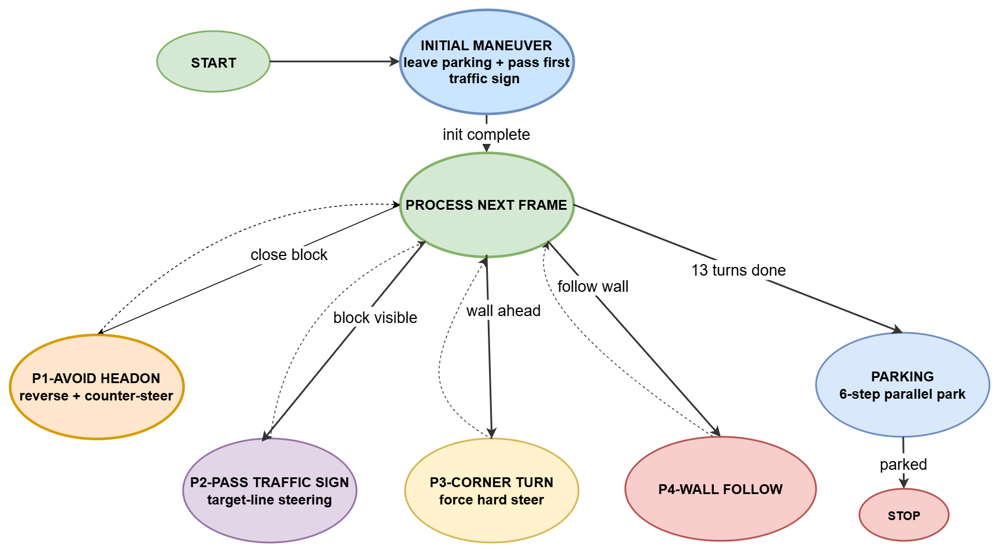

### 4.4.1 States & Priority Order

| Priority | State | What the Robot Does | Entry Condition | 
|----------|-------|--------------------|-----------------| 
 — | **INITIAL MANEUVER** | Detect direction, leave parking zone, and navigate past the first traffic sign | Race start (button press)|
| P0 | **PROCESS NEXT FRAME** | Capture a new camera frame, run the vision pipeline, and evaluate which priority state to enter | After INITIAL MANEUVER completes; re-entered every loop iteration |
| P1 | **AVOID HEADON** | Hard steer to ±35° to where there's more space | Close-black area exceeds 3000px threshold  | 
| P2 | **PASS TRAFFIC SIGN** | Target-line geometry steers the robot to keep right from red pillars and left from green pillars | Pillar detected in main camera frame |
| P3 | **CORNER TURN** | Forces a hard steer to turn into the corner |When one outer ROI drops below 100px | 
| P4 | **WALL FOLLOW** | PD controller balances left/right wall areas to keep robot centered in corridor | Default state when no higher-priority trigger fires |
| — | **PARKING** | 6-step parallel park using gyro + ToF + camera | Turn counter reaches 13 (3 laps complete) | 

When multiple triggers are true in the same frame, the highest priority wins. All states return to PROCESS NEXT FRAME after completion, except PARKING which leads to STOP.

### 4.4.2 INITIAL MANEUVER — Details

The INITIAL MANEUVER state runs once at the start of the race and handles three tasks in sequence:

**1. Direction Detection (camera-based):**
At startup, the robot determines whether the track is clockwise or counter-clockwise using the camera for first 10 frames:
- Left wall area > Right wall area → outer wall is on left → **clockwise**
- Right wall area > Left wall area → outer wall is on right → **counter-clockwise**

**2. Leave the Parking Zone:**
The robot starts inside the parking corridor against the outer wall. It must exit this corridor before the main navigation loop can begin. The robot undergoes a sequence of tuned steps to exit the parking in controlled manner.

**3. Navigate Past the First Traffic Sign:**
The first pillar can be directly in the robot path, after exiting the parking. To manage these situations robot has a pre-tuned instructions to pass the traffic sign as per its color and driving direction. Then the main loop takes over to generically handle traffic signs for next 3 laps.

---

### 4.4.3 PROCESS NEXT FRAME -Computer Vision Pipeline

The images below show what the robot's vision system does to each camera frame — from raw input to final detection output:

<table>
  <colgroup>
    <!-- Step 1-2 Columns -->
    <col style="width: 8%;">  <!-- Step -->
    <col style="width: 22%;"> <!-- What Happens (wraps tightly) -->
    <col style="width: 20%;"> <!-- Visual (larger share) -->
    <!-- Step 3-4 Columns -->
    <col style="width: 8%;">  <!-- Step -->
    <col style="width: 22%;"> <!-- What Happens (wraps tightly) -->
    <col style="width: 20%;"> <!-- Visual (larger share) -->
  </colgroup>
  <thead>
    <tr>
      <th>Step</th>
      <th>What Happens</th>
      <th>Visual</th>
      <th>Step</th>
      <th>What Happens</th>
      <th>Visual</th>
    </tr>
  </thead>
  <tbody>
    <tr>
      <td><strong>1. Raw Frame</strong></td>
      <td>Camera captures 640×360 image of the track</td>
      <td>
        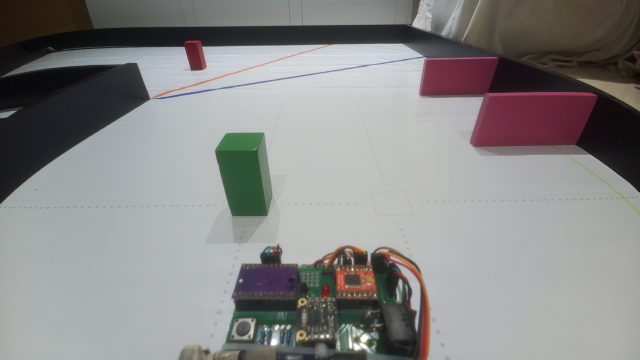
      </td>
      <td><strong>2. Convert to HSV</strong></td>
      <td>Colour space that separates hue from brightness — makes colour detection lighting-robust</td>
      <td>
        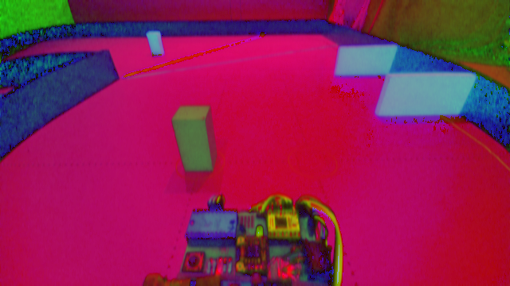
      </td>
    </tr>
    <tr>
      <td><strong>3. Colour Masks</strong></td>
      <td>Each colour gets its own binary mask (white = detected). Walls, pillars, and lines are isolated</td>
      <td>
        <div style="display: flex; gap: 4px;">
          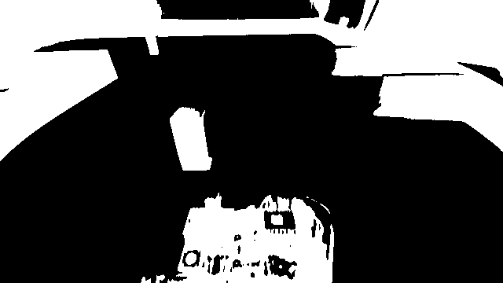
          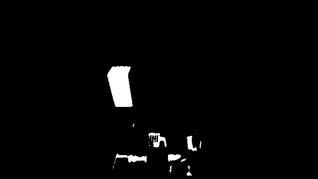
        </div>
      </td>
      <td><strong>4. Detect & Annotate</strong></td>
      <td>Find contours in each mask → report position, area, and colour to the steering logic</td>
      <td>
        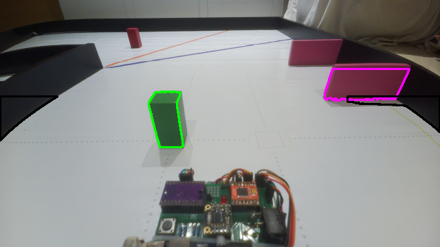
      </td>
    </tr>
  </tbody>
</table>

**ROI Zones**

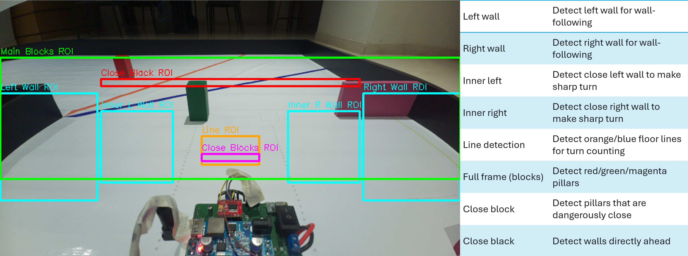

### 4.4.4 Avoid HeadOn 
If the total area in the close-black ROI exceeds 3000px, a wall is exactly in front. We hard steer to ±35° toward whichever side has more space. This is the only place the wall law ignores its own proportional output.

### 4.4.5 PASS TRAFFIC SIGN - Target-Line Geometry

**Goal:** Steer the robot to keep right from red pillars and keep left from green pillars.

**How it works:**

We define a virtual target line from a corner of the frame to the top center. The robot steers to bring the actual line towards the target line so the pillar stays on the correct side.


**Per-frame Steering angle calculation**

```
current_angle = atan2(block_x - origin_x, origin_y - block_y)  // θ = tan_inv(Δx/Δy)
steering_angle = (current_angle - IDEAL_ANGLE) * Kp

where
IDEAL_ANGLE(red) = +42.5 degrees  // tuned for red pillar
IDEAL_ANGLE(green) = -40.5 degrees  // tuned for green pillar
Kp = 1.5  // proportional constant
```

**Evaluation of multiple algorithms**
Our previous year's robot used a **fixed vertical line** as the target line and actual line. If you notice the camera image, the straight walls are seen in camera as inclined lines which means the straight path of robot visually appears as inclined lines due to the depth of vision. Fixed line caused the block to come very close to the robot and to avoid this, we used to change the target line when block used to come very close which was a hacky approach.

Inclined line using angle calculation for **Target line geometry** causes the delta between target and actual to remain almost constant even when the robot approaches the pillar. The robot now steers smoothly like a real world driver would avoid an obstacle. The code is cleaner as there aren't any hacky approaches now making it reliable.

We built a **calibration tool** (`drive_straight_tune_target.py`) that drives the robot straight past a pillar while tracking its centroid frame-by-frame. The path the centroid traces is **not vertical** — because of the camera's forward tilt, a fixed pillar drifts horizontally across the frame as it gets closer. The angle-based law accounts for this drift naturally, making the robot pass cleanly at every range.

**Edge Cases**

**Inner-wall guard:** When `wall_inner_right > 3000` (or left), the block-following angle is clipped to a one-sided range so steering can only turn further *away* from the wall, never into it. This prevents wall contact when passing a pillar near a corner.

**Magenta-coordinated path:** When a magenta parking block is visible alongwith a pillar, the steering target becomes the midpoint between them which allows us to ensure we do not hit any of the blocks.

**Close Block Avoidance Pillar:** If a pillar gets dangerously close (in the "close block" ROI), normal steering cannot avoid it. We do a hard reverse maneuver.

**Close Block Avoidance Magenta Parking:** Magenta close-blocks are only treated as evasion targets after 5 seconds from race start. Early magenta near the camera is the parking corridor entrance, which we don't want to dodge.


### 4.4.6 Wall Following — PD Controller

**Goal:** When no pillars are visible, keep the robot centered between the left and right walls.

**How it works:**

We use **four ROIs, not two.** Each side of the frame is split into an outer band and an inner band:
- **Outer ROIs** (x: 0..135 and 505..640) sit near frame edges — they feed the wall-balancing law as a simple area difference
- **Inner ROIs** (x: 140..240 and 400..500) sit closer to frame center — they detect a wall that is dead ahead and very close

**Why inner ROIs matter:** When the robot rounds a corner, the far wall slides out of view. If only outer ROIs existed, the area difference would go to zero and the robot would drive straight into the corner wall. The inner ROI catches the close wall and triggers a forced turn before contact.

**Formula:**
```
left_area = wall_left_outer + wall_inner_left
right_area = wall_right_outer + wall_inner_right
wall_error = left_area - right_area
angle = wall_error * Kp + wall_derivative * Kd + bias

Where:
  Kp = 0.0006
  Kd = 0.0003
  bias = +1 (constant offset)
```

### 4.4.7 Corner Turns and Lap Count Logic 

**Corner Turn**

When one outer ROI drops below 100px while the opposite side still sees a wall, the robot is entering a corner. We amplify the remaining wall area (2x + 25000) to force a harder turn into the corner instead of understeering.

**Lap Count Logic**

Count orange floor lines to know when 3 laps (12 turns) are complete.

**How it works:**
- Each frame, check if orange is detected in the line ROI
- Store last 4 detections in a queue: `[oldest, ..., newest]`
- Count a turn ONLY when pattern is `[False, True, True, True]` — a fresh rising edge that persisted for 3 frames
- After counting, apply 50-frame cooldown (prevent double-counting the same line)

**Why did we do this?** At high speed, a single orange line stays in the ROI for ~10 frames. Without the 4-frame rising-edge check and cooldown, one line could be counted multiple times.

### 4.4.8 Parking Algorithm

After completing 3 laps (12 turns), the robot enters the parking sequence. We have two versions: `parking()` for clockwise and `parking2()` for counter-clockwise tracks. The robot uses the IMU for precise turns and small segments of straight driving during parking manuevers.

**Parking Phases (Clockwise Example)**

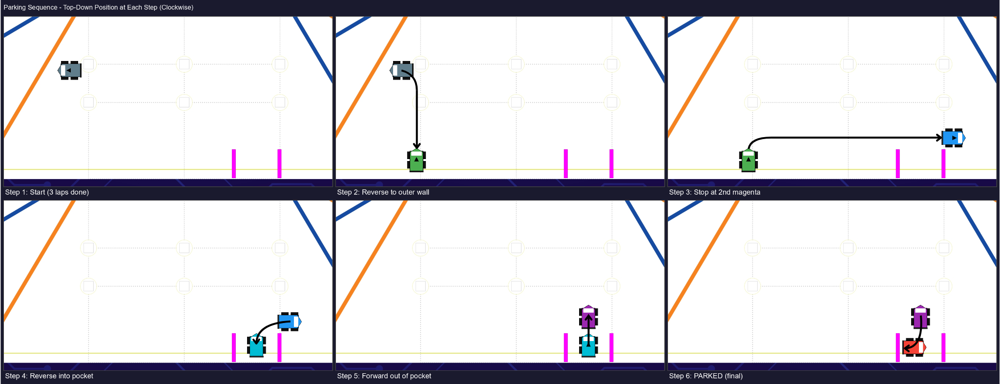

| Phase | Action | End Condition |
|-------|--------|---------------|
| 1 | Drive forward till orange line | Encoder distance reached (14 cm) |
| 2 | Reverse at -60° steering, heading → INITIAL+90° | Back ToF < 130mm (near outer wall) |
| 3 | Drive forward along wall, camera-based wall-following (Kp=0.8), count magenta pillars | 2nd magenta pillar passed + 0.62s coast |
| 4 | Steer into parking at +55°, heading → INITIAL+100° | Back ToF < 160mm |
| 5 | Forward/reverse manuever to align parallel | Back ToF ≤ 95mm AND heading ≈ INITIAL±180° |

**Parking Sensors Used**

- **Back ToF:** Knows when robot is close to rear wall of parking slot
- **Center ToF:** Monitors distance to wall during corridor driving
- **IMU heading:** Controls all steering angles precisely
- **Camera:** Follows black wall edge during Phase 3, counts magenta pillar passes

**Goal:** Use the IMU heading to maintain a straight line or execute precise turns.

**IMU Code Reference:**
```
heading_error = target_heading - current_heading
steering = heading_error × Kp

Where:
  Kp = 0.85 (normal driving)
  Kp = 1.0 to 2.0 (parking maneuvers)
```

The gyro handles 360° wrap-around: if the error is > 180°, it wraps to the shorter direction.

Used for:
- Keeping straight during initial maneuver
- 90° turns at corners
- All parking phases (precise angle targets)

---


## 4.5 Edge Cases
| Edge Case | What Could Go Wrong | How We Handle It |
| :--- | :--- | :--- |
| **Same frame processed twice** | Waste processing time | Skip frame if `frame_counter` unchanged |
| **Magenta parking block during startup** | Robot reversal within parking section | 5-second gap on startup before close block reversal activates for magenta parking blocks |
| **Inner wall very close during block follow** | Robot crashes into wall | Servo angle clamped to steer away from wall |
| **Close black wall ahead (no blocks)** | Crash into front wall | If `close_black_area > 3000` → force ±35° turn based on direction |
| **Block disappears mid-avoidance** | Sudden speed change | Grace frames: hold last block speed for 5 frames after block disappears |
| **Wheel stall (blocked/stuck)** | Robot stops moving | RPM controller detects zero RPM → stall recovery |
| **No walls visible, but orange/blue line visible** | Robot will not turn and crash | Force ±35° steering based on track direction |
---

## 4.6 Parameter Tuning

### 4.6.1 All Control Parameters
All tuned paramters are cleanly organized and available in 

[Open Challenge Tuned Parameter List](src/open_challenge/config.py)

[Obstacle Challenge Tuned Parameter List](src/obstacle_challenge/config.py)

### 4.6.2 Tuning Process

**Target Line Tuning** Look at the video to see if the robot is oscillating a lot. If it's oscillating too much, increase the Kd. If it takes too long for the target and actual lines to coincide, increase Kp

**Wall Following Tuning** For wall following, look at the robot, and if it is taking too slow turns, then increase the Kp. If it is oscillating wildly, reduce Kp and increase Kd. If it is oscillating mildly, then increase Kd. If it is overturning, decrease Kp


---

## 4.7 RPM Control — PI Controller with Feed-Forward

**Goal:** Maintain consistent wheel speed regardless of load (turns, inclines, battery sag).

**How it works:**
- Motor encoder counts pulses via RP1 PIO
- Actual RPM is compared to target RPM
- PI controller adjusts PWM duty cycle

```
Target RPM = 0.85 * MAX_WHEEL_RPM (normal driving)
Kp = 0.20
Ki = 0.50
Ramp limit = 25 RPM increase per frame (prevents wheel spin)
```

**Variable Speed near obstacles:** When a pillar is visible, the target speed is reduced proportionally to how close the pillar is. Pillar at top of frame (far) → 85% speed. Pillar at bottom (close) → 60% speed.

### 4.7.1 Why PIO for the Encoder

The wheel encoder is a quadrature pair driven through the **PIO block** on the RPi 5's RP1 I/O controller. PIO is a small, deterministic state-machine engine sitting next to the main CPU — it handles encoder pulses entirely in hardware while the CPU does nothing.

**Why this matters:** Linux is not a real-time OS. The scheduler can preempt our Python loop for tens of milliseconds. If we counted encoder edges from Python, every preemption gap would silently drop counts and reported distance would drift. The PIO state machine sits *outside* the Linux scheduler and **never misses a count** regardless of CPU load.

Two modes of operation:
- `motor.start_rpm_control(target_rpm, direction)` — frives the robot at target RPM (most commonly used)
- `motor.move(distance_cm)` — PID loop that ramps speed up, then decelerates as encoder approaches target distance (used in special situations)


### 4.7.2 Control Loop Diagram

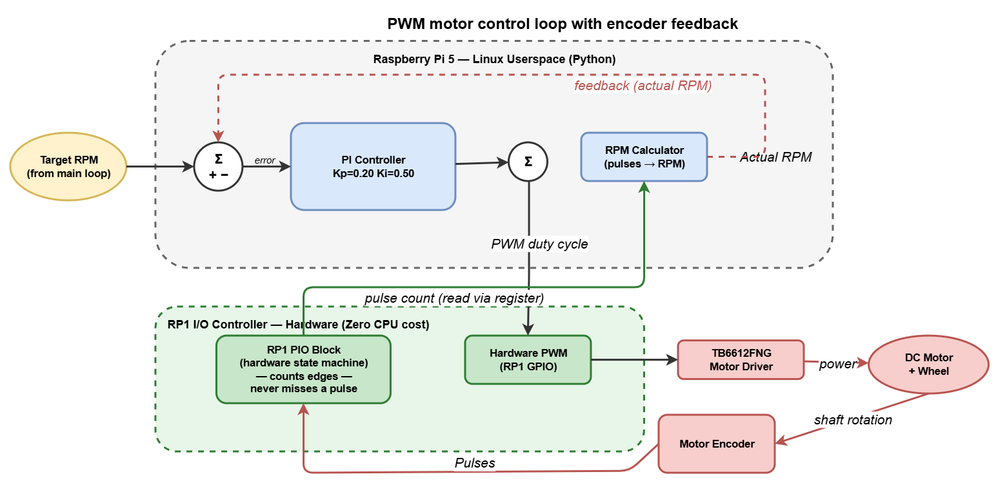

*Closed-loop RPM control showing the PI controller running on the RPi 5 CPU, with the RP1 PIO block handling encoder counting in hardware. The feed-forward path sets the initial PWM, and the PI corrects for load disturbances.*

---

## 4.8 Testing Results

In order to test all tough combinations we wrote a program that could create the field settings for the tough combinations using the [generate_tough_configs.py](test/generate_tough_configs.py). For consolidation we used the format as in [PDF](test/WRO_FE_2026_Master_Test_Tracker_v2.pdf) 

Here's one of the sample runs for Obstacle challenge :

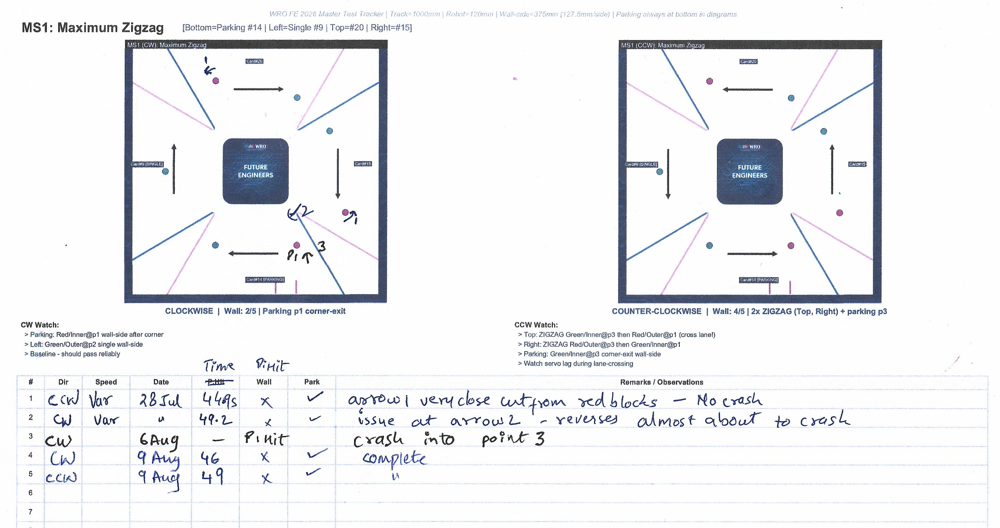

---

## 4.9 Performance Optimizations

These design choices keep the loop running at 50+ fps on a Raspberry Pi 5:
* **Operate on cropped frame:** Crop the frame before performing BGR to HSV conversion. This saves 30% of conversion cost, and the stripped-out top/bottom rows are irrelevant for robot navigation.
* **Skip processing empty masks:** Check if a mask is empty using `countNonZero` before finding contours. Most color masks are empty, saving significant time if processing is skipped.
* **Process a smaller frame:** Process a 640x360px image instead of 2304x1296 (10 times fewer pixels to process).
* **Multiprocessing:** Utilize all 4 cores on the RPi5 to reduce workload by having one core process black masks while another handles color masks.
* **Update servo angle only if changed:** Check if the servo angle has changed from the last frame; only command the servo to move if an actual change occurred.

---

## 4.10 Troubleshooting and Debugging

Every run writes a self-contained folder with:
- Annotated MP4 (ROIs, contours, target lines, FPS, turn counter, computed angle)
- Full stdout/stderr log (state transitions, ToF readings, heading deltas)

This allows post-run analysis to fix the issue observed in the prior run.

---

# 5 Systems Thinking & Engineering Decisions

This section looks at the robot as one system that combines mechanical, electrical and software aspects. Mobility Management, Power and Sensor Architecture, and Software Architecture each explain why a specific component or algorithm was chosen in isolation. This section looks at the places where a decision in one area forced something in another. We discuss the constraints all three subsystems share, the trade-offs we only discovered once the full robot was tested together, and the failures that needed more than one round of debugging to actually fix.

## 5.1 System Overview
This system diagram illustrates how power, data, and mechanical dependencies actually flow between subsystems on the robot.
- Power subsystem provides power to the circuitry across two power rails - 5V and 12V.
- Sensors sense the environment and provide signals to the Software.
- Software processes what the sensors see and makes the robot think before taking actions.
- Mobility acts upon the software signals and executes the physical movement.

**Here is a sample cycle**
- The camera sees the surroundings and provides raw frames to Rpi5
- The encoder provides pulses to the RP1 controller which provides the accumulated counts to Rpi5
- The software does image processing to determine which state it is in and decide on the robot movements
- The software provides appropriate PWM signals for the servo motor and the drive motor to the RP1 controller
- The RP1 controller provides the signals to the servo motor and to the motor driver.
- The motor driver passes on appropriate external voltage as per PWM signal to the motor.

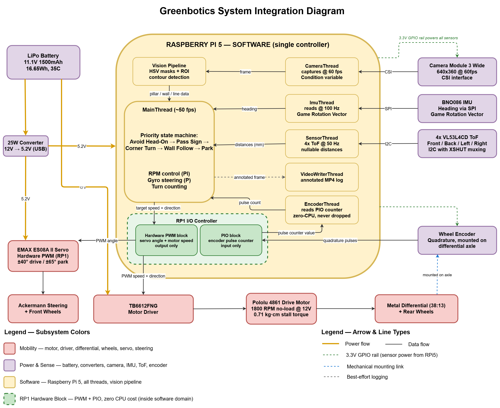

*Purple boxes are Power & Sense — battery, converters, camera, IMU, ToF, and encoder. Yellow boxes are Software — the Raspberry Pi 5, its six threads, and the vision pipeline. Red boxes are Mobility — the driver, motor, differential, servo, and steering. The dashed green box is the RP1 I/O controller, hardware inside the Pi that runs PWM and pulse-counting without using the CPU.*

---

## 5.2 Shared Constraints

A few constraints don't belong to any single subsystem. They impact the robot's design across subsystems.

### 5.2.1 The no-differential-drive rule

WRO's rule against a differential-drive robot is the constraint for multiple aspects:

Mobility: It pushed us towards a front-steering vehicle. For a front steering vehicle, the parallel parking requirement makes turning radius dictate the length of the chassis (R = L / sin(θ)). The outer radius grows further with the width (R(outer) = R(center) + W/2). Hence we tightly packed back to back the differential, drive motor, and steering assembly, building a compact robot

Power: The power and PCB components also need to be tightly packed to fit this compact sized robot.

### 5.2.2 Vehicle weight

The vehicle weight should be within 1.5 kg as per the rules. However it's not just the total weight that matters. How this weight is distributed is equally important. The battery could have been placed on top of the plate to make charging and swapping easier, but we placed it on the bottom plate to keep the centre of mass as low as possible. This gives better stability to the robot especially during sharp turns. We also have kept the weight as low as possible. This helps in multiple aspects:

Mobility: A lower weight robot requires a motor with lower power.

Power: A lower power motor requires less battery power to drive, hence smaller battery

### 5.2.3 Power budget

The full power budget identified in Power and Sensor Architecture gives us a runtime of over an hour. Building a robot within this constraint also impacted

Software: The image detection algorithm could have been improved with YOLO, but it would have required an AI HAT on the Rpi increasing the power budget further, which would require a higher powered battery, hence increasing the weight.

Mobility: A higher weight slows down the robot.

Thus multiple decisions are interlinked. Hence we limited ourselves to a software algorithm that could run on the Rpi5 itself.

### 5.2.4 Control Loop timing

The robot sense - think - act control loop needs to be really fast to make quick decisions the moment it sees things else the robot may bang into obstacles or the wall. This single constraint dictates:

Software architecture: If we collect the sensor data in the main control loop, it would slow down the system drastically. We run a multi threaded system where dedicated threads collect & process the Camera frames, IMU readings, Sensor readings. This keeps the control loop free to think and act efficiently. While the main thread is doing this, the other threads collect and process the data in parallel. This architecture works because Rpi 5 has a quad core CPU where 4 threads can run in parallel.

Power and Sensor architecture: Sensors need fast sampling rate to be able to quickly feed back changes in distances during parking to take advantage of a fast control loop. Similarly, a camera with a fast fps would feed back environment changes rapidly.

Mobility: The servo motor needs fast reaction time so that it can quickly act on the steering instructions.

---

## 5.3 Cross-Subsystem Decision Case Studies

These are decisions that cannot be fully explained from inside a single subsystem document — each one only makes sense once you look at what two or three subsystems needed at the same time.

### 5.3.1 One Raspberry Pi 5 instead of a dual-controller architecture

We used RP1, the Rpi's onboard IO controller to provide jitter free PWM output and accurate Encoder pulse counts. This avoids the typical scheduling jitter associated with offloading these to a separate thread on Linux.

The alternative to use a second microcontroller dedicated to motor tasks was rejected because of the native features of Rpi 5.

The decision is a systems decision, because three different constraints point the same way:

* **Mobility** needed precise encoder counting for sensitive parallel parking maneuvers. Losing pulses during micro-adjustments would make parking difficult.

* **Power and Sensors** had fewer boards to wire, power, and mount.

* **Software** needed the control loop to run at fast fps. An onboard controller avoids the lag associated with cross-board communication.

Using the Rpi 5's RP1 controller answers all three at once: it counts every encoder edge in the onboard controller regardless of CPU load, hardware PWM never stutters even when the vision pipeline is busy, and there is only one board's worth of wiring and power distribution.

### 5.3.2 Speed vs. accuracy — why we moved to variable speed

**Trigger:** Increasing the drive speed from 60% to 85% kept accuracy at the same 100% across 5 runs each. The robot avoided all obstacles in both scenarios. But the overall lap time got worse, not better, despite the higher speed.

**Diagnosis:** At 85% speed, the robot was reaching pillars before it could be finished steering to the correct side, triggering the close-block emergency evasion routine more often than at 60%. Each evasion is a full stop-reverse-recover cycle, and costs more time than the higher speed saved.

**Decision:** We wanted higher accuracy at higher speed. So moved to variable speed. The robot goes on full speed while the path is clear, reducing speed as a pillar gets closer. This means the robot goes slower only when it's needed. **Exactly like a real world car driver would slow down near obstacles instead of everywhere.**

**Verification:** Variable speed produced a faster overall lap time than either fixed-speed setting.

| Scenario | No. of backoffs (avg) | Time taken in seconds (avg) |
| :---- | :---- | :---- |
| 60% fixed | 0-1 | 51 |
| 85% fixed | 3-4 | 59 |
| Variable speed | 0 | 50 |

This result matches the experiment we did in Mobility Management that concluded the reaction time to stop the robot in front of an obstacle at a given distance increases with speed.

---

## 5.4 Risk & Failure Modes

This section outlines the engineering process we followed when the robot broke mid-project. These failures needed debugging across multiple aspects of the system, sometimes software, sometimes hardware and sometimes both!

### 5.4.1 Drive motor burnout — TT-GM25 to Pololu 4861

**Trigger:** The TT-GM25 drive motor began stalling intermittently, initially once in a few days, then finally four times during a single run.

**Diagnosis:**
**1)** We put a multimeter across the driver output when the robot stalled four times and noticed it was getting 6.5V. This confirmed that software and wiring was fine.

**2)** The motor terminals still showed continuity with occasional breaks.
**3)** We opened the motor casing and found dark marks on the steel shaft that remained even after cleaning it, probably signs of physical wear inside the motor.

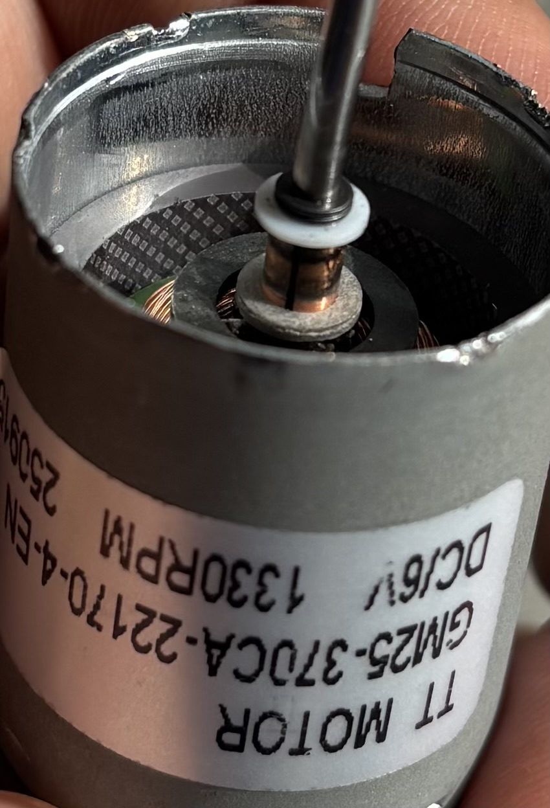

**Alternatives considered:** Replace it with another TT-GM25 of the same design, which repeats the same risk.

**Decision:** We moved to a motor from a reliable brand instead of staying with the same design, and reused the speed/torque comparison from Mobility Management section to pick the Pololu 4861 specifically, rather than just any Pololu model.

**Verification:** The Pololu 4861 has run for over a month of testing with zero stalls, against a TT-GM25 that was already failing within weeks.

### 5.4.2 ToF sensor dropout during parking

**Trigger:** Roughly once in every 20 parking runs, the robot failed to stop during a parking maneuver and hit the wall instead of braking.

**Diagnosis:** Run logs showed the distance sensor reading None at the moment of failure. This confirmed that the sensor was not responding and it wasn't a logic error in the parking routine.

**Alternatives considered:**

**1)** We assumed initialisation failure at startup time, so added a retry until successful check during the sensor initialisation at startup. Still it failed, implying that sensor was starting successfully, but dropping out mid run.

**2)** We added a fallback initialisation during sensor reads. If a sensor failed in the middle of a run, it would be re-initialised. Still it failed, confirming this wasn't a software problem.

**3)** The actual cause turned out to be hardware. The Raspberry Pi GPIO pin driving that sensor defaults to an internal Pull-Down, while the sensor needs a Pull-Up.

**Decision:** Reconfigured the GPIO pin as Pull-Up in the Pi's config.

**Verification:** Zero recurrence over 200+ runs against a roughly 1-in-20 failure rate inspite of the two software-level fixes.

### 5.4.3 Wheel wobble showing up as camera jitter

**Trigger:** No wobble was visible in the robot's physical driving, but the camera feed showed a wavy motion while the robot was moving.

**Diagnosis:** Traced to the wheel-axle fit inside the 3D-printed gearbox, which does not hold the wheel centred as precisely as the Lego chassis it replaced. That play was too small to notice by watching the chassis, but was visible when closely observing the shaft. This is amplified as the camera is mounted higher up on a pillar.

**Alternatives considered:** A software correction would have increased the main loop processing time, besides the issue wasn't significantly affecting driving.

**Decision:** Tried to fix it mechanically by adding a plastic bracket fixed with the gearbox that supports the wheel with a second axle point.

<table style="width: 100%; text-align: center; border-collapse: collapse;">
  <tr>
    <th>Wheel Bracket (Back)</th>
    <th>Wheel Bracket (Side)</th>
  </tr>
  <tr>
    <td style="padding: 10px;">
      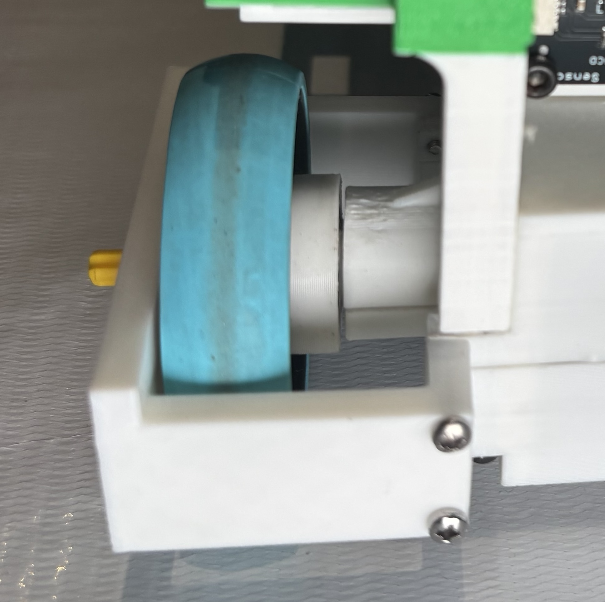
    </td>
    <td style="padding: 10px;">
      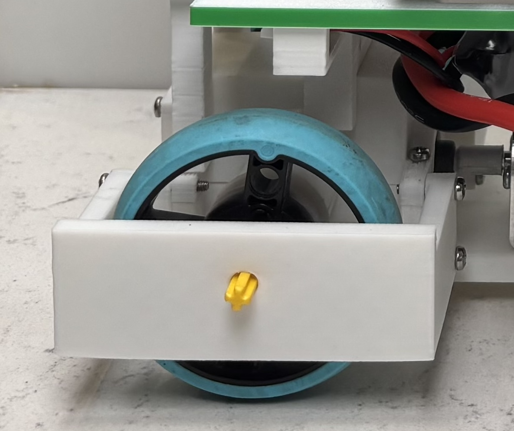
    </td>
  </tr>
</table>

**Verification:**

A comparison of the videos before and after the fix shows some improvement in wobble, though it is not completely eliminated.

|Before|After|
| :---: | :---:
|||


---

## 5.5 Iteration and Testing Cycle Summary

### 5.5.1 3D Chassis Iterations
We have worked on this robot since Jan 2026 and gone over multiple iterations with respect to various components. These changes required changes to the 3D parts as well and we designed multiple variations of each of our chassis parts to accommodate these changes.

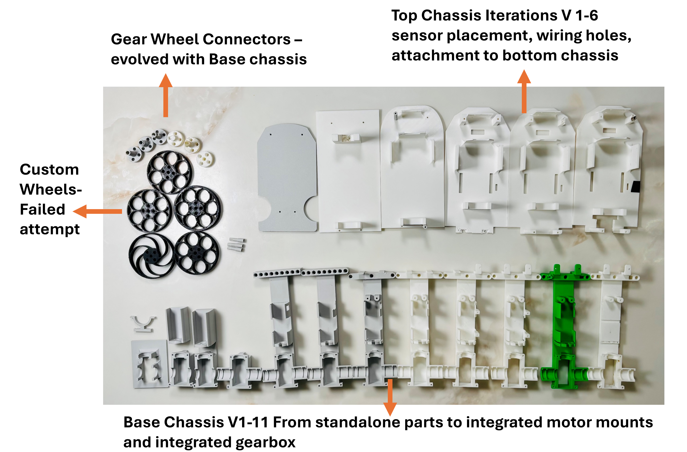

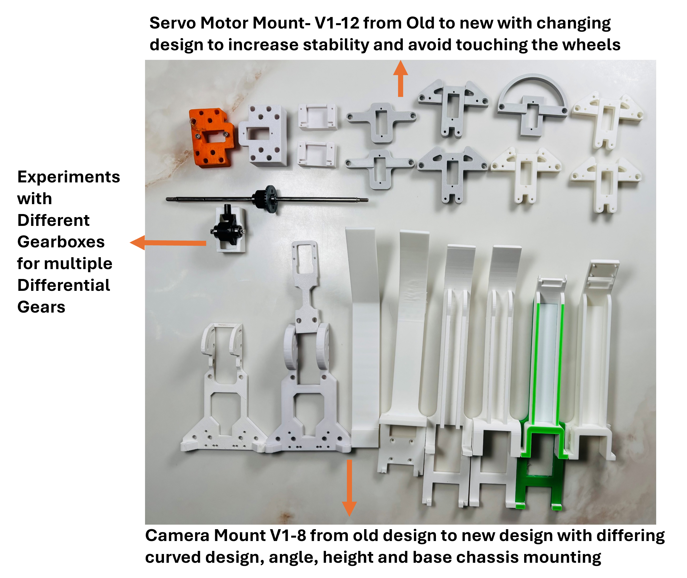

### 5.5.2 Other Design Iterations
Pulled from all three subsystem documents plus the case studies and failures above, this table is a compact record of what changed, why, and what evidence backs the change.

| Decision | Changed From → To | Why | Evidence / Status |
| :---- | :---- | :---- | :---- |
| Steering | Parallel → Ackermann | Tyre slip during tight maneuvers between inner blocks and walls | [Refer Sec 2.2 for Details](#22-steering-selection) |
| Drive motor | Lego EV3 → TT-GM25 | Lego motor was run at 100% speed and had no headroom to increase robot speed. | [Refer Sec 2.6 for Details](#26-speed-torque-calculation-drive-motor-selection) |
| Drive motor | TT-GM25 → Pololu 4861 | TT-GM25 failed in a month. Chose Pololu motor for reliability | [Refer Sec 5.4 for Details](#541-drive-motor-burnout--tt-gm25-to-pololu-4861)|
| Pillar-avoidance steering law | Fixed vertical target line → angle-based target-line geometry|The delta between the robot and obstacle reduced as the robot approached the pillar with Fixed-line delta, forcing hacky edge-case handling| [Centroid-tracking calibration tool](src/tools/drive_straight_tune_target.py)  [Section 4.4.5](#445-pass-traffic-sign---target-line-geometry)|
| Drive speed | Fixed speed (86% / 92%) → Variable speed by obstacle distance | Fixed high speed caused repeated back-off recoveries, worsening lap time |[Details for Variable Speeds](#532-speed-vs-accuracy--why-we-moved-to-variable-speed) |
| ToF sensor init | Boot-time check only → runtime re-init → GPIO Pull-Up fix | Wall collisions in ~1-in-20 parking runs | [Details for TOF sensor Dropout](#542-tof-sensor-dropout-during-parking) |
| Wheel-gearbox alignment | Bare 3D-printed gearbox → added axle-support bracket | Wobble at the wheel showed up as jitter in the camera feed | [Details of Wheel Gearbox alignment issue](#543-wheel-wobble-showing-up-as-camera-jitter)|

---

# 6 Reproducibility & GitHub Organization

Our robot is fully reproducible and this section outlines all the details required to build the robot from scratch. It explains our git file structure, how to build the robot, how to setup the software and how to test it.

---

## 6.1 Repository Structure & Module Map

This section gives a high-level map of the Git Hub repository. It highlights the purpose of each folder and what kind of files reside in it. Each folder also has its own ReadMe which details the purpose of files within that folder.

```
greenbotics-2026-main/
├── docs/           # Engineering documentation (source .md files) and supporting diagrams/photos
├── matlab/         # MATLAB Open Challenge prototype and simulation report assets
├── models/         # 3D-printable chassis STL files and KiCad PCB project
├── schemes/        # Wiring diagram, chassis renders, mount reference images
├── src/            # Python code that runs on the Raspberry Pi 5 (open/obstacle challenge, motors, sensors, tools, etc.)
├── t-photos/       # Team photo(s)
├── test/           # Master test tracker and reference test-session track layouts
├── v-photos/       # Vehicle photos (top/bottom/front/back/left/right + base plate)
├── video/          # Link(s) to performance videos
├── README.md
└── .gitignore
```

## Folder Guide

| Folder | Short Description | README |
|---|---|---|
| `docs/` | Source engineering documents behind this README (Mobility, Power & Sense, Software, Systems Thinking, Reproducibility) plus all supporting diagrams and raw robot photos/videos. | [docs/README.md](docs/README.md) |
| `matlab/` | MATLAB Open Challenge algorithm prototype and simulation report images. | [matlab/README.md](matlab/README.md) |
| `models/` | 3D-printable chassis STL files and the KiCad PCB project (schematic + layout) for the custom PCB. | [models/README.md](models/README.md) |
| `schemes/` | Wiring diagram, chassis build-step renders, and 3D-part mount reference images. | [schemes/README.md](schemes/README.md) |
| `src/` | Python code that runs on the Raspberry Pi 5 — Open Challenge and Obstacle Challenge entry points, motor/sensor/vision hardware-abstraction modules, calibration tools, and standalone experiment scripts. | [src/README.md](src/README.md) |
| `t-photos/` | Team photo(s). | [t-photos/README.md](t-photos/README.md) |
| `test/` | Master test tracker document and reference master-session test-track layout images. | [test/README.md](test/README.md) |
| `v-photos/` | Vehicle photos — Top, Bottom, Front, Back, Left, Right, Base Plate — satisfies the "photos from every side" mandatory requirement. | [v-photos/README.md](v-photos/README.md) |
| `video/` | Link(s) to Open Challenge and Obstacle Challenge performance videos (YouTube). | [video/README.md](video/README.md) |

---

## 6.2 Robot Build Instructions

**Step 1: Print the 3D parts**

- STL files for wheel shaft, bottom chassis, camera mount, differential gear box top case, motor shaft, bumper, top chassis, servo horn and wheel bracket are in models/chassis/.  
- The print settings for Bambu Lab A1 are in models/chassis/settings/  
- If you use a different printer and cannot import above settings, follow the settings below:

**Global Slicer Settings**

* **Material:** PLA  
* **Layer Height:** 0.2mm  
* **Infill Pattern:** Gyroid  
* **Walls:** 2 Wall Loops  
* **Infill density:** 15%

**Part Overrides**

* **Camera Mount:** 25% Infill  
* **Bearing to Wheel Shaft:** 4 Wall Loops  
* **Motor Shaft:** 100% Infill | 4 Wall Loops  
* **Bumper:** TPU(Flex) | 7% Infill


**Step 2: Assemble the Ackerman steering**

Build the steering assembly using the Lego parts as shown in schemes/

Ackermann steering was built using Lego components and a custom 3D part for Variable Servo Horn, which was **specially designed through trial and testing** so that it may accommodate a shifting lego screw in the backside for Ackerman.


<table style="width: 100%; text-align: center; border-collapse: collapse;">
   <tr>
    <td style="padding: 10px;">
      
    </td>
    <td style="padding: 10px;">
      
    </td>
  </tr>
</table>

**Step 3: Assemble the Robot**

- Use appropriate screws at each step to affix individual parts  
- Assemble the 3D printed parts as per Step 1 and attach Pololu 4861 motor and the Metal Differential Gear in the rear cavity  
- Insert the Ackerman steering assembly in the front cavity  
- Assemble the 3D printed parts as per Step 2 and attach EMAX servo motor  
- Assemble the 3D printed parts as per Step 3 and 4  
- Attach front and rear wheels


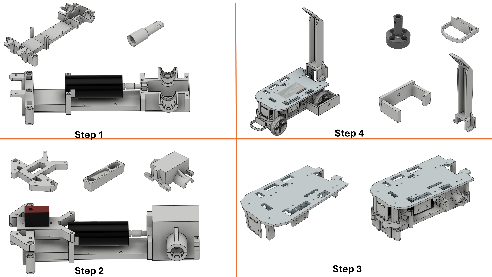


**Step 4: Fabricate the PCB**

- Fabricate the PCB from the KiCad files in models/PCB/ using KiCad.

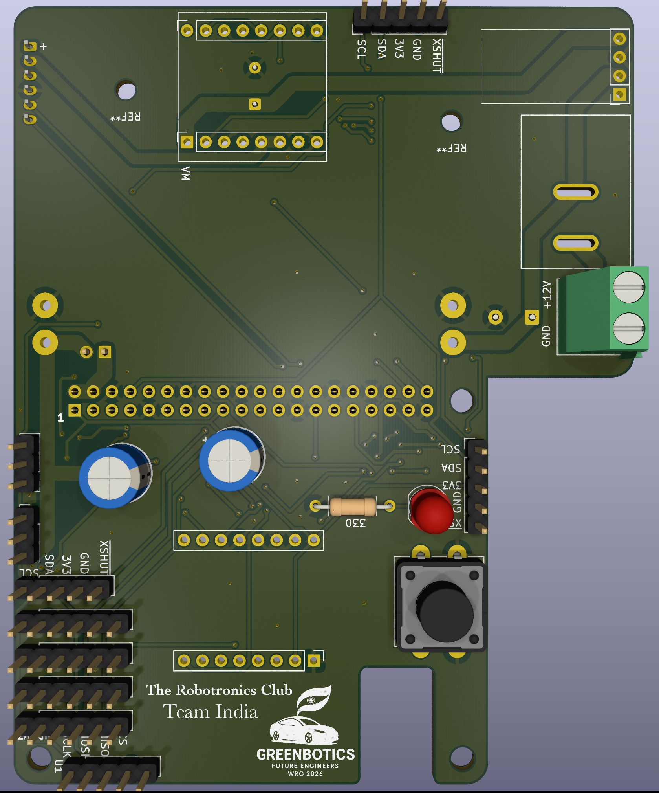


**Step 5: Solder the electronics with safe sequence**

- Solder all headers to the PCB.  
- Solder the power modules.
- Attach Raspberry Pi 5.  
- Attach the battery and verify the Raspberry Pi 5 boots.  
- Solder the startup switch and LED and verify with a simple test program.  
- Attach the motor driver module and verify motor control with a test program.  
- Attach the sensor modules and verify sensor readings with a test program.  
- Attach the IMU module and verify orientation readings with a test program.  
- Attach the Raspberry Pi 5 wide-angle camera.

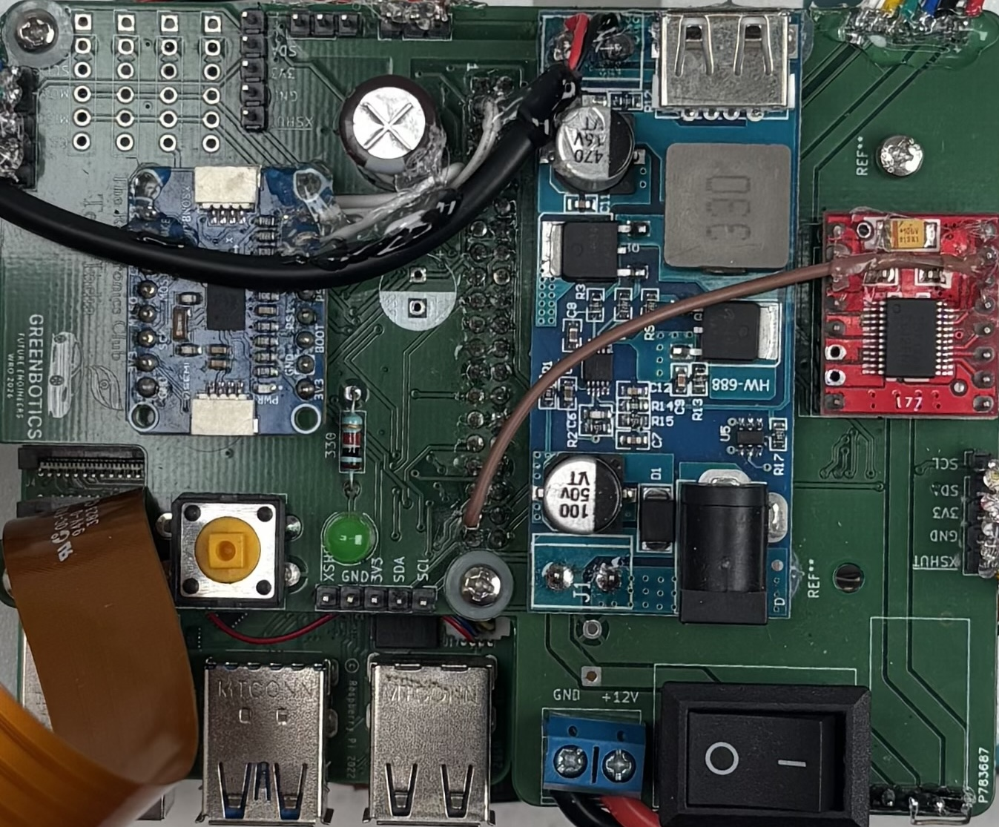

**Step 6: Install the software**

- See [Software Setup](#63-software-setup--running-the-robot) below for detailed steps on setting up software

**Step 7: Verify robot runs\!**

- Run the robot as per steps in [Testing Workflow](#64-testing-workflow) and it will run smoothly\!  
- If the rear wheel shaft doesn’t move smoothly with your hands, apply grease to the gear teeth using the greasing hole underside the robot chassis.

---

## 6.3 Software Setup & Running the Robot

### 6.3.1 Flash and configure Raspberry Pi OS

- Install Raspberry Pi OS (Trixie, 64-bit) on the Raspberry Pi 5.
- Connect to Wi-Fi and confirm internet access, then update the system:
```bash
sudo apt update
sudo apt upgrade
```

### 6.3.2 Install Git and clone Greenbotics Repo

```bash
sudo apt install -y git
git clone https://github.com/Devansh-awat/greenbotics-2026.git
cd greenbotics-2026
```

### 6.3.3 Install system-level dependencies

```bash
sudo apt install -y python3-pip python3-gpiozero python3-lgpio \
  python3-picamera2 python3-numpy python3-opencv python3-tk  \
  python3-pil.imagetk python3-libcamera i2c-tools libi2c-dev python3-dev
```

### 6.3.4 Install Python dependencies

```bash
pip3 install --break-system-packages -r src/requirements.txt
```

### 6.3.5 Enable I2C bus & PWM

Enable I2C bus using following command
```
sudo raspi-config nonint do_i2c 0 
```

Enable PWM, i2c-2 and configure pull ups by adding the below at the end of `/boot/firmware/confxtig.txt` using `nano`

```
dtparam=i2c_arm=on
dtparam=i2c_arm_baudrate=100000
dtoverlay=i2c3-pi5,pins_14_15
gpio=4,5,14,15=pu
dtoverlay=pwm-2chan
gpio=23=pu
```
Then `sudo reboot`


### 6.3.6 Run the code

```bash
cd /path/to/greenbotics-2026

# Open Challenge
python3 -m src.open_challenge.main

# Obstacle Challenge
python3 -m src.obstacle_challenge.main
```

---

## 6.4 Testing Workflow 
Having built the robot using [Section 6.2](#62-robot-build-instructions) and [Section 6.3](#63-software-setup--running-the-robot) above, follow below instructions to test it on the field.

**Open Challenge test procedure**
1. Place robot in the starting section on a WRO FE mat with its walls.
2. Run `python3 -m src.open_challenge.main`.
3. Confirm: 3 laps completed, correct direction, no wall contact, stop in finish section.

**Obstacle Challenge test procedure**
1. Place traffic signs (red/green) in a valid randomized configuration.
2. Run `python3 -m src.obstacle_challenge.main`.
3. Confirm: correct avoidance (red = pass left, green = pass right), no pillar contact, 3 laps completed, parking attempted.

---

## 6.5 Parts List (Bill of Materials)

This is a consolidated list of every major component used to build the robot, as described across the Mobility, Power & Sensor, and Reproducibility sections of this document.

| Category | Component 
|---|---|
| Compute | Raspberry Pi 5 |
| Drive Motor | Pololu 4861 (25D metal gearmotor, 12V, 1800 RPM, with Encoder) |
| Steering Motor | EMAX ES08A II servo |
| Differential | Metal differential gear, 38:13 ratio |
| Wheels | Lego SPIKE Prime medium wheels, 56mm |
| Chassis & Structural Parts | Custom 3D-printed parts (PLA) |
| Steering Linkage | Lego Ackermann assembly + Variable Servo Horn |
| Battery | 11.1V 1500mAh LiPo |
| Voltage Regulator | 25W step-down converter (12V → 5.2V) |
| Motor Driver | TB6612FNG |
| Custom PCB | Greenbotics designed PCB |
| Camera | Raspberry Pi Camera Module 3 Wide |
| Distance Sensor | VL53L4CD ToF sensor ×4 |
| IMU | BNO086 |
| Battery Monitor | Voltmeter |
| Wiring/Connectors | Wiring harness + PCB headers |

---

## 6.6 Engineering Journal

The Engineering Journal will be produced as an **export of this README**, reformatted as PDF. Placeholder folder reserved at `docs/Engineering_Journal/` 

---