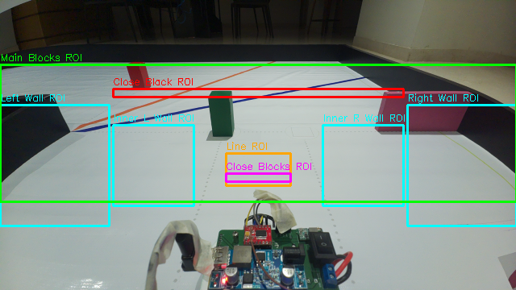

# Greenbotics — WRO Future Engineers 2026

> Consolidated engineering documentation for Team Greenbotics' WRO Future Engineers 2026 entry. This document merges the team's detailed design documentation into a single reference, structured according to the WRO FE 2026 Documentation Golden Reference (5 scored criteria).
>
> Outstanding action items (experiments to run, images to capture, data to record) are tracked separately in [`TODO_Consolidated.md`](TODO_Consolidated.md).

---

## Table of Contents

1. [Mobility & Mechanical Design](#1-mobility--mechanical-design)
2. [Power & Sensor Architecture](#2-power--sensor-architecture)
3. [Software Architecture & Obstacle Strategy](#3-software-architecture--obstacle-strategy)
4. [Systems Thinking & Engineering Decisions](#4-systems-thinking--engineering-decisions)
5. [Reproducibility & GitHub Quality](#5-reproducibility--github-quality)

---

## 1. Mobility & Mechanical Design

At the top of doc, we should have a paragraph on the excellent performance we achieved at WRO 2025 with old robot and we strived to improve it in every possible aspect this year.

---

### 1.1 Drivetrain selection

WRO rules do not allow a differential drive robot. This steers us towards a real vehicle like design that consists of a front wheel steering. These vehicles have multiple drive options

|  | All Wheel Drive | Front Wheel Drive | Rear Wheel Drive |
| :---- | :---- | :---- | :---- |
|  Driving power | All wheels | Front wheels | Rear wheels |
| Physical complexity | Transfer rotational force to a wheel that is changing its angles with respect to chassis | Transfer rotational force to a wheel that is changing its angles with respect to chassis | Simpler design. Rear axis \- rotational force Front axis \- turning force |
| Mechanical complexity | Drive motor mounted on steering mechanism. Requires powerful servo due to extra weight | Drive motor mounted on steering mechanism. Requires powerful servo due to extra weight | **Separates mechanical responsibilities.** Steering and Drive motors mounted on separate axis |
| Highlights | Off roading, steep inclines, muddy road | Pulling over obstacles  | Smooth roads, better turns |

We chose RWD for its simpler design and smoother turns.   

<table>
  <thead>
    <tr>
      <th>Differential Gear</th>
      <th>Diagram</th>
    </tr>
  </thead>
  <tbody>
    <tr>
      <td>The rear wheels have a differential gear to prevent inner wheels from skidding when turning. As shown in the diagram below, during turns, the outer wheel covers more distance(wo) than inner wheels (wi). In absence of differential gear, the inner wheels would skid.
      </td>
      <td >
       
      </td>
    </tr>
  </tbody>
 </table>   


---

### 1.2 Steering selection

Ackermann vs Parallel  
We used Parallel steering in our last year's robot. We realised certain manoeuvres such as entering parking space and tight turns between two inner blocks and inner walls caused tyre slip. We improved upon this aspect for this year's robot by using Ackermann steering. In Ackerman steering, the inner wheel turns slightly more than the outer wheel, so the robot stays on the same arc without tyre slip. This improves maneuverability especially during cornering.


Here is how we have designed Ackermann steering in our robot. 

|||

TODO: Tests that show tyre slip at cornering between both robots. Ackermann should be able to get higher speeds at cornering so we can measure one lap time.
---

### 1.3 Vehicle dimensions

The defining constraint in this vehicle is its turning radius for its parallel parking. The turning radius is defined by the dimensions of the vehicle.

<table>
  <thead>
    <tr>
      <th>Impact Analysis & Formula</th>
      <th>Visual Diagram</th>
    </tr>
  </thead>
  <tbody>
    <tr>
      <td>
        <strong>Length Impact</strong><br>
        <em>R = L / sin(θ)</em><br>
        Turning Radius(R) scales proportionally with the Length(L) of the vehicle.
      </td>
      <td>
        
      </td>
    </tr>
    <tr>
      <td>
        <strong>Width Impact</strong><br>
        <em>R(outer) = R(center) + W/2</em><br>
        Width does not change the turning radius, but increases the outer clearance radius.
      </td>
      <td>
        
      </td>
    </tr>
  </tbody>
</table>

We strive to keep both the Length and Width as minimum as possible.  
Length is the minimum length to accommodate the differential gear assembly, drive motor and the steering assembly back to back.  
Width is the minimum width for the differential assembly, couplings and the wheels attached back to back  
This results into a 23 cm long and  12 cm wide vehicle.

---

### 1.4 Differential assembly selection

We used Lego differential gear assembly in our last year's robot. While this gave us adequate performance, there were few drawbacks to it

1) Gear damage: When the robot hit a wall during our testing, the plastic gears slipped causing a grinding sound. This slowly damages the gear teeth.  
2) Backlash: When the robot makes micro adjustments during parking switching from forward to reverse, the motor rotates slightly before the wheels actually move. This makes software control of the robot inconsistent. If we move the motor a bit more, the robot sometimes hits the walls, if we make the motor move a bit less, it doesn't move.

Both these problems can be resolved with metal differential gears. To allow for precise control, we chose the largest possible gear ratio that could fit in the chassis. We chose a metal differential gear with a 38:13 ratio of ring gear to pinion gear. This gear ratio gives higher torque providing reliable transmission even at lower speeds. There is loss of top speed, but we do not need to race the car so that is fine.

| Feature | Plastic Differential (e.g., LEGO) | Metal Differential |
| :---- | :---- | :---- |
| **Backlash**  | High (Rough control at low speed during parking) | Low (Precise control at low speed during parking) |
| **Friction** | Plastic-plastic \- higher friction (Prone to low-speed stutter) | Metal-metal \- lower friction (Smooth low-speed crawl) |
| **Rigidity / Prone to damage** | Teeth Chip away after continued usage | Rigid and stable |
| **Robot Image with Gear** |||

---

### 1.5 Wheel selection

We used lego spike prime medium wheels with 56mm diameter. These are narrow like bicycle wheels giving smoother turns. A bigger wheel would amplify the backlash causing imprecise movements during parking.
##TODO Complete this section also mention we tried 3 D printing it ..also mention the width of the wheel

---

### 1.6 Drive Motor selection

We used a Lego EV3 medium motor in our last year's robot and its speed was the limiting factor for our robot. We were running the motor at 100% speed and couldn't go faster.   
Old robot rpm at wheel

```
rpm_wheel_old = rpm_motor_old / differential_gear_ratio_old

rpm_wheel_old = 250 / (28 / 20) = 250 / 1.4 = 179
```

We wanted the new robot to go at least 50% faster with enough headroom so we aimed for 100% higher rpm at wheel

```
rpm_wheel_new = rpm_motor_new / differential_gear_ratio_new

rpm_wheel_new = 2 * rpm_wheel_old = 2 * 179 = 358

358 = rpm_motor_new / (38 / 13)
rpm_motor_new = 358 * (38 / 13) = 358 * 2.92 = 1045
```

We explored different motors from [Pololu](https://www.pololu.com/product/4861) as they offer a wide range of gear ratios. We ran below Speed Torque calculations with some motors and shortlisted Pololu 4861 that provides 0.71 kg·cm torque @ 1800 rpm. This motor runs at 12V removing the need for a step down converter and associated efficiency losses.

| Criteria | LEGO EV3 Medium Motor | Pololu 4861 |
| :---- | :---- | :---- |
| Power supply match | Needs buck converter (12 V → 9V), small conversion loss | Runs directly off 12 V LiPo, no converter required |
| Mechanical reliability | Plastic gears — lower abuse tolerance, can slip under stall. Higher backlash | All-metal gearbox — higher tolerance for abuse. Lower backlash |
| No load speed | 250 rpm | 1800 rpm |
| Stall torque | 1.22 kg·cm | 0.71 kg·cm |
| Rated stall current | 0.8 A | 1.8 A — within TB6612FNG's 3.2 A peak rating |

The Pololu motor natively matches the power source and has better mechanical reliability.

#### 1.6.1 Speed Torque calculations

| Symbol | Meaning | Value |
| :---- | :---- | :---- |
| m | Robot mass | 0.8 kg |
| g | Gravitational acceleration | 9.81 m/s² |
| W | Robot weight \= m × g | 7.85 N |
| D\_w , r\_w | Wheel diameter / radius | 0.056 m / 0.028 m |
| N\_nl | Motor no-load speed at gearbox output (12 V) | 1800 RPM |
| T\_stall\_gb | Stall torque at gearbox output (extrapolated) | 0.71 kg·cm \= 0.0696 N·m |
| I\_stall | Stall current | 1.8 A |
| G\_ext | External gear ratio (13:38 metal differential) | 38 / 13 \= 2.923 |
| μ | Wheel-to-mat friction coefficient (assumed) | 0.6 (rubber-type wheel on flex banner) |
| C\_rr | Rolling resistance coefficient (assumed) | 0.03 |
| C\_rr,static | Higher than C\_rr due to stiction | 0.05 |
| T\_cont\_gb | Recommended continuous torque at gearbox output | 25% of T\_stall\_gb (manufacturer guideline: keep current ≤ 25% of stall) |

**No load speed**

```
v_nl = (π × D_w × N_nl) / (60 × G_ext)

v_nl = (π × 0.056 × 1800) / (60 × 2.923) = 1.81 m/s
```

**A) Starting Torque v/s Stall Torque rating**

Can the motor move the robot from a dead stop? The motor is in stall condition at the moment it starts and the stall torque should exceed the initial resistance(static friction) that the robot needs to begin moving.

**B) Running Torque v/s Continuous Torque rating**

Is the torque required for continuous driving comfortably within motor's output to avoid constantly overloading the motor that could result in motor breakdown


**C) Running speed v/s No load speed**

The Pololu 4861 datasheet ([https://www.pololu.com/file/0J1829/pololu-25d-metal-gearmotors-rev-2-0.pdf](https://www.pololu.com/file/0J1829/pololu-25d-metal-gearmotors-rev-2-0.pdf)) shows that torque and speed are approximately linearly related. 


Using the fraction of stall torque with the running torque from (b) 

```
N_gb = N_nl × (1 − T_req,gb / T_stall_gb)

N_gb = 1800 × (1 − 0.0230/0.71) = 1800 × 0.9676 = 1741.7 RPM

N_wheel = N_gb / G_ext = 1741.7 / 2.923 = 595.8 RPM

v = π × D_w × N_wheel / 60 = π × 0.056 × 595.8 / 60 = 1.75 m/s
```

*Conclusion:* The running speed (1.75 m/s) should be very close to the no load speed (1.81 m/s).

**Experiment Metrics**
|Theortical No Load Speed| Theoritical Running Speed |Observed Running Speed|
|---|---|--|
|1.81 m/s|1.75 m/s|1.54 m/s|

**Assumptions**

Our calculations assumed no loss at differential gear. However a differential gear would have efficiency of **η=85%** due to frictional losses. But, its impact wouldn't be of concern to us as we have a very high margin.

**Summary**

| Check | Question answered | Torque req'd at gearbox (kg·cm) | Torque available (kg·cm) | Margin |
| :---- | :---- | :---- | :---- | :---- |
| A: Starting Torque v/s Stall Torque rating | Can it start moving from rest? | 0.0383 | 0.71 (stall) | 18.5× |
| B: Running Torque v/s Continuous Torque rating | Can it sustain cruising without overheating? | 0.0230 | 0.1775 (25% cont.) | 7.7× |

The Pololu motor has adequate torque margin to start the robot from rest, sustain cruising without overheating and to provide the max speed we could possibly use.

---

### 1.7 Steering Motor selection

For our last year's robot, we used an SG90 servo motor for front wheel steering for precise steering control. While it was adequate, we explored other alternatives.

| SG90 | EMAX ES08A II |
| :---- | :---- |
| plastic gears \- lower durability against front wheel collisions | metal gears \- higher durability withstands front wheel collisions |
| deadband drift \- steering drifts over time | tighter deadband \- precise steering positioning |
| speed \- 0.10 sec/60° | speed \- 0.10 sec/60° |
| torque \- 1.6 kgf·cm | torque \- 2.0 kgf·cm |

We did have one instance of SG90 breaking last year so we chose the EMAX servo motor primarily for higher durability and secondarily for similar or better steering precision.

---

### 1.8 3D printed parts

TODO: Add a stack of old printed parts annotating with reasons for change where applicable

TODO: a blown up CAD image of all 3D parts

---

### 1.9 Assembly photos

TODO: Base plate, Top plate, left side view showing battery, bottom view showing differential

---

### 1.10 Vehicle photos

TODO: All 6 side and isometric pics of vehicle

---

### 1.11 Experiments

We ran some experiments to determine our robot precision. This data helps us calibrate robot speed for various scenarios like open challenge, obstacle challenge and parking section.

#### 1.11.1 Detection distance v/s speed

We ran a robot in a straight line until it found an obstacle 20 cm in front of it. This measures the latency of the ToF sensor by measuring the extra distance the robot goes before the sensor triggers 20cm detection.

TODO: Run below experiment and also plot graph

| Sr. no. | v (cm/s) | Δ distance (cm) |
| :---- | :---- | :---- |
|  |  |  |
|  |  |  |
|  |  |  |

#### 1.11.2 Brake distance v/s speed

We continued the previous test and the robot started breaking at the point the sensor triggered. This measures the time taken by the robot to come to a complete halt. This helps us determine how slowly the robot should move at critical points e.g. parking section.

TODO: Run below experiment and also plot graph

| Sr. no. | v (cm/s) | Δ distance (cm) |
| :---- | :---- | :---- |
|  |  |  |
|  |  |  |
|  |  |  |

#### 1.11.3 Encoder precision and tuning

We tuned the encoder to convert its pulses to the real distance the robot travels over 10m. We then ran the robot over multiple distances to verify if this linear formula was accurate.

No. of pulses over 10 m distance \=  
Distance per pulse \=

| Sr. no. | Encoder measured distance (cm) | Observed distance practically (cm) | Δ distance (cm) |
| :---- | :---- | :---- | :---- |
|  |  |  |  |
|  |  |  |  |
|  |  |  |  |

---

### 1.12 Building instructions

Link to main section system design

—————————————————UPDATES——————————————————


Detection distance accuracy v/s distance experiment
The accuracy of the ToF sensor reduces as the distance reduces with a possible blind spot. Show this in a table. We refined our design by placing our sensors inside of the robot chassis to account for the measured blind spot.

Parking accuracy experiment
The parking slot is 1.5x the robot length. The turning radius of the robot is proportional to the wheel base. Our wheel base is the tightest required to accommodate the required drive components. However every car has a projection and a bumper outside the wheel base. We ran 5 runs with different bumper sizes to choose the one which provides most reliable parking.


---

## 2. Power & Sensor Architecture

A 11.1V 1500mAh 16.65 Wh LiPo battery powers all the electronics on our robot. It drives two power converters - a 25W converter provides 5.2V to the Raspberry Pi 5 and the Servo motor while the 15W converter provides upto 8V to the Drive motor. The RPi 5 further powers the camera and sensors via its 3.3V GPIO rail.


---

### 2.1 Power Budget

We referred to components documentation to find out their voltage and current specifications.

| Devices on 5V power bus | Volts (V) | Idle Current (A) | Typical Current (A) |
| :---- | :---- | :---- | :---- |
| Raspberry Pi 5 | 5.0 | 0.600 | 0.750 |
| Servo - EMAX ES08A II | 5.0 | 0.010 | 0.200 |
| Camera module 3 wide | 5.0 | 0.250 | 0.280 |
| BNO086 IMU | 3.3 | 0.008 | 0.012 |
| VL53L4CD ToF sensor (x4) | 3.3 | 0.020 | 0.080 |
| Total load on 5V power bus | 5.0 | 0.888 | 1.322 |

| Devices on 11V power bus | Volts (V) | Idle (A) | Typical (A) |
| :---- | :---- | :---- | :---- |
| Motor driver - TB6612 FNG (Logic/VCC) | 5.0 | 0.001 | 0.002 |
| Motor - Pololu 4861 | 11.1 | 0.000 | 0.400 |
| Total load on 11V power bus | 11.1 | 0.001 | 0.402 |

\* Current values sourced from component datasheets and other sources.

Using values from the above table, we did **calculation for the need of current and power for our robot**, considering all circuit components.

| Calculation | Idle Current | Typical Current|
| :---- | :---- | :---- |
| **5V Bus** | | |
| Output power = Voltage × Current | 5V × 0.888A = 4.44W | 5V × 1.322A = 6.61W |
| Input power = Output power / Efficiency (95%) | 4.44W / 0.95 = 4.67W | 6.61W / 0.95 = 6.96W |
| **11V Bus** | | |
| Output power = Voltage × Current | 11.1V × 0.001A = 0.011W | 11.1V × 0.402A = 4.462W |
| Input power = Output power / Efficiency (97.5%) | 0.011W / 0.975 = 0.011W | 4.462W / 0.975 = 4.577W |
| **Battery Total** | | |
| Power drawn = 5V input + 12V input | 4.67 W + 0.011W = **4.68W** | 6.96W + 4.577W = **11.537** |
| Current drawn = Power / Battery voltage (11.1V) | 4.68W / 11.1V = **0.422A** | 11.537W / 11.1V = **1.039A** |

---

### 2.2 Power Strategy

#### 2.2.1 Battery Runtime Estimation
 
```
Battery specifications 
Nominal voltage = 11.1V  
Full charge voltage = 12.6V  
Capacity             = 1500mAh  
Discharge rating = 35C  
Max discharge current = capacity * C rating  
                                     = 1.5Ah * 35  
                                     = 52.5A  
Headroom v/s C rating = max discharge current / current drawn from battery  
                                     = 52.5A / 1.039A  
                                     = 50.53 x (burst that the battery can handle)

Total energy stored = capacity * nominal voltage  
                                = 1.5Ah * 11.1V  
                                = 16.65Wh

Estimated runtime = Total energy / Power drawn from battery (typical)  
                              = 16.65Wh / 11.537W  
                              = 1.44 hours
```
Applying a safety margin of 30% to avoid over discharging the battery, we comfortably get a runtime of over an hour for typical power consumption.
Moreover, we have added a **Battery Level Indicator** which allows us to be aware of the battery voltage at all times and we can ensure its fully charged before taking any benchmarking runs. 

#### 2.2.2 Voltage Converter

The 25W/5V converter provides USB compatible output suited for RPi 5's USB power input.  
```
RPi's operational power requirement = 6.96W     	Converter's output power = 25W  
```
This is **more than 3X the required power** to account for spikes.  


---

### 2.3 Power Verification

#### 2.3.1 Full Circuit Loop Measurement

A multimeter was put in series in the LiPo battery path and the robot run on a raised platform to measure the typical operating current.

| Condition | Measured current (A) | Theoretical current (A) |
| :---- | :---- | :---- |
| Idle operation | 0.350 to 0.420 (across multiple readings) | 0.422 |
| Typical operation | 0.780 to 0.990 (across multiple readings) | 1.039 |


#### 2.3.2 5V Power Bus — Onboard Telemetry

We used pmic_read_adc diagnostic command from Raspberry Pi 5 to read real-time voltage and current measurements from its built-in Power Management IC. The telemetry total power almost matches the theoretically calculated power for RPi and sensors connected to it.

**TODO: Add code link to pmic_read_adc script**


---

### 2.4 Wiring Diagram and PCB

In our first draft of the robot, there were many criss-crossing wires between many different components. A lack of clean arrangement for the wires made the robot very messy to handle. During practice runs, wires would routinely get loose, making it difficult to troubleshoot errors.

To solve this, we designed a PCB which cleanly connected all of our components together, making the robot far cleaner and reliable.

Here is a comparison showing our robot before and after the PCB
**TODO: Check if we have before after pictures and embed a full wiring PCB diagram.**

The complete wiring diagram below shows all power and signal connections between the battery, voltage converters, Raspberry Pi 5, motor driver, servo, camera, IMU, and ToF sensors.


**TODO: Add a simplified pin layout diagram showing how PWM and Encoder connect to RP1 hardware pins**

---

### 2.5 Sensors

#### 2.5.1 Sensor Placement Summary

| Sensor | Position | Height | Angle | Mounting Method | Justification |
|---|---|---|---|---|---|
| Camera Module 3 Wide | Rear-center, on pillar | 26 cm | 40 ° down | 3D-printed bracket on rear post | Forward view over chassis; avoids front blind spots; short CSI cable to RPi |
| VL53L4CD #1 | Front | 5.5 cm | 0° (horizontal, forward) | Recessed inside chassis body | Detects front parking wall at short range |
| VL53L4CD #2 | Rear | 6.7 cm | 180° (horizontal, backward) | Recessed inside chassis body | Detects rear parking wall at short range |
| VL53L4CD #3 | Left side | 5.5 cm | 90° left | Recessed inside chassis body | Left wall distance for lane positioning |
| VL53L4CD #4 | Right side | 5.5 cm | 90° right | Recessed inside chassis body | Right wall distance for lane positioning |
| BNO086 IMU | Center chassis | 11.6 cm | Flat  | PCB-mounted, close to center of gravity | Minimum vibration; accurate heading readings |


---

#### 2.5.2 Camera

**Specification Comparison**

| Specification | Raspberry Pi Camera Module 3 Wide | Raspberry Pi HQ Camera + 180° Fish Eye lens |
| :---- | :---- | :---- |
| Resolution | 11.9 MP | 12.3 MP |
| Focusing | Auto | Manual |
| Field of View (FOV) | 120° Diagonal (102° Horizontal) | 180° Diagonal (180° Horizontal) |
| HDR support | Up to 3 MP, 30 fps | No |
| Aspect ratio | 16:9 (wider, optimized for videos) | 4:3 (squarish, optimized for still pictures) |

**Why We Chose Camera Module 3 Wide**

- The Camera Module 3 Wide provides auto focus which keeps moving targets sharp.
- The 120° FOV is sufficiently wide and at the same time gives zero edge distortion.
- The HDR would be useful for low light conditions if encountered.

**Experimentation**
- In the HQ Camera, objects towards the edges become curved and stretched, causing occasional failures in object contour detection. The distortion can be corrected, but the process is computationally intensive, reducing the control loop speed and slows down reaction time.
- In the HQ Camera, objects towards the edges seem compressed and smaller, causing contour area to drop below the detection threshold.
- The HQ camera was too heavy to be mounted at the rear top. Mounting it in the front lower center still covers the field due to its higher FOV, but it reduces the perception of depth as when mounted high, further objects appear higher up in the image but when mounted in front, all objects appear at a similar height.

|Camera Image from FishyEye Camera|Camera Image from RPi5 Wide Camera|
| :---: | :---:
|||

**TODO: Show edge distorted pics from both cameras with traffic signs at edges, in a FPV image. Show side-by-side comparison of detection accuracy at frame edges.**

**Placement**

1) Mount the camera on the pillar
2) Adjust the camera angle so that
   1) The front edge of the robot is visible in the camera. This is essential to avoid blind spots in the front.
   2) With the robot at the edge of a square section, it should be able to see at least till the middle traffic pillar to avoid last minute sudden steering to avoid the obstacle.

**TODO: Show a picture depicting camera placement and visible coverage area from robot's perspective**

---

#### 2.5.3 Distance Sensor

**Specification Comparison**

| Specification | VL53L4CD | VL53L1X | VL53L8CX |
| :---- | :---- | :---- | :---- |
| **Zone Architecture** | Single Zone | Single Zone *(Programmable ROI)* | **Multi-Zone (4x4 or 8x8 grid)** |
| **Maximum Range** | Up to 1.3 meters (1300 mm) | **Up to 4.0 meters (4000 mm)** | **Up to 4.0 meters (4000 mm)** |
| **Minimum Range** | **Down to 1 mm** | ~40 mm | ~20 mm |
| **Field of View (FoV)** | 18° Diagonal | 15° to 27° (Adjustable via ROI) | **65° Diagonal** (Wide angle) |
| **Max Sampling Rate** | **Up to 100 Hz** | Up to 50 Hz | Up to 60 Hz |
| **Ambient Light Immunity** | Moderate | Standard | **Excellent** (Uses histogram processing) |
| **Primary Focus** | Ultra-short range precision & speed | Mid-to-Long range point sensing | Scene mapping, multi-target tracking |

**TODO: Add ambient light immunity numbers from VL53L4CD datasheet**

**Why We Chose VL53L4CD**

- Our robot uses distance sensors for parallel parking — it must detect parking walls at very short range to avoid collision.
- We need high precision and accuracy at short ranges (down to 1mm minimum range).
- This model has a high 100 Hz update rate, providing faster reaction times compared to VL53L1X (50 Hz) and VL53L8CX (60 Hz).
- Its only disadvantage is its max range is 1.3m unlike others, but that is sufficient for our purpose since we only need to detect walls within parking distance.

**Experimentation**

We mounted all 3 sensors and ran a distance detection test.

**TODO: Table with distance detection test for all 3 sensors at different speeds, if running in robot, or motionless test**

**Placement**

Even though the VL53L4CD's datasheet mentions a minimum range of 1mm, its ranging error is higher at short distances of < 20mm. To avoid this issue altogether, we have mounted the sensor recessed inside the robot body on all sides, as much as we physically could. This ensures that the closest distance it needs to measure is more than 15 to 20 mm.

**TODO: Show a photo or a 3D diagram of recessed sensor mount**

---

#### 2.5.4 IMU

**Specification Comparison**

| Specification / Feature | BNO055 | BNO086 |
| :---- | :---- | :---- |
| **Heading Drift** | High (drifts significantly; loses calibration by the 3rd lap) | Very low drift of 0.5° per minute with dynamic calibration |
| **Dedicated "Game Rotation Vector"** | No | **Yes** (6-DOF: Gyro + Accel) |
| **Hardware Tare (Zeroing)** | No *(Must manually calculate offset)* | **Yes** *(Native firmware command)* |
| **Calibration Architecture** | Continuous Background | **Initial Calibration + Runtime Stillness calibration** |

**Why We Chose BNO086**

- **Accuracy:** Very low drift of 0.5° per minute means the robot can make accurate parking maneuvers even in the 3rd lap.
- **Magnetic Immunity:** The Game Rotation Vector disables the magnetometer. This prevents the robot's heading from "jumping" when parking next to metal walls.
- **Alignment Ease:** Can issue a Tare command once the car is straight in the lane, instantly resetting heading to zero without manual offset calculation.
- **Field Adaptability:** BNO086 lets the host device tell the sensor its exact motion state to improve sensor accuracy by calibrating it for stillness before parking.

**Experimentation**

**TODO: Run both old and new robots for 3 - 5 full circles and see accuracy on a 90 degree turn. May need to calibrate new robot. Record heading drift comparison data.**

**Placement**

IMU is best placed at the center of the robot. We have tried to place it as close to the center as possible given the chassis and PCB limitations.

---

### 2.6 Microcontroller — Raspberry Pi 5 as Single Controller

We used Raspberry Pi 5 as the master brain for our robot. It single handedly manages the navigation loop and using the following important features we have eliminated the need for a co-processor.

* **Used RP1 Southbridge Chip as Hardware Co-Processor to Avoid OS Delays:** A standard Linux OS constantly pauses programs to switch between threads, which can cause skipped encoder pulses or stuttering motor signals. We solved this by offloading our low-level tasks to the Pi 5's built-in RP1 chip, which handles them at the hardware level.

* **Used RP1's Native Hardware PWM Channels for Stable Motor Control:** We connected our motor drivers directly to the RP1's built-in PWM channels. Because these signals are generated by dedicated hardware, they stay perfectly stable and jitter-free for smooth speed control without relying on the busy main CPU.

* **Zero Dropped Encoder Pulses:** We wired our wheel encoders into the RP1's Programmable I/O (PIO) blocks. These are independent hardware counters that run completely outside the main CPU, meaning they track every single pulse in the background with microsecond precision.

This design gave us the following **benefits**

* **Less Wiring and No Communication Lag:** By running everything on a single Raspberry Pi 5 instead of adding a secondary board like an ESP32, we simplified our electronics and saved space. This completely eliminated the data lag that usually happens when two different systems try to talk to each other.

* **Accurate Tracking Under Heavy Load:** Because the PIO silicon continuously counts and stores pulses in hardware buffers, we never lose track of our distance. Even when the main processor is heavily loaded with intense image processing tasks, the robot's navigation loop can just read the exact counts whenever it needs them.

**TODO: Add a simplified pin layout diagram showing how PWM and Encoder connect to RP1 hardware pins**

---

### 2.7 Calibration Procedures (Recommended — Not Yet Written)

This section should document how each sensor is calibrated before a race.

#### 2.7.1 Camera HSV Threshold Calibration

*What to include: Step-by-step process to calibrate color detection thresholds for red and green traffic signs under venue lighting. Show the tool/script used, sample HSV values, and how values change across lighting conditions.*

#### 2.7.2 IMU Calibration

*What to include: Steps to achieve full calibration of BNO086 (Game Rotation Vector mode). How the Tare command is used. How to verify heading accuracy before a race. Time required for calibration.*

#### 2.7.3 Distance Sensor Calibration

*What to include: Offset calibration procedure for VL53L4CD at known distances. How recessed mounting affects readings. Verification that readings are accurate at 15-200mm range.*

---

### 2.8 Failure Point Analysis (Recommended — Not Yet Written)

This section should identify what can go wrong and what we do about it.

*What to include: A table listing failure scenarios, their probability, severity, and mitigation. For example:*

- *What happens if venue lighting is very different from practice lighting? (Camera detection fails)*
- *What happens if battery voltage drops during a race? (Motor slows, sensor readings drift)*
- *What happens if a ToF sensor gets occluded by dust or debris?*
- *What happens if the IMU drifts mid-race?*
- *What happens if the motor draws a spike and causes voltage sag on the 5V rail?*

---

### 2.9 Iteration Evidence (Recommended — Not Yet Written)

This section should show how the power/sensor design changed over time based on testing.

*What to include:*

- *Camera mount evolution: If the camera position was changed (height, angle, front vs rear), show before/after with test results. Example: "We tested two camera positions. The first position caused glare from overhead lights, so we moved the camera 3 cm higher and tilted it by 10 degrees downward, which reduced misdetection by 40 percent."*
- *Sensor selection changes: If you initially tried a different sensor and switched, document why with data.*
- *PCB or wiring changes: If the wiring layout evolved, show the earlier version and what problem it caused.*
- *Before/after performance comparison table showing improvement.*

---

### 2.10 Sensor Placement Geometry (Recommended — Not Yet Written)

This section should use math and field dimensions to justify where each sensor is placed.

*What to include:*

- *Camera FOV calculation: At the mounted height and angle, how much of the track is visible? Calculate coverage width at different distances. Show that the camera can see pillars early enough to react.*
- *ToF sensor coverage: Show the sensing cone/beam at the mounted position. Prove that it covers the parking wall detection zone.*
- *A top-down diagram of the robot with sensor FOV cones overlaid on the track dimensions (track width, section length, pillar positions).*

---

## 3. Software Architecture & Obstacle Strategy

The WRO Future Engineers competition has two challenge rounds. Our software architecture handles both using common sensor and motor modules, with the obstacle challenge code being a superset of the open challenge.

| Mode | Entry Point | Purpose |
|------|-------------|---------|
| **Open Challenge** | `src/open_challenge/main.py` | Three full laps on an empty track |
| **Obstacle Challenge** | `src/obstacle_challenge/main_v4.py` | Three laps obeying red/green traffic signs + parallel parking |

Both modes share the same hardware-abstraction modules (`src/sensors/*`, `src/motors/*`) and follow the same architectural template — a multi-threaded sense/think/act loop running at ~50 fps on the Raspberry Pi 5. The obstacle code adds pillar-aware steering and parking on top of the same wall-following base.

**The arena:** A 3 x 3 m mat with movable inner walls, orange and blue floor lines marking each section boundary, and (in obstacle mode) red and green traffic sign pillars that must be passed on a fixed side — keep right from red, keep left from green. A magenta parking block marks the parking corridor where the robot must parallel-park after 3 laps.

---

### 3.1 Design Philosophy

We chose a **camera-first approach** for obstacle detection, a **multi-threaded architecture** for responsiveness, and **proportional control everywhere** for smooth driving.

- **Why camera-first:** The WRO track has colored pillars (red and green) that the robot must pass on specific sides. Only a camera can detect color at a distance. ToF sensors tell us how far walls are, but cannot tell us pillar color.
- **Why multi-threaded:** Reading the camera, IMU, and ToF sensors sequentially would slow the loop to ~15 fps. By reading them in parallel threads, the main loop gets fresh data every frame without waiting.
- **Why single RPi 5:** Instead of using a separate microcontroller for motor control, we use the RPi 5's RP1 hardware PWM and PIO blocks. This eliminates communication lag between two boards (see Power & Sensor Architecture §6 for details).
- **Why proportional control (not lane-switching):** Our earlier code in WRO 2025 used discrete lane-switching — "if red pillar, move to right lane." This was brittle because gyro drift accumulates over 3 laps, and what the robot thought was "right lane" gradually drifted sideways. Our current code drives everything off camera-derived geometric error with proportional gains. Steering changes smoothly with the visual error, adapts continuously instead of waiting for a state change, and works regardless of where exactly a pillar is positioned.

#### 3.1.1 Why We Rejected YOLO / Neural Networks

We considered training a YOLO classifier for shadow-robust pillar detection. We decided against it because:
- Annotation cost — even a few hundred labeled frames is several hours of work across lighting conditions
- Inference speed — YOLO on Pi 5 CPU will not hit our 50+ fps budget without adding a Hailo/Coral AI HAT (extra hardware, cost, power)

Instead we rely on tight HSV ranges, carefully placed ROIs, and the priority state machine — so classifier-grade discrimination is rarely needed.

---

### 3.2 System Architecture

#### 3.2.1 Threading Model

Our software runs 4 background threads so the main navigation loop never waits on hardware. Each thread continuously reads one sensor and the main loop grabs the latest value whenever it needs it.


*Figure 2: Full system architecture showing all sensor threads feeding the main navigation loop, which commands the servo and motor. The VideoWriter thread records annotated frames for post-run analysis without blocking the control path.*

#### 3.2.2 Code Module Map

```
src/
├── motors/
│   ├── motor.py          # TB6612FNG drive motor: forward/reverse/brake + RPM closed-loop
│   └── servo.py          # Hardware PWM steering via RP1 (GPIO18)
├── sensors/
│   ├── camera.py         # Picamera2 wrapper: capture frames at 640×360
│   ├── bno086.py         # BNO086 IMU: heading via SPI
│   ├── distance.py       # 4× VL53L4CD ToF via I2C with XSHUT multiplexing
│   └── encoder.py        # PIO quadrature encoder for wheel distance/RPM
├── open_challenge/
│   ├── config.py         # HSV + ROI constants for open challenge
│   └── main.py           # Open Challenge entry point
└── obstacle_challenge/
    ├── main_v4.py        # Obstacle Challenge entry point + all decision logic
    ├── config.py         # HSV + ROI constants for obstacle challenge
    └── drive_straight_tune_target.py  # Calibration tool for target-line angles
```

| Module | What It Does |
|--------|-------------|
| `motors/motor.py` | Controls drive motor via TB6612FNG. Provides `forward()`, `reverse()`, `brake()`, and a closed-loop `start_rpm_control(target_rpm, direction)` for parking |
| `motors/servo.py` | Steering via hardware PWM on RP1. `set_angle()` (clamped ±40°) for normal driving, `set_angle_unlimited()` (±65°) for parking |
| `sensors/camera.py` | Initializes Picamera2, captures 640×360 frames. Uses a Condition variable so the main loop blocks until a new frame is ready (never processes the same frame twice) |
| `sensors/bno086.py` | Reads heading from BNO086 at ~100 Hz. Uses Game Rotation Vector mode (no magnetometer — immune to metal walls) |
| `sensors/distance.py` | Reads 4 VL53L4CD sensors via XSHUT pin multiplexing. Returns nullable distances (consumers always check for None) |
| `sensors/encoder.py` | Quadrature encoder via RP1 PIO hardware. Counts pulses in dedicated silicon — zero CPU cost, zero dropped counts even under heavy load |
| `obstacle_challenge/main_v4.py` | The main brain. Runs the sense/think/act loop at ~50 fps. Contains the priority state machine, all steering algorithms, turn counting, and parking routines |

---

### 3.3 Open Challenge — `src/open_challenge/main.py`

The open challenge uses only the WALL FOLLOW and CORNER TURN behaviours from our architecture. With no traffic signs on the track, the robot drives three laps using the wall-following controller to stay centered, detects corners via the close-black ROI, and counts orange lines to know when 3 laps are complete.

The flow is 

1. **Initialize** — start camera and IMU threads, wait for button press, lock starting heading
2. **Drive** — motor at full speed
3. **Every frame (~60 fps):**
   - **Sense** — capture frame, detect walls on left/right and orange floor lines
   - **Decide** — balance wall areas to stay centered; if wall ahead, force a hard turn
   - **Act** — apply smoothed steering angle; count orange lines for lap tracking
4. **Stop** — after 12 orange lines (= 3 laps) and heading aligned with start → coast 0.8 s → brake


*Open Challenge program flow — the robot initializes, then repeats a sense → decide → act loop every frame until 3 laps are complete.*

The same direction detection, turn counting, and performance optimizations described in later sections apply to both modes. The obstacle challenge code is a superset — it adds pillar-aware steering (§3.4.5) and parking (§3.4.8) on top of this same wall-following base.

---

### 3.4 Obstacle Challenge — State Machine & Algorithms

The following sections describe the obstacle challenge, which builds on the open challenge core by adding a priority state machine for pillar avoidance and a parking routine.

**State Machine**

We implement a **flat priority state machine** that is evaluated fresh every frame. We chose this design because it makes the robot's behavior fully predictable from a single frame's sensor data — if you know what the camera and sensors see right now, you know exactly what the robot will do next.


#### 3.4.1 States & Priority Order

| Priority | State | What the Robot Does | Entry Condition | 
|----------|-------|--------------------|-----------------| 
 — | **INITIAL MANEUVER** | Detect direction, leave parking zone, and navigate past the first traffic sign | Race start (button press)|
| P0 | **PROCESS NEXT FRAME** | Capture a new camera frame, run the vision pipeline, and evaluate which priority state to enter | After INITIAL MANEUVER completes; re-entered every loop iteration |
| P1 | **AVOID HEADON** | Hard steer to ±35° to where there's more space | Close-black area exceeds 3000px threshold  | 
| P2 | **PASS TRAFFIC SIGN** | Target-line geometry steers the robot to keep right from red pillars and left from green pillars | Pillar detected in main camera frame |
| P3 | **CORNER TURN** | Forces a hard steer to turn into the corner |When one outer ROI drops below 100px | 
| P4 | **WALL FOLLOW** | PD controller balances left/right wall areas to keep robot centered in corridor | Default state when no higher-priority trigger fires |
| — | **PARKING** | 6-step parallel park using gyro + ToF + camera | Turn counter reaches 13 (3 laps complete) | 

When multiple triggers are true in the same frame, the highest priority wins. All states return to PROCESS NEXT FRAME after completion, except PARKING which leads to STOP.

#### 3.4.2 INITIAL MANEUVER — Details

The INITIAL MANEUVER state runs once at the start of the race and handles three tasks in sequence:

**1. Direction Detection (camera-based):**
At startup, the robot determines whether the track is clockwise or counter-clockwise using the camera for first 10 frames:
- Left wall area > Right wall area → outer wall is on left → **clockwise**
- Right wall area > Left wall area → outer wall is on right → **counter-clockwise**

**2. Leave the Parking Zone:**
The robot starts inside the parking corridor against the outer wall. It must exit this corridor before the main navigation loop can begin. The robot undergoes a sequence of tuned steps to exit the parking in controlled manner.

**3. Navigate Past the First Traffic Sign:**
The first pillar can be directly in the robot path, after exiting the parking. To manage these situations robot has a pre-tuned instructions to pass the traffic sign as per its color and driving direction. Then the main loop takes over to generically handle traffic signs for next 3 laps.

---

#### 3.4.3 PROCESS NEXT FRAME -Computer Vision Pipeline

The images below show what the robot's vision system does to each camera frame — from raw input to final detection output:

<table>
  <colgroup>
    <!-- Step 1-2 Columns -->
    <col style="width: 8%;">  <!-- Step -->
    <col style="width: 22%;"> <!-- What Happens (wraps tightly) -->
    <col style="width: 20%;"> <!-- Visual (larger share) -->
    <!-- Step 3-4 Columns -->
    <col style="width: 8%;">  <!-- Step -->
    <col style="width: 22%;"> <!-- What Happens (wraps tightly) -->
    <col style="width: 20%;"> <!-- Visual (larger share) -->
  </colgroup>
  <thead>
    <tr>
      <th>Step</th>
      <th>What Happens</th>
      <th>Visual</th>
      <th>Step</th>
      <th>What Happens</th>
      <th>Visual</th>
    </tr>
  </thead>
  <tbody>
    <tr>
      <td><strong>1. Raw Frame</strong></td>
      <td>Camera captures 640×360 image of the track</td>
      <td>
        
      </td>
      <td><strong>2. Convert to HSV</strong></td>
      <td>Colour space that separates hue from brightness — makes colour detection lighting-robust</td>
      <td>
        
      </td>
    </tr>
    <tr>
      <td><strong>3. Colour Masks</strong></td>
      <td>Each colour gets its own binary mask (white = detected). Walls, pillars, and lines are isolated</td>
      <td>
        <div style="display: flex; gap: 4px;">
          
          
        </div>
      </td>
      <td><strong>4. Detect & Annotate</strong></td>
      <td>Find contours in each mask → report position, area, and colour to the steering logic</td>
      <td>
        
      </td>
    </tr>
  </tbody>
</table>

*The pipeline runs every frame at ~50 fps. Only pixels inside predefined ROI zones are processed — the rest is ignored for speed.*

**ROI Zones**

<table>
  <thead>
    <tr>
      <th>Sensor View / Image</th>
      <th>ROI</th>
      <th>Purpose</th>
    </tr>
  </thead>
  <tbody>
    <tr>
      <!-- This cell spans all 8 data rows horizontally next to them -->
      <td rowspan="8" style="vertical-align: middle; text-align: center;">
        
      </td>
      <td>Left wall</td>
      <td>Detect left wall for wall-following</td>
    </tr>
    <tr>
      <td>Right wall</td>
      <td>Detect right wall for wall-following</td>
    </tr>
    <tr>
      <td>Inner left</td>
      <td>Detect close left wall to make sharp turn</td>
    </tr>
    <tr>
      <td>Inner right</td>
      <td>Detect close right wall to make sharp turn</td>
    </tr>
    <tr>
      <td>Line detection</td>
      <td>Detect orange/blue floor lines for turn counting</td>
    </tr>
    <tr>
      <td>Full frame (blocks)</td>
      <td>Detect red/green/magenta pillars</td>
    </tr>
    <tr>
      <td>Close block</td>
      <td>Detect pillars that are dangerously close</td>
    </tr>
    <tr>
      <td>Close black</td>
      <td>Detect walls directly ahead</td>
    </tr>
  </tbody>
</table>

#### 3.4.4 Avoid HeadOn 
If the total area in the close-black ROI exceeds 3000px, a wall is exactly in front. We hard steer to ±35° toward whichever side has more space. This is the only place the wall law ignores its own proportional output.

#### 3.4.5 PASS TRAFFIC SIGN - Target-Line Geometry

**Goal:** Steer the robot to keep right from red pillars and keep left from green pillars.

**How it works:**

We define a virtual target line from a corner of the frame to the top center. The robot steers to bring the actual line towards the target line so the pillar stays on the correct side.

<table>
  <tr>
    <td></td>
    <td>
      <strong>Per-frame Steering angle calculation:</strong>
<pre><code>current_angle = atan2(block_x - origin_x, origin_y - block_y)  // θ = tan_inv(Δx/Δy)
steering_angle = (current_angle - IDEAL_ANGLE) * Kp

where
IDEAL_ANGLE(red) = +42.5 degrees  // tuned for red pillar
IDEAL_ANGLE(green) = -40.5 degrees  // tuned for green pillar
Kp = 1.5  // proportional constant</code></pre>
    </td>
  </tr>
</table>

**Evaluation of multiple algorithms**
Our previous year's robot used a **fixed vertical line** as the target line and actual line. If you notice the camera image, the straight walls are seen in camera as inclined lines which means the straight path of robot visually appears as inclined lines due to the depth of vision.
Fixed line causes the delta between the target and actual to increase as the robot approaches the pillar. As the robot approached closer to the pillar, it sharply steered closer towards the pillar or sharply steered away from the pillar depending on the color of the pillar. We had to handle multiple edge cases which was a hacky approach.
Inclined line using angle calculation for **Target line geometry** causes the delta between target and actual to remain almost constant even when the robot approaches the pillar. The robot now steers smoothly like a real world driver would avoid an obstacle. The code is cleaner as there aren't any hacky approaches now making it reliable.
**TODO Recheck with Devansh**
We built a **calibration tool** (`drive_straight_tune_target.py`) that drives the robot straight past a pillar while tracking its centroid frame-by-frame. The path the centroid traces is **not vertical** — because of the camera's forward tilt, a fixed pillar drifts horizontally across the frame as it gets closer. The angle-based law accounts for this drift naturally, making the robot pass cleanly at every range.

**TODO** make images of edge cases and show in a table

**Edge Cases**
**Inner-wall guard:** When `wall_inner_right > 3000` (or left), the block-following angle is clipped to a one-sided range so steering can only turn further *away* from the wall, never into it. This prevents wall contact when passing a pillar near a corner.

**Magenta-coordinated path:** When a magenta parking block is visible at roughly the same y as a pillar, the steering target becomes the midpoint between them — targetting the gap between the parking block and the traffic pillar.

**Close Block Avoidance:** If a pillar gets dangerously close (in the "close block" ROI), normal steering cannot avoid it. We do a hard reverse maneuver.

#### 3.4.6 Wall Following — PD Controller

**Goal:** When no pillars are visible, keep the robot centered between the left and right walls.

**How it works:**

We use **four ROIs, not two.** Each side of the frame is split into an outer band and an inner band:
- **Outer ROIs** (x: 0..135 and 505..640) sit near frame edges — they feed the wall-balancing law as a simple area difference
- **Inner ROIs** (x: 140..240 and 400..500) sit closer to frame center — they detect a wall that is dead ahead and very close

**Why inner ROIs matter:** When the robot rounds a corner, the far wall slides out of view. If only outer ROIs existed, the area difference would go to zero and the robot would drive straight into the corner wall. The inner ROI catches the close wall and triggers a forced turn before contact.

**Formula:**
```
left_area = wall_left_outer + wall_inner_left
right_area = wall_right_outer + wall_inner_right
wall_error = left_area - right_area
angle = wall_error * Kp + wall_derivative * Kd + bias

Where:
  Kp = 0.0006
  Kd = 0.0003
  bias = +1 (constant offset)
```

#### 3.4.7 Corner Turns and Lap Count Logic 

**Corner Turn**

When one outer ROI drops below 100px while the opposite side still sees a wall, the robot is entering a corner. We amplify the remaining wall area (2x + 25000) to force a harder turn into the corner instead of understeering.

**Lap Count Logic**

Count orange floor lines to know when 3 laps (12 turns) are complete.

**How it works:**
- Each frame, check if orange is detected in the line ROI
- Store last 4 detections in a queue: `[oldest, ..., newest]`
- Count a turn ONLY when pattern is `[False, True, True, True]` — a fresh rising edge that persisted for 3 frames
- After counting, apply 50-frame cooldown (prevent double-counting the same line)

**Why did we do this?** At high speed, a single orange line stays in the ROI for ~10 frames. Without the 4-frame rising-edge check and cooldown, one line could be counted multiple times.

#### 3.4.8 Parking Algorithm

After completing 3 laps (12 turns), the robot enters the parking sequence. We have two versions: `parking()` for clockwise and `parking2()` for counter-clockwise tracks. The robot uses the IMU for precise turns and small segments of straight driving during parking manuevers.

**Parking Phases (Clockwise Example)**


| Phase | Action | End Condition |
|-------|--------|---------------|
| 1 | Drive forward till orange line | Encoder distance reached (14 cm) |
| 2 | Reverse at -60° steering, heading → INITIAL+90° | Back ToF < 130mm (near outer wall) |
| 3 | Drive forward along wall, camera-based wall-following (Kp=0.8), count magenta pillars | 2nd magenta pillar passed + 0.62s coast |
| 4 | Steer into parking at +55°, heading → INITIAL+100° | Back ToF < 160mm |
| 5 | Forward/reverse manuever to align parallel | Back ToF ≤ 95mm AND heading ≈ INITIAL±180° |

**Parking Sensors Used**

- **Back ToF:** Knows when robot is close to rear wall of parking slot
- **Center ToF:** Monitors distance to wall during corridor driving
- **IMU heading:** Controls all steering angles precisely
- **Camera:** Follows black wall edge during Phase 3, counts magenta pillar passes

**TODO: Record parking success rate over 20 attempts**

#### 3.4.9 Close-Block Emergency Evasion

**Goal:** If a pillar gets dangerously close (in the "close block" ROI), normal steering cannot avoid it. We do a hard reverse maneuver.

**How it works:**
1. Detect pillar in close ROI (y=225..235, area > 15 pixels)
2. Turn hard away: Red → -25°, Green → +30°, Magenta → ±25-30° based on direction
3. Reverse at speed 60 for 0.5 seconds
4. Go forward with opposite steering for 0.3 seconds
5. Resume normal navigation

**Safety gate for magenta:** Magenta close-blocks are only treated as evasion targets after 5 seconds from race start. Early magenta near the camera is the parking corridor entrance — we don't want to dodge that.

#### 3.4.10 Gyro Steering — P Controller

**Goal:** Use the IMU heading to maintain a straight line or execute precise turns.

**How it works:**
```
heading_error = target_heading - current_heading
steering = heading_error × Kp

Where:
  Kp = 0.85 (normal driving)
  Kp = 1.0 to 2.0 (parking maneuvers)
```

The gyro handles 360° wrap-around: if the error is > 180°, it wraps to the shorter direction.

Used for:
- Keeping straight during initial maneuver
- 90° turns at corners
- All parking phases (precise angle targets)

#### 3.4.11 Turn Counting

**Goal:** Count orange floor lines to know when 3 laps (12 turns) are complete.

**How it works:**
- Each frame, check if orange is detected in the line ROI
- Store last 4 detections in a queue: `[oldest, ..., newest]`
- Count a turn ONLY when pattern is `[False, True, True, True]` — a fresh rising edge that persisted for 3 frames
- After counting, apply 50-frame cooldown (prevent double-counting the same line)

**Why debounce?** At high speed, a single orange line stays in the ROI for ~10 frames. Without the 4-frame rising-edge check and cooldown, one line could be counted multiple times.

---

### 3.5 Edge Cases

| Edge Case | What Could Go Wrong | How We Handle It |
|-----------|--------------------|-----------------| 
| Two pillars visible at once | Robot confused about which to follow | Take the first detected block (sorted by position) |
| Pillar at frame edge | Partial detection, wrong centroid | Minimum area filter rejects partial blobs |
| Orange reflection on wall | False turn count | 4-frame debounce + 50-frame cooldown |
| IMU fails to initialize | No heading data → no gyro steering | Code still runs with wall-following only |
| ToF sensor returns None | Division error or wrong wall calc | Always check `if reading is not None` before use |
| Same frame processed twice | Double-command motors | Skip frame if frame_counter unchanged |
| Magenta near start | False close-block evasion | 5-second time gate before magenta evasion activates |
| Inner wall very close during block follow | Pillar steering pushes into wall | Angle clipped: red+inner_right → clip to [-45, -10]; green+inner_left → clip to [15, 45] |
| Close black wall ahead (no blocks) | Crash into front wall | If close_black_area > 3000 → force ±35° turn based on direction |
| Block disappears mid-avoidance | Sudden speed change | Grace frames: hold last block speed for 5 frames after block disappears |
| Wheel stall (blocked/stuck) | Robot stops moving | RPM controller detects zero RPM → stall recovery |
| Orange/blue line visible but no walls | Corner entry with no wall reference | Force ±35° steering based on track direction |
| Power brown-out resets IMU | Heading jumps by random amount | We only read heading deltas via `get_angular_difference` — invariant to 360° wrap, gives sane result after glitch |
| Video writer can't keep up | Main loop blocks on disk | Drop-newest queue (maxsize=2): lose annotation frames, never control frames |
| Two walls converge in corner | Close-black fires during block follow | Priority order: visible block consumes the frame *before* close-black runs |
| Gyro drift over 3 laps | Crab-walks into wall on straights | All gyro setpoints are relative to INITIAL_HEADING — never absolute compass headings |

---

### 3.6 Parameter Tuning

#### 3.6.1 All Control Parameters

| Parameter | Value | What It Controls |
|-----------|-------|-----------------|
| MOTOR_SPEED | 65 | Forward driving speed (PWM %) |
| WALL_KP | 0.0006 | Wall-following proportional gain |
| WALL_KD | 0.0003 | Wall-following derivative gain |
| Block gain | 1.5 | Target-line steering multiplier |
| Gyro Kp (cruise) | 0.85 | Heading correction strength |
| Gyro Kp (parking) | 1.0–2.0 | Tighter heading control for parking |
| RPM Kp | 0.20 | Speed proportional gain |
| RPM Ki | 0.50 | Speed integral gain |
| RPM ramp limit | 25/frame | Max RPM increase per frame |
| Orange cooldown | 50 frames | Frames to wait between turn counts |
| Orange history | 4 frames | Debounce window for turn detection |
| Close block evasion angle (red) | -25° | Hard turn for close red pillar |
| Close block evasion angle (green) | +30° | Hard turn for close green pillar |
| Steering clamp (normal) | ±40° | Maximum servo angle during driving |
| Steering clamp (parking) | ±60° | Maximum servo angle during parking |
| Speed reduction range | 85%–60% | Speed mapped to pillar distance |
| Corner boost threshold | 700 mm | Side distance that triggers corner boost |
| Wall bias | +1° | Constant offset added to wall-following |

#### 3.6.2 Tuning Process

**HSV Threshold Tuning**

We use `src/sensors/color_tuning.py` — a live trackbar-based HSV picker:
1. Power up robot on the actual mat under actual lighting
2. Run the tool — a window shows H/S/V sliders per color
3. Pan the robot across the mat so each pillar and line passes through the camera at real angles
4. Adjust bounds until the mask for each target is contiguous and black everywhere else
5. Copy final values into the `HSV_RANGES` dict in `main_v4.py`

**Key rule for BLACK tuning:** Keep S (saturation) low, not V. If you let S go wide, the dark blue mat and dark sides of red pillars get classified as wall — causing phantom walls in mid-corridor.

**Target-Line Angle Calibration**

`drive_straight_tune_target.py` drives the robot straight past a pillar under gyro hold, tracking the pillar centroid frame-by-frame. It fits a least-squares line through those centroids. The resulting diagonal — not vertical — path is the correct target for the block-following law. If the camera mount changes, re-run this tool and update `RED_TARGET_X` / `GREEN_TARGET_X` constants.

**Gain Tuning Approach**

| Parameter | How We Tuned It |
|---|---|
| MOTOR_SPEED (100%) | Started at 80%, increased by 5% steps. At each step re-checked if gains still held stable. Final value is the edge of what the controller can hold. |
| Wall-law gain (0.0006) | Started at 0.0001; doubled until tracking was tight; reduced 30% for safety margin |
| Block-law gain (1.5) | Hand-tuned on 6-pillar mock track — chosen so chassis exits each pillar with ~5cm clearance |
| Slew-rate clamp (10 deg/frame) | Smallest value that prevents jerky motion without slowing corner response |
| Parking distances (160mm, 65mm) | Trial and error on actual parking lot — drove routine, watched result, adjusted, repeated |

---

### 3.7 RPM Control — PI Controller with Feed-Forward

**Goal:** Maintain consistent wheel speed regardless of load (turns, inclines, battery sag).

**How it works:**
- Motor encoder counts pulses via RP1 PIO
- Actual RPM is compared to target RPM
- PI controller adjusts PWM duty cycle

```
Target RPM = 0.85 * MAX_WHEEL_RPM (normal driving)
Kp = 0.20
Ki = 0.50
Ramp limit = 25 RPM increase per frame (prevents wheel spin)
```

**Speed modulation near obstacles:** When a pillar is visible, the target speed is reduced proportionally to how close the pillar is. Pillar at top of frame (far) → 85% speed. Pillar at bottom (close) → 60% speed.

#### 3.7.1 Why PIO for the Encoder

The wheel encoder is a quadrature pair driven through the **PIO block** on the RPi 5's RP1 I/O controller. PIO is a small, deterministic state-machine engine sitting next to the main CPU — it handles encoder pulses entirely in hardware while the CPU does nothing.

**Why this matters:** Linux is not a real-time OS. The scheduler can preempt our Python loop for tens of milliseconds. If we counted encoder edges from Python, every preemption gap would silently drop counts and reported distance would drift. The PIO state machine sits *outside* the Linux scheduler — it ticks off RP1's own clock, cannot be preempted, and **never misses a count** regardless of CPU load.

Two modes of operation:
- `motor.move(distance_cm)` — PID loop that ramps speed up, then decelerates as encoder approaches target distance
- `motor.start_rpm_control(target_rpm, direction)` — holds a target wheel speed (used by parking routines)

#### 3.7.2 Control Loop Diagram


*Figure: Closed-loop RPM control showing the PI controller running on the RPi 5 CPU, with the RP1 PIO block handling encoder counting in hardware. The feed-forward path sets the initial PWM, and the PI corrects for load disturbances.*

---

### 3.8 Testing Results

**TODO: This section needs actual test data from practice runs.**

#### 3.8.1 Open Challenge Success Rate

| Metric | Value |
|--------|-------|
| Total test runs | TODO |
| Successful completions (3 laps) | TODO |
| Success rate | TODO% |
| Average lap time | TODO s |

#### 3.8.2 Obstacle Challenge Success Rate

| Metric | Value |
|--------|-------|
| Total test runs | TODO |
| Successful completions (3 laps) | TODO |
| Pillar hits per run (average) | TODO |
| Wrong-side passes per run | TODO |
| Success rate (clean laps) | TODO% |

#### 3.8.3 Parking Success Rate

| Metric | Value |
|--------|-------|
| Total parking attempts | TODO |
| Successful parallel parks | TODO |
| Success rate | TODO% |
| Average parking time | TODO s |

---

### 3.9 Performance Optimizations

These design choices keep the loop running at 50+ fps on a Raspberry Pi 5:

| Optimization | What It Does | Why It Matters |
|---|---|---|
| Frame slice before conversion | Crop to y=100..290 before BGR-to-HSV | Saves ~30% of cvtColor cost — top/bottom rows produce only false positives |
| Pre-computed ROI bitmasks | All ROI rectangles become uint8 masks at startup | No per-frame allocation — saves ~0.4ms/frame, ~5000 allocations over a 3-minute run |
| Directional blur (1x7) | Vertical-only Gaussian instead of 2D kernel | Half the cost of isotropic blur; also the correct blur for rolling-shutter noise |
| countNonZero early-out | Check if mask is empty before findContours | Most color masks are empty most of the time — skips expensive contour work |
| Operate on lores stream | Perception runs on 640x360, not full 2304x1296 | 10x fewer pixels to process per frame |
| Condition variable for camera | Main thread blocks until new frame arrives | Never busy-polls, never processes the same frame twice |
| servo.set_angle only on change | Skip hardware write if angle hasn't changed | Eliminates unnecessary syscalls and prevents steering jitter |
| Drop-newest annotation queue | Annotated MP4 thread uses maxsize=2 queue | If encoder lags, we lose annotation frames, never control frames |
| Separate annotate and encode threads | Drawing contours (CPU) split from disk write (I/O) | Neither blocks the other |
| RPM ramp limiter | Max +25 RPM/frame speed increase | Prevents wheel slip without adding latency |
| Constants at import time | All ROI rectangles, HSV bounds, angles computed once | Zero per-frame recomputation |
| Slew-rate clamp (±10 deg/frame) | Caps how much steering changes per frame | Prevents jerky motion from perception noise |

The general principle: **do the cheap reject as early as possible, and avoid every byte of work on data you don't actually need.**

---

### 3.10 Recommended Sections — Not Yet Written


#### 3.10.1 PID Tuning Visualization

*What to include: Plot the robot's steering angle over time at different PD gains. Show underdamped (oscillating between walls), overdamped (slow to respond at corners), and final tuned response.*

#### 3.10.2 Run Logging and Debug

Every run writes a self-contained folder with:
- Annotated MP4 (ROIs, contours, target lines, FPS, turn counter, computed angle)
- Full stdout/stderr log (state transitions, ToF readings, heading deltas)

This allows post-run analysis without re-running on the track.

---

## 4. Systems Thinking & Engineering Decisions

This section looks at the robot as one system that combines mechanical, electrical and software aspects. Mobility Management, Power and Sensor Architecture, and Software Architecture each explain why a specific component or algorithm was chosen in isolation. This section looks at the places where a decision in one area forced something in another. We discuss the constraints all three subsystems share, the trade-offs we only discovered once the full robot was tested together, and the failures that needed more than one round of debugging to actually fix.

---

### 4.1 System Overview

Before going into individual decisions, it helps to see how power, data, and mechanical dependencies actually flow between subsystems on the robot.

Our robot works because three subsystems stay in sync every frame: **Power & Sense** feeds electricity and raw readings in, **Software** decides what to do, and **Mobility** turns that decision into motion. The diagram below is our single reference for how all three connect — power path, data path, and threads included.


*Figure 6: Purple boxes are Power & Sense — battery, converters, camera, IMU, ToF, and encoder. Yellow boxes are Software — the Raspberry Pi 5, its six threads, and the vision pipeline. Red boxes are Mobility — the driver, motor, differential, servo, and steering. The dashed green box is the RP1 I/O controller, hardware inside the Pi that runs PWM and pulse-counting without using the CPU.*

### How the subsystems work together

**Power & Sense feeds the loop.** The LiPo battery runs through a 25W converter (Pi, camera, servo) and a 15W converter (motor driver) — split so a motor current spike never sags the Pi's voltage and resets it. The camera, IMU, and 4 ToF sensors all draw their 3.3V from the Pi's own GPIO rail, so one power domain covers every sensor.

**Software turns sensing into decisions.** Four threads (CameraThread, ImuThread, SensorThread, EncoderThread) each read one sensor continuously and hand fresh data to MainThread whenever it's ready — this is why we run threads instead of reading sensors one at a time in a single loop, which would drop our frame rate from ~50 fps to ~15 fps and make the robot react too slowly to pillars. Camera frames go through the vision pipeline (HSV masks + ROI) before reaching MainThread as pillar, wall, and line positions. MainThread runs the priority state machine — avoid head-on, pass traffic sign, corner turn, wall follow, park — and outputs a steering angle and target motor speed every frame.

**RP1 hardware bridges software to mobility.** MainThread's outputs don't drive the motor and servo directly — they go through the RP1 I/O controller, a hardware block inside the Pi that generates PWM signals and counts encoder pulses without using the CPU. This matters because Linux can pause our Python code for a few milliseconds at any time; if we counted encoder pulses in Python, those pauses would silently drop counts. RP1's PIO block sits outside the OS scheduler, so it never misses a pulse — this is also why we didn't need a second microcontroller like an Arduino for motor control.

**Mobility executes the motion.** The TB6612FNG driver and Pololu motor turn the rear wheels through our metal differential, while the EMAX servo turns the front wheels through Ackermann steering. The wheel encoder mounted on the differential axle feeds distance and RPM data straight back into the PIO block, closing the loop MainThread uses for RPM control.

### Why this design holds together

- **Single controller, not two boards:** Putting RP1's PWM and PIO on the same chip as our navigation code removed the wiring and communication lag a separate motor-control board would add.
- **Threads over a single loop:** Reading camera, IMU, and ToF sensors in parallel keeps MainThread fed with fresh data every frame instead of waiting on the slowest sensor.
- **Split power rails:** Isolating the motor's 15W supply from the Pi's 25W supply stops motor current spikes from corrupting sensor readings or crashing the Pi.
- **Camera-first, not distance-only:** Only the camera can tell red pillars from green ones — ToF sensors handle short-range wall and parking detection where color doesn't matter.

---

### 4.2 Shared Constraints

A few constraints don't belong to any single subsystem. They impact the robot's design across subsystems.

#### 4.2.1 The no-differential-drive rule

WRO's rule against a differential-drive robot is the constraint for multiple aspects:

Mobility: It pushed us towards a front-steering vehicle. For a front steering vehicle, the parallel parking requirement makes turning radius dictate the length of the chassis (R = L / sin(θ)). The outer radius grows further with the width (R(outer) = R(center) + W/2). Hence we tightly packed back to back the differential, drive motor, and steering assembly, building a compact robot

Power: The power and PCB components also need to be tightly packed to fit this compact sized robot.

#### 4.2.2 Vehicle weight

The vehicle weight should be within 1.5 kg as per the rules. However it's not just the total weight that matters. How this weight is distributed is equally important. The battery could have been placed on top of the plate to make charging and swapping easier, but we placed it on the bottom plate to keep the centre of mass as low as possible. This gives better stability to the robot especially during sharp turns. We also have kept the weight as low as possible. This helps in multiple aspects:

Mobility: A lower weight robot requires a motor with lower power.

Power: A lower power motor requires less battery power to drive, hence smaller battery

#### 4.2.3 Power budget

The full power budget identified in Power and Sensor Architecture gives us a runtime of over an hour. Building a robot within this constraint also impacted

Software: The image detection algorithm could have been improved with YOLO, but it would have required an AI HAT on the Rpi increasing the power budget further, which would require a higher powered battery, hence increasing the weight.

Mobility: A higher weight slows down the robot.

Thus multiple decisions are interlinked. Hence we limited ourselves to a software algorithm that could run on the Rpi5 itself.

#### 4.2.4 Control Loop timing

The robot sense - think - act control loop needs to be really fast to make quick decisions the moment it sees things else the robot may bang into obstacles or the wall. This single constraint dictates:

Software architecture: If we collect the sensor data in the main control loop, it would slow down the system drastically. We run a multi threaded system where dedicated threads collect & process the Camera frames, IMU readings, Sensor readings. This keeps the control loop free to think and act efficiently. While the main thread is doing this, the other threads collect and process the data in parallel. This architecture works because Rpi 5 has a quad core CPU where 4 threads can run in parallel.

Power and Sensor architecture: Sensors need fast sampling rate to be able to quickly feed back changes in distances during parking to take advantage of a fast control loop. Similarly, a camera with a fast fps would feed back environment changes rapidly.

Mobility: The servo motor needs fast reaction time so that it can quickly act on the steering instructions.

---

### 4.3 Cross-Subsystem Decision Case Studies

These are decisions that cannot be fully explained from inside a single subsystem document — each one only makes sense once you look at what two or three subsystems needed at the same time.

#### 4.3.1 One Raspberry Pi 5 instead of a dual-controller architecture

We used RP1, the Rpi's onboard IO controller to provide jitter free PWM output and accurate Encoder pulse counts. This avoids the typical scheduling jitter associated with offloading these to a separate thread on Linux.

The alternative to use a second microcontroller dedicated to motor tasks was rejected because of the native features of Rpi 5.

The decision is a systems decision, because three different constraints point the same way:

* **Mobility** needed precise encoder counting for sensitive parallel parking maneuvers. Losing pulses during micro-adjustments would make parking difficult.

* **Power and Sensors** had fewer boards to wire, power, and mount.

* **Software** needed the control loop to run at fast fps. An onboard controller avoids the lag associated with cross-board communication.

Using the Rpi 5's RP1 controller answers all three at once: it counts every encoder edge in the onboard controller regardless of CPU load, hardware PWM never stutters even when the vision pipeline is busy, and there is only one board's worth of wiring and power distribution.

#### 4.3.2 Speed vs. accuracy — why we moved to variable speed

**Trigger:** Increasing the drive speed from 86% to 92% kept accuracy at the same 100% across 5 runs each. The robot avoided all obstacles in both scenarios. But the overall lap time got worse, not better, despite the higher speed.

**Diagnosis:** At 92% speed, the robot was reaching pillars before it could be finished steering to the correct side, triggering the close-block emergency evasion routine more often than at 86%. Each evasion is a full stop-reverse-recover cycle, and costs more time than the higher speed saved.

**Decision:** We wanted higher accuracy at higher speed. So moved to variable speed. The robot goes on full speed while the path is clear, reducing speed as a pillar gets closer. This means the robot goes slower only when it's needed. **Exactly like a real world car driver would slow down near obstacles instead of everywhere.**

**Verification:** Variable speed produced a faster overall lap time than either fixed-speed setting.

| Scenario | No. of backoffs (avg) | Time taken in seconds (avg) |
| :---- | :---- | :---- |
| 86% fixed | 0-1 | 51 |
| 92% fixed | 3-4 | 59 |
| Variable speed | 0 | 50 |

This result matches the experiment we did in Mobility Management that concluded the reaction time to stop the robot in front of an obstacle at a given distance increases with speed.

---

### 4.4 Risk & Failure Modes

This section outlines the engineering process we followed when the robot broke mid-project. These failures needed debugging across multiple aspects of the system, sometimes software, sometimes hardware and sometimes both!

#### 4.4.1 Drive motor burnout — TT-GM25 to Pololu 4861

**Trigger:** The TT-GM25 drive motor began stalling intermittently, initially once in a few days, then finally four times during a single run.

**Diagnosis:**
**1)** We put a multimeter across the driver output when the robot stalled four times and noticed it was getting 6.5V. This confirmed that software and wiring was fine.

**2)** The motor terminals still showed continuity with occasional breaks.
**3)** We opened the motor casing and found dark marks on the steel shaft that remained even after cleaning it, probably signs of physical wear inside the motor.


**Alternatives considered:** Replace it with another TT-GM25 of the same design, which repeats the same risk.

**Decision:** We moved to a motor from a reliable brand instead of staying with the same design, and reused the speed/torque comparison from Mobility Management section to pick the Pololu 4861 specifically, rather than just any Pololu model.

**Verification:** The Pololu 4861 has run for over a month of testing with zero stalls, against a TT-GM25 that was already failing within weeks.

#### 4.4.2 ToF sensor dropout during parking

**Trigger:** Roughly once in every 20 parking runs, the robot failed to stop during a parking maneuver and hit the wall instead of braking.

**Diagnosis:** Run logs showed the distance sensor reading None at the moment of failure. This confirmed that the sensor was not responding and it wasn't a logic error in the parking routine.

**Alternatives considered:**

**1)** We assumed initialisation failure at startup time, so added a retry until successful check during the sensor initialisation at startup. Still it failed, implying that sensor was starting successfully, but dropping out mid run.

**2)** We added a fallback initialisation during sensor reads. If a sensor failed in the middle of a run, it would be re-initialised. Still it failed, confirming this wasn't a software problem.

**3)** The actual cause turned out to be hardware. The Raspberry Pi GPIO pin driving that sensor defaults to an internal Pull-Down, while the sensor needs a Pull-Up.

**Decision:** Reconfigured the GPIO pin as Pull-Up in the Pi's config.

**Verification:** Zero recurrence over 200+ runs against a roughly 1-in-20 failure rate inspite of the two software-level fixes.

#### 4.4.3 Wheel wobble showing up as camera jitter

**Trigger:** No wobble was visible in the robot's physical driving, but the camera feed showed a wavy motion while the robot was moving.

**Diagnosis:** Traced to the wheel-axle fit inside the 3D-printed gearbox, which does not hold the wheel centred as precisely as the Lego chassis it replaced. That play was too small to notice by watching the chassis, but was visible when closely observing the shaft. This is amplified as the camera is mounted higher up on a pillar.

**Alternatives considered:** A software correction would have increased the main loop processing time, besides the issue wasn't significantly affecting driving.

**Decision:** Tried to fix it mechanically by adding a plastic bracket fixed with the gearbox that supports the wheel with a second axle point.


**Verification:**

A comparison of the videos before and after the fix shows some improvement in wobble, though it is not completely eliminated.

|Before|After|
| :---: | :---:
|||


---

### 4.5 Iteration and Testing Cycle Summary

Pulled from all three subsystem documents plus the case studies and failures above, this table is a compact record of what changed, why, and what evidence backs the change.

| Decision | Changed From → To | Why | Evidence / Status |
| :---- | :---- | :---- | :---- |
| Steering | Parallel → Ackermann | Tyre slip during tight maneuvers between inner blocks and walls | TODO: cornering test data (Mobility Management) |
| Differential gear | Plastic (Lego) → Metal (38:13) | Gear damage from wall hits; backlash caused inconsistent low-speed parking control | Comparison table, Mobility Management § 4.4 |
| Steering servo | SG90 → EMAX ES08A II | SG90 broke from front-wheel collisions last year | Torque/durability comparison, Mobility Management |
| Drive motor | Lego EV3 → TT-GM25 | Lego motor was run at 100% speed and had no headroom to increase robot speed. | Last year's robot run stats |
| Drive motor | TT-GM25 → Pololu 4861 | TT-GM25 failed in the field (shaft wear); Pololu chosen for reliability and speed headroom | See § 4.1 — 1 month, zero stalls |
| IMU | BNO055 → BNO086 | Heading drift accumulated over 3 laps; no hardware tare or magnetic immunity | 0.5°/min drift spec; see § 3.2 |
| Camera | HQ Camera + fisheye → Camera Module 3 Wide | Edge distortion and compressed edge objects hurt contour detection | Side-by-side test, Power and Sensor Architecture |
| Pillar-avoidance steering law | Fixed vertical target line → angle-based target-line geometry | Fixed-line delta grew as the robot approached a pillar, forcing hacky edge-case handling | Centroid-tracking calibration tool (drive_straight_tune_target.py) |
| Drive speed | Fixed speed (86% / 92%) → Variable speed by obstacle distance | Fixed high speed caused repeated back-off recoveries, worsening lap time | See § 3.3 — TODO: lap-time table |
| ToF sensor init | Boot-time check only → runtime re-init → GPIO Pull-Up fix | Wall collisions in ~1-in-20 parking runs | See § 4.2 — 200+ runs, zero recurrence |
| Wheel-gearbox alignment | Bare 3D-printed gearbox → added axle-support bracket | Wobble at the wheel showed up as jitter in the camera feed | Before/after video — TODO: insert gif (see § 4.3) |

---

## 5. Reproducibility & GitHub Quality

> Rubric target (Advanced/6): *"The robot is fully reproducible from the documentation. GitHub has clear project structure, meaningful commit messages, documented testing workflow and versioning or release notes."*

---

### 5.1 Repository Structure & Module Map

This section replaces a generic folder tree with a description of what each file/module actually does, so a reader can navigate the repository without opening every file. This is the evidence the rubric asks for under "GitHub structure and clarity" and "file organization."

```
Greenbotics/
├── src/
│   ├── open_challenge/
│   ├── obstacle_challenge/
│   ├── motors/
│   ├── sensors/
│   ├── requirements.txt
│   └── README.md
├── docs/
├── models/
├── schemes/
├── matlab/
├── other/
├── v-photos/
├── t-photos/
├── video/
├── README.md
├── CHANGELOG.md
├── LICENSE
└── .gitignore
```

**`src/open_challenge/` — Open Challenge logic**

| File | Purpose |
|---|---|
| `main.py` | Entry point for the Open Challenge. Camera-based wall following using HSV color masks, proportional steering, orange-line turn counting, sharp-turn collision avoidance. Stops after 12 turns (3 laps). |
| `config.py` | Tunable parameters for the Open Challenge: HSV thresholds, steering gains, speed settings. |

**`src/obstacle_challenge/` — Obstacle Challenge logic**

| File | Purpose |
|---|---|
| `main.py` | Entry point for the Obstacle Challenge. Detects driving direction (clockwise/counter-clockwise) from distance sensors, performs the initial maneuver, avoids red/green traffic signs, counts turns, and executes parallel parking on the final approach. |
| `config.py` | Tunable parameters: HSV thresholds for signs/lines, steering gains, parking sequence constants. |

**`src/motors/` — Actuation**

| File | Purpose |
|---|---|
| `motor.py` | Drive motor control via TB6612FNG driver — PWM speed control, forward/reverse/brake. |
| `servo.py` | Steering servo control via hardware PWM — angle-to-pulse-width conversion, safety clamping. |
| `turning_radius.py` | Turning radius calculations used for steering angle limits and parking geometry. |

**`src/sensors/` — Perception**

| File | Purpose |
|---|---|
| `camera.py` | Raspberry Pi Camera Module 3 interface (Picamera2) — dual-resolution capture (high-res processing, low-res fast loop). |
| `distance.py` | Distance sensor abstraction layer used by the main challenge loops. |
| `encoder.py` | Wheel encoder reading via PIO (RP1) for speed/distance feedback. |
| `bno055.py` | BNO055 IMU driver (I2C) — orientation/heading for straight-line correction and turn detection. |
| `bno086.py` / `bno086_spi.py` | BNO086 IMU driver variants (I2C and SPI) — alternative/upgraded IMU option. |
| `vl53l1x.py` | VL53L1X ToF distance sensor driver, read through the TCA9548A I2C multiplexer. |
| `vl53l4cd.py` | VL53L4CD ToF distance sensor driver (direct I2C, no multiplexer dependency). |
| `vl53l8cx_python.py` | Python ctypes bindings to the vendored VL53L8CX ULD/SPI shared libraries (`libvl53l8cx_uld.so`, `libvl53l8cx_spi.so`) and the SPI platform shim (`vl53l8cx_spi_platform.c`, `build_spi_platform.sh`). |
| `i2c_bus.py` | Shared I2C bus handle used across sensor drivers to avoid bus contention. |
| `color_tuning.py` / `color_annotate_tuner.py` | Interactive tools for tuning HSV color thresholds against live camera frames. |
| `calibrate_bno.py` | Calibration routine for the BNO08x IMU family. |
| `color_samples/*.npy` | Saved HSV sample sets (RED, GREEN, BLUE, ORANGE, BLACK) used as reference during color tuning. |

**`docs/` — Engineering documentation**

| File | Purpose |
|---|---|
| `MobilityManagementFinal.md` | Source document for Section 1 — chassis, drivetrain, steering design and justification. |
| `PowerAndSenseFinal.md` | Source document for Section 2 — power budget, sensor selection and placement, wiring. |
| `SoftwareArchitectureFinal.md` | Source document for Section 3 — state machine, algorithms, obstacle/parking strategy. |
| `GitHub_Rproducibility_final.md` | Source document for this section. |
| `GitHub_cleanupSteps.md` | Repository housekeeping checklist — not part of scored documentation. |
| `diagrams/` | Supporting diagrams referenced throughout this README (mobility, power/sense, software, parking). |
| `Engineering_Journal/` | Placeholder — see [5.7](#57-engineering-journal). |

**`models/`, `schemes/`, `matlab/`, `other/` — Hardware & reference assets**

| Folder | Purpose |
|---|---|
| `models/chassis/` | 3D-printable STL files (servo mount, servo horn mount, camera mounts, sensor mount) and Lego BrickLink chassis files. |
| `models/PCB/` | KiCad schematic, PCB layout, and Gerber-adjacent files for the custom PCB. |
| `schemes/` | Wiring diagram, chassis renders (top/front/iso/bottom views), mount reference images. |
| `matlab/` | MATLAB prototype (`open_challenge.m`) used during early algorithm exploration — kept as a reference of the design process, not part of the deployed robot code. |
| `other/readmephotos/`, `lddphotos/`, `flowchart/`, `evolutionphotos/` | Supporting images for the main README: component photos, LEGO Digital Designer renders, algorithm flowcharts, and the build's version history in photos. |

**Vehicle & team evidence**

| Folder | Purpose |
|---|---|
| `v-photos/` | Vehicle photos: Top, Bottom, Front, Back, Left, Right — satisfies the "photos from every side" mandatory requirement. |
| `t-photos/` | Team photo(s). |
| `video/video.md` | Links to Open Challenge and Obstacle Challenge performance videos (YouTube). |

---

### 5.2 Robot Build Instructions

*(Sourced from the project's own README "Robot construction guide" section — see [Section 1.12](#112-building-instructions) and Steps 1–7 embedded in that section.)*

**Step 1: Print the 3D parts**
- STL files for servo motor mount, servo horn mount, camera base, camera arm, and sensor mounts are in `models/chassis/`.
- Recommended print settings: **Material: PLA, Infill: 100%**

**Step 2: Assemble the steering and drive train**
- Build the steering assembly using the Lego parts as shown in `schemes/`.
- Attach the two rear wheels with a differential gear assembly using Lego gears and axle.
- Attach the Lego EV3 medium motor with Lego pins to the chassis; the motor gears must mesh with the differential gear.
- Attach the front wheels.

**Step 3: Attach the 3D-printed mounts**
- Mount the servo on the 3D-printed servo motor mount.
- Attach the servo horn to the steering assembly with the 3D-printed servo horn mount.
- Attach the servo mount to the chassis using Lego pins.
- Attach the camera base mount to the rear of the chassis, and the camera arm mount to the base using screws.
- Use zip ties where needed for extra stability.

**Step 4: Fabricate the PCB**
- Fabricate the PCB from the KiCad files in `models/PCB/` using [KiCad](https://www.kicad.org/).

**Step 5: Solder the electronics (gradual, safe startup order)**
1. Solder all headers to the PCB.
2. Solder the power modules.
3. Attach the battery and verify the Raspberry Pi 5 boots.
4. Solder the startup switch and LED; verify with a simple test program.
5. Attach the motor driver module; verify motor control with a test program.
6. Attach the multiplexer module; verify sensor readings with a test program.
7. Attach the IMU module; verify orientation readings with a test program.
8. Attach the Raspberry Pi 5 wide-angle camera.

**Step 6: Install the software** — see [5.3](#53-software-setup--running-the-robot) below.

**Step 7: Verify robot stability**
- Run the robot — it should move smoothly.
- If gears make a grinding noise, this is usually caused by Lego components not being tightly coupled. Use zip ties to secure chassis beams firmly.

---

### 5.3 Software Setup & Running the Robot

#### 5.3.1 Flash and configure Raspberry Pi OS

- Install Raspberry Pi OS (Bookworm, 64-bit) on the Raspberry Pi 5.
- Connect to Wi-Fi and confirm internet access, then update the system:
  ```bash
  sudo apt update
  sudo apt upgrade
  ```

#### 5.3.2 Install Git and connect to GitHub

```bash
sudo apt install -y git
git config --global user.name "Your Name"
git config --global user.email "you@example.com"
```

Generate an SSH key and register it with GitHub (recommended over HTTPS for push access):
```bash
ssh-keygen -t ed25519 -C "you@example.com"
cat ~/.ssh/id_ed25519.pub
```
Add the printed key at [github.com/settings/keys](https://github.com/settings/keys), then clone:
```bash
git clone git@github.com:<your-org>/greenbotics-wro-fe-2026.git
cd greenbotics-wro-fe-2026
```

#### 5.3.3 Install system-level dependencies

```bash
sudo apt install -y \
  python3 python3-pip python3-venv \
  python3-opencv python3-numpy \
  python3-gpiozero python3-libcamera python3-picamera2 python3-lgpio \
  i2c-tools
```

#### 5.3.4 Create a virtual environment with system package access

Picamera2 and libcamera are installed as system (apt) packages and are not reliably installable via pip alone, so the virtual environment must be created with `--system-site-packages` to see them:

```bash
python3 -m venv .venv --system-site-packages
source .venv/bin/activate
```

#### 5.3.5 Install pinned Python dependencies

```bash
pip3 install -r src/requirements.txt
```

> **Known compatibility issue:** Picamera2 depends on an older `numpy` build than the one OpenCV installs by default. If you see camera/numpy errors after installing `opencv-python`, reinstall numpy to the pinned version in `requirements.txt`:
> ```bash
> pip3 install --force-reinstall numpy==1.26.4
> ```

#### 5.3.6 (Optional) VS Code setup for development

```bash
sudo apt install -y code
```
Open the cloned folder in VS Code, install the Python extension (Ctrl+Shift+X → "Python" by Microsoft), then select the virtual environment interpreter: `Ctrl+Shift+P` → **Python: Select Interpreter** → choose `.venv/bin/python`.

#### 5.3.7 Run the code

```bash
cd /path/to/greenbotics-wro-fe-2026

# Open Challenge
python3 -m src.open_challenge.main

# Obstacle Challenge
python3 -m src.obstacle_challenge.main
```

Ensure all hardware is wired per Section 2 and `schemes/` before running.

---

### 5.4 Testing Workflow

**Open Challenge test procedure**
1. Place robot in the starting section on a standard track (borders at 1000mm or 600mm).
2. Run `python3 -m src.open_challenge.main`.
3. Confirm: 3 laps completed, correct direction, no wall contact, stop in finish section.
4. Repeat for a batch of runs (recommend 20) and log: lap time, wall contacts, completion (Y/N).

**Obstacle Challenge test procedure**
1. Place 6 traffic signs (red/green) in a valid randomized configuration.
2. Run `python3 -m src.obstacle_challenge.main`.
3. Confirm: correct avoidance (red = pass left, green = pass right), no pillar contact, 3 laps completed, parking attempted.
4. Repeat for a batch of runs (recommend 20) and log: correct avoidances (out of 6), contacts, lap completion, parking success.

**Pass/Fail criteria**

| Result | Criteria |
|---|---|
| PASS | All pillars avoided correctly, 3 laps completed, no contacts |
| PARTIAL | 1–2 incorrect avoidances or 1 contact |
| FAIL | >2 incorrect avoidances, multiple contacts, or incomplete laps |

*(Insert actual logged results here — mean lap time, success rate over N runs — once a test batch has been run and summarized.)*

---

### 5.5 CHANGELOG Template

```markdown
# Changelog

## [Unreleased]
- main_v5 in development (obstacle challenge)

## [v3.0] - YYYY-MM-DD — Final Submission
### Added
### Changed
### Fixed

## [v2.0] - YYYY-MM-DD — Internationals Prep
### Added
### Changed
### Fixed

## [v1.0] - YYYY-MM-DD — Nationals
### Added
### Known Issues
```

---

### 5.6 Commit & Versioning Practice

- Use descriptive commit messages, e.g. `fix(steering): correct PID overshoot at sharp corners`, not `update` or `fix`.
- Mandatory deadline commits (per rules): 1st ≥2 months before competition (≥20% of code), 2nd ≥1 month before (~60% complete), 3rd ≥2 weeks before (100% complete — this is what's scored).
- Tag milestone commits as releases (`v1.0`, `v2.0`, `v3.0`) matching the CHANGELOG entries above.

---

### 5.7 Engineering Journal

The Engineering Journal will be produced as an **export of this README**, reformatted for narrative/PDF presentation (title page, section numbering, page breaks — this document already uses `page-break-before` styling in places to build on).

Placeholder folder reserved at `docs/Engineering_Journal/` — will hold `Engineering_Journal.pdf` and its source `.md` once exported.

---

### 5.8 Reproducibility Self-Check

- [ ] Another team can identify every required part from the BOM in this README
- [ ] Another team can follow [Section 5.2](#52-robot-build-instructions) to assemble the mechanical build
- [ ] Another team can follow [Section 5.3](#53-software-setup--running-the-robot) to install software and run both challenges from a clean Raspberry Pi
- [ ] `src/requirements.txt` versions match what was actually tested
- [ ] Testing workflow results are logged with real numbers, not placeholders, before the scored commit
- [ ] CHANGELOG has at least 3 dated version entries before the scored commit

---

*End of Document | Team Greenbotics | WRO Future Engineers 2026*
