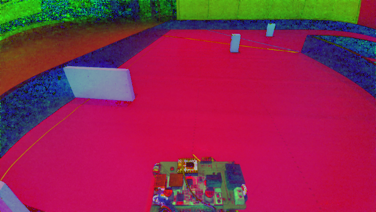
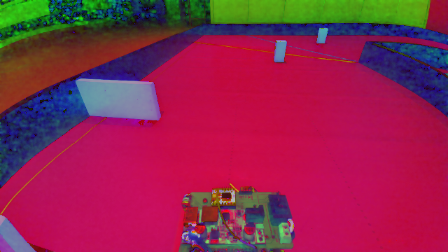
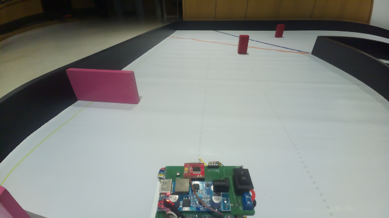
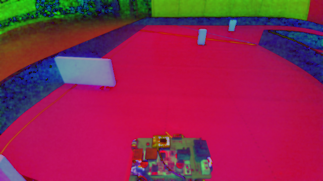

# Camera Image Filter Sweep ($d = 5$, Varying $\sigma_{\text{color}}$ & $\sigma_{\text{space}}$)

This document provides a side-by-side visual comparison of **Normal (BGR) Visual Images** and **HSV Space Images** captured live from the Raspberry Pi camera (`imx708_wide` sensor at native $640 \times 360$ resolution) with a fixed diameter of **$d = 5$** across a sweep of different **$\sigma_{\text{color}}$** and **$\sigma_{\text{space}}$** values.

---

## 📏 Filter Parameter Definitions ($d = 5$)

- **$d = 5$**: Diameter of each pixel neighborhood used during filtering.
- **$\sigma_{\text{color}}$ (Color Sigma)**: Controls how different colors are blended together across edge boundaries. Larger values mean colors that are farther apart will be mixed together.
- **$\sigma_{\text{space}}$ (Spatial Sigma)**: Controls the spatial distance over which pixels influence each other. Larger values mean pixels farther away will influence each other as long as their colors are close enough.

---

## 📊 Summary of $d=5$ Filter Grid

| # | Config Name | $\sigma_{\text{color}}$ | $\sigma_{\text{space}}$ | Description / Characteristics |
|---|---|---|---|---|
| 01 | **Unfiltered (Raw)** | - | - | Raw camera frame baseline |
| 02 | **Low / Low** | 15 | 15 | Very subtle filtering, maximum edge sharpness & detail |
| 03 | **Med Color / Low Space** | 50 | 15 | Strong color grouping, tight spatial locality |
| 04 | **High Color / Low Space** | 100 | 15 | Aggressive color blending, tight spatial blur |
| 05 | **Low Color / Med Space** | 15 | 50 | Strict color edge preservation, medium spatial blur |
| 06 | **Default Tuning** | 50 | 50 | **Current Production Tuning** (Balanced noise reduction) |
| 07 | **High Color / Med Space** | 100 | 50 | Strong color smoothing with medium spatial range |
| 08 | **Low Color / High Space** | 15 | 100 | Strict color boundaries with wide spatial smoothing |
| 09 | **Med Color / High Space** | 50 | 100 | Medium color smoothing with wide spatial range |
| 10 | **Ultra High Color & Space**| 150 | 150 | Maximum bilateral filtering effect possible at $d=5$ |

---

## 📸 Image Comparison Gallery ($d = 5$)

### 01. Unfiltered (Raw Camera Frame)

| Normal BGR Image | HSV Space Image |
| :---: | :---: |
|  |  |

---

### 02. $d=5, \sigma_{\text{color}}=15, \sigma_{\text{space}}=15$ (Low / Low)

| Normal BGR Image | HSV Space Image |
| :---: | :---: |
|  |  |

---

### 03. $d=5, \sigma_{\text{color}}=50, \sigma_{\text{space}}=15$ (Med Color / Low Space)

| Normal BGR Image | HSV Space Image |
| :---: | :---: |
|  |  |

---

### 04. $d=5, \sigma_{\text{color}}=100, \sigma_{\text{space}}=15$ (High Color / Low Space)

| Normal BGR Image | HSV Space Image |
| :---: | :---: |
|  |  |

---

### 05. $d=5, \sigma_{\text{color}}=15, \sigma_{\text{space}}=50$ (Low Color / Med Space)

| Normal BGR Image | HSV Space Image |
| :---: | :---: |
|  |  |

---

### 06. $d=5, \sigma_{\text{color}}=50, \sigma_{\text{space}}=50$ (Default Tuning)

| Normal BGR Image | HSV Space Image |
| :---: | :---: |
|  |  |

---

### 07. $d=5, \sigma_{\text{color}}=100, \sigma_{\text{space}}=50$ (High Color / Med Space)

| Normal BGR Image | HSV Space Image |
| :---: | :---: |
|  |  |

---

### 08. $d=5, \sigma_{\text{color}}=15, \sigma_{\text{space}}=100$ (Low Color / High Space)

| Normal BGR Image | HSV Space Image |
| :---: | :---: |
|  |  |

---

### 09. $d=5, \sigma_{\text{color}}=50, \sigma_{\text{space}}=100$ (Med Color / High Space)

| Normal BGR Image | HSV Space Image |
| :---: | :---: |
|  |  |

---

### 10. $d=5, \sigma_{\text{color}}=150, \sigma_{\text{space}}=150$ (Ultra High Color & Space)

| Normal BGR Image | HSV Space Image |
| :---: | :---: |
|  |  |
