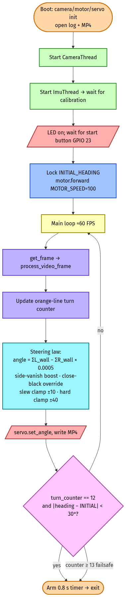
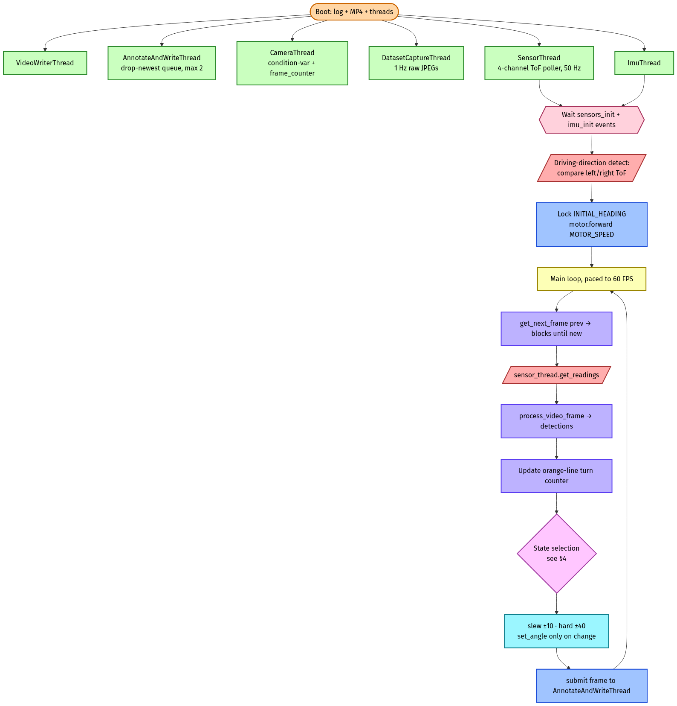
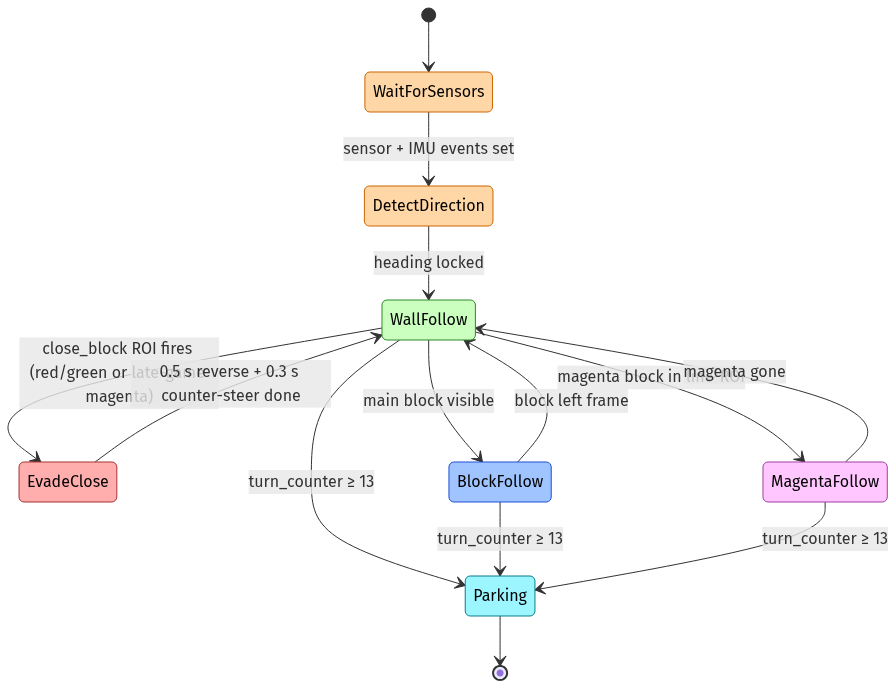
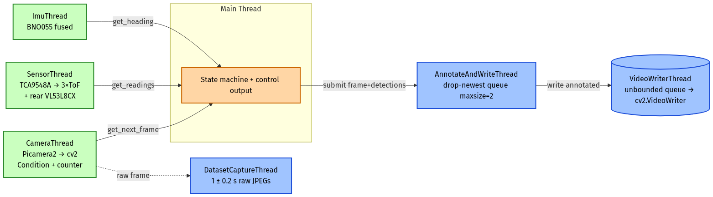

# Software Architecture & Obstacle Strategy — Team Greenbotics

This document covers the software for two competition modes:

| Mode | Entry point | Purpose |
|---|---|---|
| **Open Challenge** | `src/open_challenge/main.py` | Three full laps on an empty track. |
| **Obstacle Challenge** | `src/obstacle_challenge/main_v4.py` | Three laps while obeying red/green pillars and parking. |

Both share the same hardware-abstraction modules (`src/sensors/*`, `src/motors/*`) and the same overall architectural template — a multi-threaded sense/think/act loop with a single-writer state machine on the main thread. The obstacle code is a strict superset: same wall-following fallback, with object-aware behaviours layered on top.

The arena, pillar colours, parking-corridor geometry and lap rules are the ones defined in the WRO 2026 *Future Engineers — Self-Driving Cars General Rules* document. Concretely: a 3 × 3 m mat with movable inner walls, red and green pillars (50 mm × 50 mm × 100 mm) that must be passed on a fixed side (red → left, green → right), a magenta **parking block** marking the parking corridor, and orange / blue line segments on the floor that mark each turn.

---

## 1. Design goals and how they shaped the architecture

| Goal | Consequence |
|---|---|
| Run the perception/control loop at ≥60 FPS on a Raspberry Pi 5. | Camera I/O, IMU I/O, ToF I/O and video encoding each get their own thread so the main loop never blocks on a hardware read. |
| Never miss a frame at the moment a turn happens (the orange/blue line passes under the camera in only a handful of frames at 100% throttle). | A condition-variable handshake in `CameraThread` guarantees the main loop sees *every new* frame, not just the latest snapshot. |
| Be deterministic enough to debug after the fact. | Every run writes (a) the annotated MP4, (b) the full stdout/stderr log, and (c) a 1 Hz raw-frame dump for retraining/evaluation. All three are stamped into a fresh `obstacle/<timestamp>/` or `open/<timestamp>/` folder. |
| Fail soft when a sensor stalls. | Each sensor thread guards its own try/except and an `initialization_complete` `threading.Event` so the main thread can still arm even if one peripheral mis-init's. ToF readings are nullable (`None`) and consumers always test for that. |
| Be tunable by a non-author. | All tuneable variables — HSV ranges, ROI rectangles, area thresholds, gains, clamps, speeds, distances — live in a dedicated `config.py` per challenge, with a one-line comment next to each constant explaining what it is and what changing it does. Nothing tuneable is buried inside a function. *(The current code still has some constants at the top of `main_v4.py`; the planned cleanup is to migrate every one of them into `obstacle_challenge/config.py` alongside the open-challenge file that already does this.)* |
| Drive like a human, not jerkily. | The control law is **proportional everywhere it can be** rather than a discrete "if block then switch lane" state machine. Steering changes smoothly with the visual error, the slew-rate clamp limits how much the wheels can flick frame-to-frame, and `set_angle` writes are skipped when the angle hasn't changed — so the chassis tracks corners instead of chattering through them. See §1.1. |

### 1.1 Why proportional control instead of lane-switching

An earlier code base used at our nationals run treated the obstacle field as a discrete decision: *"if the next pillar is red, command the robot to the left lane; if green, command the right lane."* Lane-switching was driven primarily by gyro heading offsets relative to the corridor.

Two problems made that approach brittle:

1. **Gyro drift accumulates.** Even small BNO055 fusion error (a couple of degrees over a 3-minute run) makes "the left lane" stop meaning the same physical line. As drift built up, what the robot *thought* was the left side of the track gradually walked sideways relative to the actual track — so when it then committed to the lane offset, the chassis ended up driving into the wall, or straight into the very pillar it was trying to dodge. The recovery was a hard correction at the next pillar, which then clipped the pillar.
2. **We wanted it to drive smoothly.** A proportional, vision-based law works regardless of where exactly the next pillar is positioned — even a pillar shifted from a "typical" layout still produces a centroid we can steer off. And in the lane-switching code, a pillar that came into view late at the edge of the frame still triggered a full lane-change manoeuvre, which wasted time and distance every single time it happened. The current law just nudges the steering slightly because the geometric error is small, and only commits to a big swing when the error is big.

The current code drives almost everything off camera-derived geometric error (block centroid, ROI areas, magenta-block position). The camera is far less drift-prone than the gyro for *relative* steering, and a proportional law adapts continuously instead of waiting for a state change. The IMU is still used, but only for *absolute* heading on parking maneuvers and for capturing a single `INITIAL_HEADING` reference at start-up.

---

## 2. Module map

```
src/
├── motors/
│   ├── motor.py        # TB6612FNG drive: forward()/reverse()/brake()/cleanup() + encoder-PID move()
│   │                   # and an RPM-target closed loop (start_rpm_control()/set_rpm_target()/
│   │                   # get_measured_rpm()/stop_rpm_control()), used by main_v4's parking routines
│   └── servo.py        # Hardware-PWM steering (rpi_hardware_pwm, GPIO18): set_angle() (clamped)
│                       # and set_angle_unlimited() — there is no PCA9685 on this vehicle
├── sensors/
│   ├── camera.py       # Picamera2 wrapper: initialize(), capture_frame(), cleanup()
│   ├── bno055.py       # Adafruit BNO055 IMU: initialize(), get_heading(), cleanup()
│   ├── distance.py     # 4-channel TCA9548A multiplexed VL53L1X / URM09 / VL53L8CX driver
│   ├── encoder.py      # PIO quadrature encoder, used by motor.move() and the RPM control loop
│   ├── vl53l1x.py      # Lightweight VL53L1X helper
│   ├── vl53l8cx_python.py + libvl53l8cx_uld.so  # Python ctypes wrapper around the ST ULD C library
│   └── color_tuning.py # Live HSV trackbar tool — see §6
├── open_challenge/
│   ├── config.py       # HSV + ROI constants for open challenge
│   └── main.py         # Open Challenge entry point
└── obstacle_challenge/
    ├── main_v4.py                        # Obstacle Challenge entry point (constants live at top of file)
    ├── drive_straight_tune_target.py     # The diagonal-line tuning tool — see §6.3
    ├── test_sensor_threading.py          # ToF multiplexer regression test
    ├── sensor_test.py                    # Standalone all-channel ToF print
    ├── capture_dataset.py                # Manual button-triggered raw-frame capture (see §3.4) —
    │                                      # standalone tool only; the always-on in-lap dataset thread
    │                                      # described below was removed, see §2.4
    └── stats_reader.py                   # cProfile pstats reader for the .pstats files at repo root
```

### 2.1 Public interface of each hardware module

| Module | Symbols used by the mains |
|---|---|
| `motors.motor` | `initialize()`, `forward(speed)`, `reverse(speed)`, `brake()`, `cleanup()`, `move(distance_cm,…)`, `start_rpm_control(target_rpm, direction)` / `set_rpm_target(...)` / `get_measured_rpm()` / `stop_rpm_control()` (the closed loop `main_v4.py`'s `parking()`/`parking2()` actually drive with), `encoder` (the live `IncrementalEncoder` instance) |
| `motors.servo` | `initialize()`, `set_angle(a)` (clamped to ±40°), `set_angle_unlimited(a)` (used for parking maneuvers that need ±65°), `cleanup()` |
| `sensors.camera` | `initialize() -> bool`, `capture_frame() -> ndarray`, `cleanup()` |
| `sensors.bno055` | `initialize()`, `get_heading() -> float\|None`, `cleanup()` |
| `sensors.distance` | `initialise()`, `get_distance(channel) -> float\|None`, `cleanup()` — channels: `0` left URM09, `2` center VL53L1X, `3` right URM09, `-1` rear VL53L8CX on its own bit-banged I²C bus (see §2.3) |
| `sensors.encoder` | `IncrementalEncoder(pin_a)` exposing `.position` (counts) and `.distance` (mm) |

### 2.2 The encoder — `sensors/encoder.py`

The wheel encoder is **new for the 2026 season.** A quadrature encoder was physically present on the motor in 2025 but the software did not read it — speed was open-loop and parking distances were timed. For 2026 we wire it up properly so `motor.move(distance_cm, …)` can close the loop on actual travelled distance instead of seconds-of-throttle. See commit `65b7fc8` "Coded encoder, made changes to obstacle challenge to target a specific angle from block rather than a specific line".

The encoder is a quadrature pair driven through the **PIO** block on the Raspberry Pi 5's RP1 I/O controller, using `adafruit_rp1pio` + `adafruit_pioasm`.

**What "PIO" is.** PIO ("Programmable I/O") is a small, deterministic state-machine engine sitting next to the main CPU. You load it with a tiny assembly program (the `_program` block in `encoder.py` — the standard Raspberry Pi quadrature decoder, x4-edge) and from then on the state machine handles the encoder pulses entirely on its own, in hardware time, while the CPU does literally nothing. This matters because a quadrature encoder at our wheel speed produces several thousand edges per second; counting those edges in Python with interrupts would either drop counts under load or spend most of a core servicing them. PIO drops zero edges and costs zero CPU.

**Why this matters: Linux is not a real-time OS.** Raspberry Pi OS is a general-purpose Linux kernel — the scheduler is free to preempt our Python loop for tens of milliseconds at a time when it feels like servicing some other task. If we tried to count encoder edges from Python (or even from a Linux interrupt handler running on the CPU), every one of those preemption gaps would silently drop edges, and our reported distance would drift. The PIO state machine sits *outside* the Linux scheduler entirely — it ticks off the RP1's own clock, not the Cortex-A76's, so it cannot be preempted and **will never miss a count** regardless of how busy Linux gets.

**PIO is Pi-5-specific.** The RP1 chip exposing PIO only ships on the Pi 5. On a Pi 4 or earlier, `adafruit_rp1pio` will not import and `motor.move(...)` will fail. If anyone forks this onto an older Pi, the encoder path needs to be rewritten — typical replacements are a dedicated counter IC (e.g. an LS7366R over SPI), or a microcontroller (Pico, AVR) that does the counting and reports counts back over UART/I²C. None of those are drop-in.

We wrap the PIO state machine in `IncrementalEncoder` and bake in the gear ratio (20/28) and wheel diameter (62.4 mm) so consumers can read either raw counts (`.position`) or millimetres (`.distance`).

`motor.move(distance_cm, …)` runs a small PID loop that ramps speed up over `accel_dist_cm`, then proportionally decelerates as the encoder approaches the target — this replaced the old fixed timed-reverse, which used to drift by a couple of centimetres run-to-run. `main_v4.py`'s parking routines (`parking()`/`parking2()`, §5.8) go through the encoder a second way: `motor.start_rpm_control(target_rpm, direction)` holds a *target wheel speed* rather than a target distance, with `get_measured_rpm()` exposed for logging and `stop_rpm_control()` to hand control back to `forward()`/`reverse()`. Both paths read the same `IncrementalEncoder`; `move()` closes the loop on distance, the RPM API closes it on speed.

### 2.3 The VL53L8CX — its own bit-banged I²C bus, and a hand-rolled Python wrapper

The rear-facing wide-FoV ToF is an **ST VL53L8CX** (8×8 zone TMF). It is by far the most sensitive device on the robot and the only one for which we had to step outside the comfortable Adafruit / CircuitPython ecosystem.

**Why it has a dedicated bus.**
On our first PCB the VL53L8CX shared the main hardware I²C bus with the BNO055 and the TCA9548A multiplexer. It would not initialise reliably — typical symptom was `vl53l8cx_is_alive` returning 0 about half the time, or initialising successfully and then falling silent after a few seconds. We then tried hanging it off one channel of the TCA9548A; same symptoms. The sensor is fussy about both bus capacitance and timing, and once any of the other I²C devices are on the same physical wires you start losing the start/stop margins it expects.

The fix: give the VL53L8CX its own I²C bus, exposed to userspace as `/dev/i2c-2`. With the sensor alone on that bus, init became a single-attempt operation, and runtime failures dropped sharply.

> **Devansh — the exact bus configuration is still TBD on your end.** Please send the `dtoverlay=` line in `/boot/firmware/config.txt` and the SDA/SCL GPIO pins so §9.2 can be filled in. External pull-ups are confirmed required (see §9.2).

**Why a hand-rolled Python wrapper.**
There is no maintained Python library for the VL53L8CX. ST publishes a C "Ultra-Lite Driver" (ULD) but the only language bindings are C/C++. So `src/sensors/vl53l8cx_python.py` is a `ctypes` wrapper:

* The ULD is built into a shared library `libvl53l8cx_uld.so` (checked in alongside the wrapper).
* The wrapper declares the exact `VL53L8CX_Configuration` and `VL53L8CX_ResultsData` C structs as `ctypes.Structure`s, and pins `argtypes` / `restype` for every ULD entry point we call (`vl53l8cx_init`, `vl53l8cx_set_ranging_frequency_hz`, `vl53l8cx_start_ranging`, `vl53l8cx_check_data_ready`, `vl53l8cx_get_ranging_data`, `vl53l8cx_set_resolution`, `vl53l8cx_comms_init`, `vl53l8cx_comms_close`).
* The bus path used by the C side is set at compile time of the C library — we patched the ULD's `platform.c` to open `/dev/i2c-2`. **The C library has to be rebuilt if the bus path changes.**
* On the Python side we provide a clean `VL53L8CX(i2c_bus_path="/dev/i2c-2")` class with `start_ranging()`, `stop_ranging()`, `get_data()`, and a `resolution` property. The 4×4 mode is used in production because the 8×8 mode is too slow at our 60 Hz target.
* `distance.py` consumes `get_data()` and reduces the 4×4 grid to a single distance: it picks the eight middle-column zones, keeps only ones whose `target_status` is 5 (range valid) or 9 (valid with reduced confidence), and returns the *minimum* — i.e. the closest object behind the robot. This is exactly the signal the parking routines need.

> **Heads-up if you're cloning this repo:** the prebuilt `libvl53l8cx_uld.so` is checked into `src/sensors/`, so you do not need to build the C library yourself unless the I²C bus path or the ULD version changes. If you do need to rebuild, the wrapper code in `vl53l8cx_python.py` is the canonical reference for which symbols, struct layouts and bus path the build must match — read it alongside ST's ULD source.

### 2.4 Why we considered YOLO and chose not to

The two largest perception failure modes on the WRO mat are:

1. **Reflections** off the mat (the printed playing surface is glossy enough that overhead lights project a bright streak that drifts as we drive).
2. **Shadows** from our own chassis and from the inner walls, which falsify the wall mask near corners.

We seriously considered training a small YOLO classifier on the captured-frame stream (see §3.4 / `capture_dataset.py`) to give us shadow-robust pillar and wall labels. We decided against it for two reasons:

* **Annotation cost.** Even a couple of hundred labelled frames is several hours of bounding-box work, and we'd need many hundreds to cover the lighting variations across the venues we test in.
* **Inference speed.** YOLO on a Pi 5 CPU will not hit our 60 FPS budget. Running it at a useful frame rate would have meant adding a Hailo / Coral AI HAT, which is extra hardware, extra cost, and a meaningfully different power profile.

What we did instead: lean *very* heavily on tight HSV ranges, carefully placed ROIs, and the field-aware priority state machine in §4 so that classifier-grade discrimination (e.g. between a green pillar and a green-tinted shadow on the floor) is rarely required.

Having decided against YOLO, we then removed the always-on `DatasetCaptureThread` from `main_v4.py` too — the same two reasons that killed the classifier idea (annotation cost, on-Pi inference speed) meant the archive it was building had no near-term use, so it wasn't worth the extra thread, the per-lap disk writes, or the SD-card wear during every competition run. The standalone `obstacle_challenge/capture_dataset.py` tool (button-triggered, off the hot path) is kept around for deliberate one-off captures if we ever want to revisit this.

---

## 3. Top-level flow

### 3.1 Open Challenge — `src/open_challenge/main.py`



*Source: [`diagrams/open_challenge_flow.mmd`](diagrams/open_challenge_flow.mmd)*

### 3.2 Obstacle Challenge — `src/obstacle_challenge/main_v4.py`



*Source: [`diagrams/obstacle_challenge_flow.mmd`](diagrams/obstacle_challenge_flow.mmd)*

**Frame budget.** The main loop sleeps to a 1/60 s tick. Measured inner-loop work (HSV + contours + steering) is well under 16 ms on a Pi 5; the throttle exists so `prev_frame_counter` arithmetic is stable and the MP4 stream stays at a constant fps.

### 3.3 Driving-direction detection (obstacle)

Before forward motion starts the robot doesn't know whether it's set down to drive clockwise or counter-clockwise around the inner walls. The starting square is placed against an outer wall (parking corridors are always against the outer walls, by rule), so whichever side ToF reads *closer* tells us which side the outer wall is on, and that determines the driving direction:

* `left < right` ⇒ outer wall is on the **left** ⇒ **clockwise**,
* otherwise ⇒ outer wall is on the right ⇒ **counter-clockwise**.

`INITIAL_HEADING` is captured immediately after this decision and every subsequent absolute-heading reference is `INITIAL_HEADING ± delta`.

### 3.4 Frame capture and the dataset stream

`main_v4.py` does not run any capture thread during a competition lap — see §2.4 for why the earlier
always-on `DatasetCaptureThread` was removed. The one remaining capture path is a standalone tool:

* **`obstacle_challenge/capture_dataset.py`** — initialises the camera, then waits on the start button (GPIO 23): each press writes one raw frame. Used for deliberate "I want a clean shot of *that* lighting condition" capture between practice runs, off the hot path.

---

## 4. State machine

The obstacle main loop is a **flat priority state machine** evaluated every frame. We chose a flat machine over a hierarchical one because:

* Every "state" is one branch of an `if/elif/else` — there's no implicit transition graph to forget about.
* The branch is fully redetermined from the *current* frame's detections + sensor readings. There is essentially no inter-frame state except the orange-line debouncer, the close-block-evasion timer (`time.sleep`-blocking), the slew-rate filter, and the turn counter.
* This bounds the worst-case behaviour: if perception lies for one frame, the *next* frame's decision is unaffected by the lie.

### 4.1 States and transitions



*Source: [`diagrams/state_machine.mmd`](diagrams/state_machine.mmd)*

`perform_initial_maneuver()` runs once at start-up and gets the robot *out* of the parking pocket — it is the mirror of `parking()` / `parking2()`, which get the robot back *in* at the end of the run. It inserts itself between "lock INITIAL_HEADING" and "motor.forward(MOTOR_SPEED)" in §3.2 and hands control to the main loop once the chassis is clear of the pocket and pointed down the corridor.

### 4.2 Why these priorities

The order **close-block → block → magenta → wall** is not arbitrary:

1. **Close block first.** By the time a pillar lands inside `close_block_roi` (`y=230..240`, `x=250..390`), it is ~10 cm ahead and we cannot use a smooth steering law to dodge it — we *must* reverse. Failing to short-circuit here causes a wall scrape.
2. **Main block second.** A visible block defines the next obstacle to obey, even if walls are also visible. We always prefer the geometric block-target law over the wall law because the wall law is direction-agnostic (it would happily run into a green pillar if it widened the right-side wall area).
3. **Magenta third.** In the obstacle game the magenta parking block only appears at the parking corridor; it should not steal control on a straight section.
4. **Walls last.** The safe default. If we see nothing useful, balance the corridor.

---

## 5. Algorithms

### 5.1 Computer vision — `process_video_frame`

Both mains run the same skeleton:

```
(blur 1×7 — vertical-only Gaussian; see "directional blur" below)
   │
   ▼
BGR → HSV  (LAB optionally available via USE_LAB; defaults to HSV)
   │
   ├── inRange × {RED1, RED2, GREEN, MAGENTA, ORANGE, BLUE, BLACK}
   │      └── RED is two HSV slices joined: 0–5 and 174–180 (hue wrap)
   │
   ├── per-ROI bitwise_and with pre-computed roi_mask_*
   │      (masks are built once at module import — no per-frame allocation)
   │
   ├── pure_black_mask = black AND NOT (red OR green OR blue)
   │      └── prevents red/green/blue pillars from leaking into the wall mask
   │
   ├── close_black = pure_black OR magenta, masked by the front strip ROI
   │      └── magenta on the floor is treated as "thing in front"
   │          for the sharp-turn override
   │
   └── per category: cv2.findContours → max(area) → centroid via moments
```

**HSV vs LAB — why HSV by default.** Hue is a 1-D circular variable; the WRO mat's colours separate cleanly along it under typical gym lighting. Competition lights vary in colour temperature, but HSV's `S` and `V` channels absorb most of that drift while `H` stays stable. We *do* keep a parallel LAB pipeline behind the `USE_LAB` flag — LAB separates the WRO red and orange more reliably under very warm tungsten lighting where HSV's red wraps and bleeds into orange. We pay a constant conversion cost in either mode, so the choice is purely a tuning question, and HSV is easier to reason about with the trackbar tool, so HSV is the default.

**Directional blur — why `1×7` and not `7×7`.** The blur kernel is one column wide and seven rows tall. We blur along the *rolling-shutter scan direction* to suppress per-row aliasing artefacts (the picamera2 sensor produces visible row noise at the exposures we run). We deliberately do *not* blur horizontally because at top throttle the robot is turning fast enough that the scene already smears horizontally between row 0 and row 359 — adding horizontal blur on top of motion blur destroys the small features we rely on (orange line edges, pillar edges) and measurably reduces detection accuracy. Vertical-only blur removes the noise we have without amplifying the noise we can't avoid.

**Pre-computed ROI masks.** Allocating `np.zeros((360, 640))` and drawing a rectangle every frame costs ~0.4 ms; doing it once at import costs zero. Over a 3-minute run that is ~5 000 saved allocations. See §5.7 for the rest of the optimisation work.

**Sliced frame `y=100..290` on the obstacle path.** The top 100 px is sky/ceiling and the bottom 70 px is the chassis nose; both produce only false positives. Slicing the source array before any conversion saves the entire HSV/blur cost on those rows (~30 % of the frame).

**RED is two ranges.** OpenCV stores hue ∈ [0, 180]; red wraps the seam. We OR `[0,5]` with `[174,180]`. In LAB mode this is unnecessary (red is contiguous in `a*`), so the code branches on `USE_LAB`.

**Black needs a low S, not a low V.** When tuning the BLACK range in `color_tuning.py`, the rule is: **let V (brightness) go all the way down, let H (hue) span the full 0–180 range, but keep S (saturation) low** — i.e., black is "anything dark *and* close to grey." If you instead pull V high and leave S wide, the dark blue patches printed on the WRO mat and the dark sides of red pillars in shadow get classified as black, which then either widens the wall mask into the pillars or makes the wall-following law see phantom walls in the middle of the corridor. The `pure_black_mask = black AND NOT (red OR green OR blue)` step is a second layer of defence on the same problem.

### 5.2 IMU heading — `bno055` + `ImuThread` + `steer_with_gyro`

The BNO055 returns absolute heading (0–359°) at ~100 Hz. `ImuThread` polls in a tight loop and exposes `get_heading()` behind a lock. `INITIAL_HEADING` is captured exactly once on the first non-`None` reading after the start button.

The proportional controller `steer_with_gyro(current, target, kp)` is a single P-loop with three subtleties:

1. **Wrap handling.** `error = target − current`; if `error > 180` subtract 360, if `< −180` add 360. This is what makes "350° → 10°" yield `+20°`, not `−340°`.
2. **Gain selection.** `kp = 0.85` is the loop default for steering during straight runs; `kp = 1.0–2.0` is used for tight angular maneuvers (parking, return-to-heading) where overshoot is acceptable but slowness is not. Higher `kp` is fine here because the servo itself is rate-limited (~250 °/s), so the controller saturates at the clamp before it can oscillate visibly.
3. **Output clamp.** Always clipped to ±45° for normal drive and ±60° for `set_angle_unlimited` parking maneuvers (the steering linkage's hard limit).

### 5.3 Wall-following law

Both mains compute, every frame:

```
left_area  = Σ area of contours in ROI {wall_left, wall_inner_left}
right_area = Σ area of contours in ROI {wall_right, wall_inner_right}
```

**The four ROIs**, not two, are deliberate. They split each side of the frame into an **outer** band and an **inner** band — the names refer to where the band sits *in the frame*, not which physical wall they look at. The **outer ROIs** (`x∈0..135` and `x∈505..640`) sit near the *frame edges* and feed the wall-balancing law as a simple area difference. The **inner ROIs** (`x∈140..240` and `x∈400..500`) sit *closer to the centre of the frame* — they detect a wall that is dead ahead of, and very close to, the chassis, regardless of which physical wall (corridor inner or outer) is producing it.

The reason that mattered enough to be its own ROI: imagine the robot has been hugging the corridor's inner wall, then the corridor opens into a corner and the inner wall slides out of view. If the outer wall is also far away, and there's no block in frame to steer off, the wall-balancing law has nothing to act on — the area difference goes to zero and the steering goes straight, which historically meant the robot ploughed across the corner into whichever wall it was closest to. The inner-frame ROI catches exactly this case: the wall it's still close to lands in the inner band of the frame, the area there grows past the threshold, and the close-black override (§5.3 below) commits to a sharp turn away from it before contact.

```
if   left  < 100 and right + inner_right > 100:  right_area = right_area*2 + 25 000
elif right < 100 and left  + inner_left  > 100:  left_area  = left_area*2  + 25 000
```

The boost handles the **corner case** in the literal sense: when one *outer* side ROI suddenly drops below 100 px while the opposite side still sees a wall, the robot has just started rounding a corner — one wall has slid out of view. We amplify the remaining wall so the steering signal forces the robot to *turn harder into the corner* instead of collapsing to ~0° and ploughing across the inside line.

```
angle = (left_area − right_area) × gain
        gain = 0.0005 (open) | 0.001 (obstacle, where the signal is also halved by the slice)
```

**Close-black override.** If `Σ area in close_x ROI > 3000`, a wall is square in front of us and proportional control will hit it. We jam the angle to ±35° toward whichever side has more *space* (open challenge: less wall area; obstacle: a fixed sign matched to `driving_direction`). This is the only place the wall law ignores its own input.

### 5.4 Block-following law (obstacle only)

Red (left-pass) and green (right-pass) pillars are obeyed using a **target-line geometry**, not a centroid-error. Each colour is assigned a virtual *origin* at the bottom of the frame (`(24, 360)` for red, `(616, 360)` for green) and a virtual *target* near the top centre (`(320, 0)`). The "ideal" angle from origin → target is precomputed:

```
RED_IDEAL_ANGLE   = atan2(320 − 24,  360 − 0)  ≈  +39.4°
GREEN_IDEAL_ANGLE = atan2(320 − 616, 360 − 0)  ≈  −39.4°
```

At runtime, given the block centroid `(block_x, block_y)`:

```
current_angle = atan2(block_x − origin_x, origin_y − block_y)
servo_angle   = (current_angle − IDEAL_ANGLE) × 1.5
```

Geometrically this is "steer so the robot's would-be path from a fictional rear corner *just clears* the pillar on the correct side."

**Why an angle, not a fixed line on the floor.** An earlier version of the block-following law treated the pillar as something the robot should "line up with" along a single straight target line drawn down the camera image. That worked tolerably when the pillar was at one specific distance from the chassis, but failed at every other range:

* When the pillar was *close* to the robot, the straight-line target steered the chassis right alongside it — too close, and the chassis would clip the pillar.
* When the pillar was *far* from the robot, the same straight-line target steered the chassis several lane-widths away from it — wasting time and distance, and on a tight track running the chassis into the opposite wall before the pillar even came into close range.

So we built a calibration script (`drive_straight_tune_target.py`, §6.2) that drives the robot dead straight past a pillar while tracking the pillar's centroid frame by frame. The path the centroid traces across the image is the camera's *empirical* projection of "a fixed point in the world, at varying distances ahead, moving past the chassis." That path is **not a vertical line and not even a straight line in any naïve sense** — because of the camera's mounting angle, it's a diagonal whose horizontal offset from frame-centre depends on how far the pillar is. Concretely: **the closer the pillar, the further from frame-centre we want the centroid to be**, and the script gives us the exact relationship.

The angle-based target law in this section is what falls out of that calibration: instead of "drive so the centroid is at a fixed `x`", it's "drive so the angle from the chassis-corner origin to the centroid matches the angle the calibration script measured." That single change made the chassis pass cleanly at every range we tested.

We need two annotated camera frames here to make this concrete:

1. **Old:** the straight-line target overlaid on a frame, with the pillar at three different distances, showing the chassis sitting too-close-then-too-far.
2. **New:** the diagonal target line from the calibration script overlaid on the same scene, showing how the steering target follows the pillar at every range.

> *(Photos pending — see §10 items 5, 6, 9.)*

**Inner-wall guard — edge case.** If the robot is approaching the corner *that follows* the pillar, `wall_inner_right_size > 3000` (or `wall_inner_left`) means a wall is closing in fast in the inner band of the frame. In that geometry there's a real risk that following the block-target angle will swing the chassis into the wall while it tries to clear the pillar. The angle is then clipped to a one-sided range (`[−45, −10]` for red, `[15, 45]` for green) so the steering can only turn *further away from the wall* — never further into it.

**Magenta-coordinated path — edge case.** When a magenta parking block is also visible at roughly the same `y` as the pillar (within 70 px), the steering target becomes the midpoint between the magenta block and the pillar. The intuition: the magenta parking block tells the robot "you have to thread between *me* and the green/red pillar to enter the parking corridor." The block-only target would clip one or the other; a target halfway between them threads the gap.

### 5.5 Close-block evasion

When a red/green pillar enters the *close* ROI band (`y=230..240`, area > 15 px — the threshold is intentionally low because the band is only 10 px tall), proportional steering cannot save us. We execute a fixed 3-step maneuver:

```
1.  servo.set_angle(±25..30°)         # turn away from pillar
2.  motor.reverse(60); sleep(0.5 s)
3.  motor.forward(60)
4.  servo.set_angle(∓ same)           # straighten and re-pass
5.  sleep(0.3 s)
6.  motor.forward(MOTOR_SPEED)        # resume
```

Magenta close-blocks are only treated as evasion targets *after* `t > 5 s` from `run_start_time` — early-game magenta in the close band is the parking-corridor entry block, which we do not want to dodge.

### 5.6 Turn counting

Every frame the line ROI (an 80×40 strip just below the camera horizon) is queried for orange floor-line. The detection is fed into a 4-deep `deque`, and a turn is counted **only** when the pattern is `[False, True, True, True]` — i.e., a fresh rising edge that has *persisted* for three frames. After a count, a 50-frame cooldown (`ORANGE_COOLDOWN_FRAMES`) is applied; this is **the minimum gap we expect between two consecutive orange lines on the track**, sized so the robot has cleared the line and physically driven into the next track section before another orange detection is allowed to count. Without it, a single orange line that lingers in the ROI for ~10 frames at top speed could be counted twice.

The 3-of-4-frame debouncer in front handles the *opposite* direction of error: a single-frame orange detection (specular highlight, distant cone, dataset-capture shutter artefact) is rejected before it ever reaches the cooldown logic.

### 5.7 Image-processing optimisations

The obstacle perception path runs in well under 16 ms on a Pi 5 — comfortably inside the 60 FPS budget — and the open-challenge path is faster still. None of the individual optimisations below is dramatic on its own, but together they turn what was originally a ~25 FPS pipeline (the season's first working version) into a 60 FPS one without changing the algorithm. The general principle behind every entry: **do the cheap reject as early as possible, and avoid every byte of work that depends on data you don't actually need.**

* **Frame slice before colour-space conversion.** We crop the frame to `y=100..290` *before* the BGR→HSV call. cvtColor is the single most expensive call in the pipeline and cropping first cuts ~30 % of the work it has to do — the top 100 px is sky/ceiling, the bottom 70 px is the chassis nose, both produce only false positives. Cropping after cvtColor would mean we did the conversion on those rows and threw it away.
* **Pre-computed ROI bitmasks.** All ROI rectangles are turned into `uint8` bitmasks once at module import. Every frame we just `cv2.bitwise_and` against them — no per-frame `np.zeros((360, 640))` allocation, no `cv2.rectangle` draw. Each saved allocation is ~0.4 ms; over a 3-minute run that's ~5 000 saved allocations, or about 2 s of cumulative runtime.
* **Single `1×7` blur.** Replaces a `3×3` (or `5×5`) Gaussian. A separable kernel along one axis is roughly half the work of an isotropic 2-D kernel of the same support, and as discussed in §5.1 it also happens to be the *correct* blur to do on a rolling-shutter sensor at our throttles.
* **`countNonZero` early-out.** A `findContours` call on a sparse mask is dominated by a fixed setup cost regardless of how many contours come out. Most colour masks are empty for most of the run (no red pillar in frame ⇒ red mask is all zero), so we test `cv2.countNonZero(mask) > 0` first and skip `findContours` entirely on empty masks. This saves measurable time per frame because at any given instant the *majority* of the eight colour masks are empty.
* **Skip the rest of a category once we already have a winner.** Several detection paths sort contours by area and break out of the loop once they've found one above threshold — there's no need to keep scanning smaller blobs once the largest one is committed.
* **Operate on `lores` stream, not the full sensor frame.** The Picamera2 configuration declares both a 2304×1296 main stream (for human-readable raw captures) and a 640×360 `lores` stream (for the perception pipeline). Perception runs on the 640×360 stream; the dataset capture pulls from `lores` too. We never decode the 2304×1296 frame in the hot path.
* **Drop-newest annotation queue.** Drawing the contour overlay onto the MP4 is expensive (`cv2.drawContours` per category, text labels, ROI boxes, target lines). Routing it to its own thread with a `maxsize=2` drop-newest queue means perception never waits on rendering. If the encoder lags, we lose annotation frames, never control frames.
* **Annotate is split from encode.** `AnnotateAndWriteThread` is the CPU-bound drawing thread; the actual `cv2.VideoWriter.write()` runs in `VideoWriterThread` so disk I/O never blocks the OpenCV draw.
* **`servo.set_angle` only on change.** Re-issuing the same hardware-PWM duty cycle every frame still costs a syscall and generates tiny jitter on the line. Skipping the write when the *integer* angle has not changed eliminates that jitter and stops the steering linkage twitching at angles that would otherwise round-trip-the-same.
* **Constants resolved at import.** All ROI rectangles, HSV bounds and pre-computed angles (e.g. `RED_IDEAL_ANGLE`) are module-level constants — they're computed exactly once at import time, never re-derived per frame.
* **No allocation in the inner loop.** Numpy temporaries inside the per-frame path are reused where possible; output arrays are passed in via `dst=` arguments to the OpenCV calls that support it. We do not re-allocate the HSV image or the per-colour masks every frame.

> **Devansh — the `loop_performance.pstats` and `open_challenge.pstats` files at the repo root predate the current code path; the numbers in them aren't representative of what `main_v4.py` runs today.** I'd like a fresh `cProfile` capture from one full obstacle run on the latest code and one full open-challenge run. The simplest way: wrap the `main()` body in `cProfile.Profile()` / `pr.dump_stats('loop_performance.pstats')`, do a normal run, then `python -m src.obstacle_challenge.stats_reader loop_performance.pstats`. Paste the top 10 cumulative-time functions back to me and I'll turn the qualitative bullets above into a real numeric table.

### 5.8 Parking (`parking()` and `parking2()`)

The parking routines are entered after the lap counter reaches the parking lap. `parking()` covers the clockwise case and `parking2()` covers the counter-clockwise case; they are dispatched from the main loop based on `driving_direction`. Both follow the same five-step plan:

**Step 1 — drive into the corridor that contains the parking blocks.** The robot enters the lap-final straight as normal, but instead of triggering another wall-follow loop it commits to the corridor that holds the two magenta parking blocks (these two blocks together mark the parking-pocket entry, per WRO 2026 rules).

**Step 2 — reverse so the chassis back faces the same outer wall as the parking blocks, then back into that wall.** A short forward-turn lines the chassis up to (INITIAL_HEADING ± 170°), then a reverse along that target heading drives the back of the chassis into the outer wall — the rear ToF watches for "wall ≈ 160 mm" and stops the reverse there.

**Step 3 — turn so the robot is parallel to that outer wall, then drive parallel to it using the top edge of the magenta block as the reference.** This is **camera-based wall-following, not ToF-based** — the controller scans the bottom strip of the frame for the magenta block, fits an average `y` of the block's *top edge*, computes the error against a target row, and feeds it into a P-loop on the steering. The advantage over ToF wall-following on this leg is that the magenta block sits exactly where we want to be relative to it, so an error of zero is automatically the correct lateral position; ToF would only know how far we are from the wall, not whether we're aligned with the parking-corridor entry.

**Step 4 — count magenta passes, turn after the second.** There are two magenta blocks in this corridor. The block-tracker increments a counter on each one, using a Schmitt-trigger style edge detector: a block's area peaks *twice* during a single pass (rising as it enters the field of view and falling as it leaves), so a naive peak detector would miscount. The state machine is "first rise → fall below low threshold → next rise = +1", which edge-triggers exactly once per physical block regardless of speed. After the **second** magenta block has been counted, the robot commits to the parking-pocket manoeuvre.

**Step 5 — manoeuvre into the parking pocket.** A reverse-turn at `set_angle_unlimited(±55..65°)` swings the chassis into the pocket, bounded by either rear ToF or by heading reaching `INITIAL_HEADING + 180°`. A two-phase shimmy then squares the chassis up: forward until centre-ToF < 75 mm, reverse until back-ToF < 65 mm, leaving the robot fully inside the painted pocket.

> **Devansh — needs a parking diagram and ideally a short GIF.** The five steps above are numbered specifically so a diagram or a frame-by-frame GIF can label each phase ("1", "2", …, "5") and the prose stays in sync. Please grab a top-down phone video of one successful parking run and pull a representative frame for each step, plus a schematic top-down diagram that shows the chassis position/heading at the start of each step. Add them under §10 once produced.

---

## 6. Tuning workflow

The robot has three persistent tuning surfaces: **HSV ranges**, **ROI placement**, and **gain constants**. Each has its own dedicated tool.

### 6.1 HSV tuning — `src/sensors/color_tuning.py`

Trackbar-based live HSV picker. Workflow:

1. Power up the robot on the actual mat under the actual lighting we'll run in.
2. Run `python -m src.sensors.color_tuning`. A window appears with H/S/V low/high trackbars per colour.
3. Pan the robot across the mat so each pillar / line / parking block passes through the camera at the angles we'll see in the run.
4. Sweep the bounds until the mask for each target is **contiguous within the target** and **black everywhere else**. The single most common mistake is making `S_low` too low — that lets the floor reflection through the red mask.
5. Copy the printed numbers into the `HSV_RANGES` block at the top of `main_v4.py` and the matching block in `open_challenge/config.py`.

### 6.2 Camera-angle / line-shape tuning — the diagonal-line discovery

`src/obstacle_challenge/drive_straight_tune_target.py` is more interesting than its name suggests. The script:

* drives the robot forward in a straight line under gyro hold, while
* tracking the centroid of the largest red/green block frame-by-frame, then
* fits a least-squares line through those centroids and renders it onto a final frame (`final_extrapolation.png`).

What this surfaces: **the path a pillar traces across the camera image as the robot drives straight past it is not a vertical line.** The camera is tilted *forward* (it points slightly down so it can see the floor immediately ahead of the chassis) — it is not tilted to either side of the chassis centerline. Even with a perfectly centred camera, the forward tilt is enough that a pillar which is laterally fixed in the world appears to drift horizontally across the frame as it moves toward the bottom. The "line" extrapolated by `cv2.fitLine` comes out diagonal.

The block-following law in §5.4 originally assumed the target line was vertical (target = `(320, 0)` → directly overhead). With that assumption, when the robot tried to "line up with the block" it would actually curve around the block instead of running parallel to it. Replacing the vertical target with the **diagonal** the script measured — i.e. setting the virtual target at the `(x, 0)` actually predicted by the fitted line — made the chassis run parallel to the pillar, which is what we want.

The `RED_TARGET_X = 320` / `GREEN_TARGET_X = 320` constants in `main_v4.py` are the result of this calibration. If the camera mount changes, re-run `drive_straight_tune_target.py`, eyeball `final_extrapolation.png`, and update those constants.

### 6.3 Gain tuning

| Parameter | How it was tuned |
|---|---|
| `MOTOR_SPEED = 100` (percentage of full throttle; 100 = full speed) | Tuned upward from 80 to 100 in steps of 5. At each step we re-checked whether the proportional gains still produced a clean track — if the chassis started to oscillate or overshoot we re-tuned the gains *before* taking the next speed step. The final value sits one notch below the speed at which we could no longer keep the loop stable, i.e. 100% is full speed and we're running right at the edge of what the controller can hold. |
| Wall-law gain `0.0005 / 0.001` | Started at 0.0001; doubled until the robot tracked the corridor without visible oscillation; halved by 30 % for safety margin. |
| Block-law gain `1.5` | Hand-tuned on a 6-pillar mock track with two pillars per side, chosen so the chassis exits each pillar with ~5 cm clearance to the next-likely pillar position. |
| `ORANGE_COOLDOWN_FRAMES = 50` | The minimum time we expect between two consecutive orange lines on the track; set so the robot has driven past the just-counted line and into the next track section before another count is allowed. |
| `WALL_THRESHOLD = 200 mm` (direction sense) | Half of the 1 m corridor width minus the chassis half-width minus error margin. |
| Close-block evasion timings (0.5 s reverse, 0.3 s forward) | Set against a stop-watched mock pillar: smallest reverse that re-opens the close ROI, smallest forward that re-acquires the next pillar. |
| Slew-rate clamp `±10°/frame` | Caps how much the steering angle can change frame-to-frame, **to prevent jerky motion** — not because the linkage can't physically move further. A small frame-to-frame change keeps the chassis tracking through corners smoothly instead of snapping back and forth as perception noise fluctuates. |
| Parking sub-step distances (160 mm, 65 mm, etc.) | Trial and error on the actual parking lot: drove the routine, watched where the chassis ended up, adjusted, repeated until each step landed the chassis where the next step expected it. |

### 6.4 What we measure on every run

Every run leaves a self-contained folder `obstacle/<timestamp>/` (or `open/<timestamp>/`) with:

| File | Used for |
|---|---|
| `obstacle.mp4` | Visual debug — annotated ROIs, contours, target lines, FPS, frame counter, turn counter, computed angle. |
| `obstacle_output.txt` | Every `print(...)` in the run, in order: state transitions, ToF readings during parking, heading deltas, turn counter increments. |
| `/dataset/<runtag>_NNNNNN.jpg` | Raw frames for offline regression of HSV ranges and ROI placement. |

---

## 7. Threading & data flow



*Source: [`diagrams/threading.mmd`](diagrams/threading.mmd)*

* **Why `Condition` not `Lock` in `CameraThread`.** Polling for "is there a new frame?" wastes Pi cycles. The condition variable lets the main thread sleep until there *is* one.
* **Why a `frame_counter` in addition to the buffer.** Without it, two consecutive `get_frame()` calls could return the same array and we'd run perception twice on the same pixels.
* **Why drop-newest in the annotator queue.** If we drop oldest, the annotated MP4 desyncs from the live state. If we block, the control loop stalls. Drop-newest preserves both real-time control and a representative (if sometimes-skipped) recording.
* **Why a separate `VideoWriterThread` *and* `AnnotateAndWriteThread`.** Annotation is CPU (drawing contours); encoding is I/O. Separating them lets the OpenCV draw run while the encoder writes the previous frame.
* **Where there are no locks.** The slew-rate filter, turn counter, and `prev_angle` are all main-thread-local — no synchronization needed.

---

## 8. Edge cases & how they are handled

| Edge case | Symptom if unhandled | Handler in code |
|---|---|---|
| BNO055 fails to come up | Robot never starts | `ImuThread.run` catches and still sets `initialization_complete` so main can exit cleanly via the watchdog; LED stays off. |
| ToF channel returns `None` for many consecutive reads | Stale value drives steering | `SensorThread` increments `consecutive_none[ch]`; reading code in `parking*` and the main loop always tests `if dist is not None` before use. |
| Wasting cycles processing an already-processed frame | Main loop runs perception twice on the same pixels and reacts twice to the same scene | `CameraThread.get_next_frame` blocks on a `Condition` until `frame_counter` advances, so each frame is consumed exactly once. |
| Two pillars in view at once | Robot drives at the centroid of both = wall | `process_video_frame` keeps the *lowest* main block (max `y`) — the closest one. The far block is ignored until the near one is passed. |
| Red pillar glint masquerading as orange line | False turn count | Orange detection is gated by `ORANGE_MIN_AREA = 20`, then by the 3-of-4-frame debouncer, then by a 50-frame cooldown. Three independent filters. |
| Pillar suddenly disappears (passed) — sharp servo flick toward the wall | Robot wobbles into wall | The angle slew-rate clamp `[prev−10, prev+10]` caps how much steering can change in a single frame, smoothing the transition out of block-following back into wall-following. |
| Close-black ROI fires inside a corner because two walls converge | Robot slams reverse | Same priority order: a visible block consumes the frame *before* the close-black branch runs (close-black only fires inside the `else` arm where no block is visible). |
| About to clip the wall while passing a pillar | Robot rounds a pillar correctly but the wall closes faster than the steering can track and the chassis brushes the wall | Inner-band guard in §5.4: when `wall_inner_right_size > 3000` (or left), the block-following angle is clipped so it can only turn *further away from the wall*, never further into it. |
| Magenta block visible alongside a pillar at the parking-corridor entry | Robot dodges the pillar correctly, then hits the magenta block — or vice versa | Magenta-coordinated path in §5.4: when both are at similar `y`, the steering target becomes the midpoint between them, threading the gap. |
| Magenta corridor mis-firing as a turn | Turn count overshoots | The orange and magenta masks are mutually exclusive in HSV (`H≈10` vs `H≈165`); the `pure_black` mask also subtracts magenta so it cannot become a "wall." |
| Chassis on a slight grade — IMU heading drifts during a long straight | Crab-walks into wall | All gyro setpoints are *relative* to `INITIAL_HEADING` captured at button press; we never use absolute compass headings. Rotation drift on the BNO055's fused euler is negligible over 3 minutes. |
| Frame writer thread can't keep up with 60 FPS | Main loop blocks on disk | `AnnotateAndWriteThread` uses `queue.Queue(maxsize=2)` with a *drop-newest-on-full* policy: if the encoder lags, we lose annotation frames, never control frames. |
| Process killed mid-run | MP4 truncated, log lost | Each output file is opened immediately at boot and flushed on every print; the `finally` block joins all threads and releases the writer. A truncated MP4 is still playable. |
| Power brown-out resets BNO055 mid-lap | Heading jumps | We only read heading deltas via `get_angular_difference`, which is invariant to a 360°-wrap and gives a sane result even after a glitch. |

---

## 9. How to reproduce

### 9.1 OS and Python environment

* Raspberry Pi 5.
* **Raspberry Pi OS Trixie (64-bit)**. Older Bookworm images will mostly work but Trixie ships the newer `picamera2` and the `i2c-gpio` overlay we rely on for the rear ToF, so prefer Trixie.
* Python 3.12 (Trixie default).

Install Python deps. Trixie's Python is a PEP 668 "externally managed" environment, so install system-wide with `--break-system-packages`:

```bash
sudo pip install --break-system-packages \
  picamera2 opencv-python gpiozero \
  adafruit-circuitpython-bno055 \
  adafruit-circuitpython-tca9548a \
  adafruit-circuitpython-vl53l1x \
  adafruit-blinka adafruit-circuitpython-busdevice \
  adafruit-pioasm adafruit-rp1pio \
  rpi-hardware-pwm lgpio numpy
```

`adafruit-pioasm` and `adafruit-rp1pio` are required by the wheel encoder (`src/sensors/encoder.py`); without them `motor.move(...)` cannot run.

**Avoid virtualenvs on this robot.** `picamera2`, `lgpio`, `rpi-hardware-pwm` and the Adafruit Blinka stack all link against system-level libraries (libcamera, the kernel I²C/GPIO interfaces, the RP1 PIO node) and are surprisingly fragile inside a venv — every time we tried, *something* (camera enumeration, hardware PWM, or PIO loading) would fail in a non-obvious way that took longer to debug than it saved. Install system-wide with `--break-system-packages` and move on.

### 9.2 Enabling the rear-ToF dedicated bus

The VL53L8CX lives on its own bus, exposed as `/dev/i2c-2`. The exact `dtoverlay=` line and pin assignments are TBD pending Devansh's confirmation, but one thing is **definitely required**: **external pull-up resistors (2.2–4.7 kΩ from SDA→3.3 V and SCL→3.3 V) on this bus.** The reason — only the *main* I²C bus on a Raspberry Pi (`/dev/i2c-1`) has properly-sized hardware pull-ups baked into the board; every other I²C bus you bring up via a `dtoverlay` (whether `i2c-gpio` bit-banged or one of the RP1 hardware controllers) is on otherwise-bare GPIO pins. The Pi's internal pull-ups on those GPIOs are far too weak for I²C signalling at any meaningful capacitance, and the on-board pull-up on the Pololu VL53L8CX carrier (item #3419) is documented by Pololu as too weak for anything but very short wires. Without external pull-ups, `vl53l8cx_is_alive` returns 0 intermittently and the driver throws `VL53L8CX_STATUS_CORRUPTED_FRAME` at speed.

Once configured, `i2cdetect -y 2` should list address `0x29`.

> **Devansh — please paste the exact `dtoverlay=` line in `/boot/firmware/config.txt` and the GPIO pins SDA/SCL are on, and I'll fold them into this section.**

### 9.3 The VL53L8CX C library — use the prebuilt `.so`

The shared library at `src/sensors/libvl53l8cx_uld.so` is **prebuilt and checked in**. As a normal user of this repo you do not need to rebuild it — the Python wrapper `vl53l8cx_python.py` loads it directly with `ctypes`, and that is the only contract this codebase has with the C side.

The C library is built from ST's *VL53L8CX_Linux_driver_2.1.0* package (the "Ultra-Lite Driver", aka ULD), with `user/platform/platform.c` patched so it opens `/dev/i2c-2` instead of the default `/dev/i2c-1`. The bus path is **compiled in**, not configurable at runtime; the `i2c_bus_path=…` argument the Python wrapper accepts is for logging only. So the only times you need a rebuild are: (a) the I²C bus path changes, or (b) the ULD version is bumped. If neither is true, ship the checked-in `.so`.

If you do need to rebuild, the canonical reference for what the build has to produce is `vl53l8cx_python.py` itself — every C symbol the wrapper resolves with `ctypes`, every struct it mirrors, and every constant it imports has to exist in the resulting `.so` with matching layout. Read the wrapper alongside ST's ULD source and match the entries one-for-one.

### 9.4 Run

1. Clone this repo to `~/greenbotics`.
2. Wire as in `schemes/` (camera arm, three multiplexed ToFs on bus 1 at TCA9548A `0x70`, rear VL53L8CX on bus 2, BNO055 on bus 1, motor on TB6612 (hardware PWM, GPIO19), servo on hardware PWM (GPIO18), start button on GPIO 23, status LED on GPIO 12, encoder phases on GPIO 20/21).
3. Place the robot in the start zone, switched off; toggle power; LED turns on once `bno055` finishes calibrating (~5 s).
4. Run from the repo root:
   ```bash
   python -m src.open_challenge.main         # for Open Challenge
   python -m src.obstacle_challenge.main_v4  # for Obstacle Challenge
   ```
5. Press the start button. The run is fully autonomous from there.
6. Inspect outputs in `open/<ts>/` or `obstacle/<ts>/`.

**About the `python -m` form.** The codebase is laid out as a Python *package* (`src/` with `__init__.py` files in each subdir), not as a flat folder of scripts. Files inside the package import each other with proper relative imports — `from src.sensors import camera`, `from src.motors import motor`, etc. If you launch a script directly (`python src/obstacle_challenge/main_v4.py`), Python sets the working directory as the search path, the `src.` package prefix isn't on `sys.path`, and the imports fail. The `python -m src.obstacle_challenge.main_v4` form tells Python to run the file *as a module inside the `src` package*: it walks the dotted path, finds `src/obstacle_challenge/main_v4.py`, and runs it with the package context already set up — so every `from src.*` import resolves correctly. This applies to every entry point in this repo (`main.py`, `main_v4.py`, `color_tuning.py`, `capture_dataset.py`, `drive_straight_tune_target.py`); always launch them with `-m` and a dotted path, never as a bare file.

To re-tune colours on a new mat:
```
python -m src.sensors.color_tuning
```
Adjust the trackbars until each colour is clean, copy the printed numbers into the `HSV_RANGES` dict at the top of `main_v4.py` and the matching block in `open_challenge/config.py`.

---

## 10. Photographs we still need to add

The doc would land much harder with a handful of camera-FoV reference shots. None of these can be faked from screenshots — they have to come from the actual robot on the actual mat. Here's the shot list I'd like; please grab whichever you can:

1. **Side profile of the robot** showing the camera mast and forward tilt — this is what justifies the "diagonal-line tuning" in §6.2.
2. **Top-down photo of the robot on the mat** with the chassis centerline and the camera optical axis marked, so the reader can see how off-centre the camera is.
3. **Raw camera frame on a straight section of corridor**, no annotation. Just so the reader has a baseline.
4. **The same frame, annotated** with the four wall ROIs (`wall_left`, `wall_right`, `wall_inner_left`, `wall_inner_right`), the close-black band (`y=230..240`), and the orange-line ROI overlaid in different colours.
5. **Camera frame approaching a red pillar**, with the `RED_IDEAL_ANGLE` line drawn from origin `(24, 360)` to target `(320, 0)` and the *measured* current angle line drawn alongside — the §5.4 figure.
6. **Same as 5 but for a green pillar** from origin `(616, 360)`.
7. **Camera frame at the parking-corridor entry**, showing the magenta parking block and a same-y red/green pillar — the §5.4 magenta-coordinated case.
8. **Camera frame entering the parking pocket** from inside the corridor, with the rear ToF cone roughly indicated so the reader sees what "back-ToF says wall ~160 mm" means.
9. **One frame per pillar colour from `final_extrapolation.png`** showing the diagonal traced by the pillar centroid as we drive past it (the actual artefact `drive_straight_tune_target.py` writes).
10. **Photo of the rear of the chassis** showing the VL53L8CX board mounted on its dedicated bit-banged bus — useful evidence for §2.3.
11. **A wide shot of the mat with reflections visible under venue lighting** — motivates §2.4 (why we considered YOLO).

Any subset of these makes the doc better; if you can only pick four I'd start with **3, 4, 5, 9**.
