This directory contains the following schematic diagrams

- Wiring diagrams
- 3D printed parts diagrams
- Chassis assembly steps diagrams

 

- Circuit Diagram

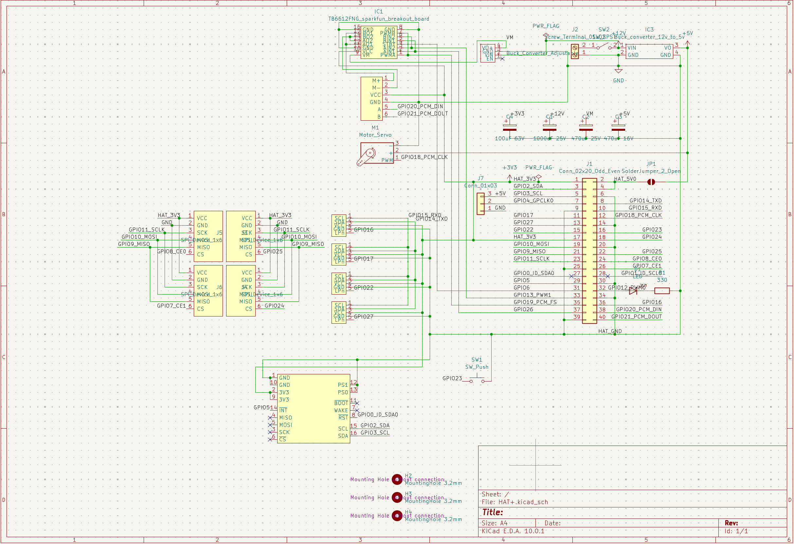

- Bearing to wheel shaft

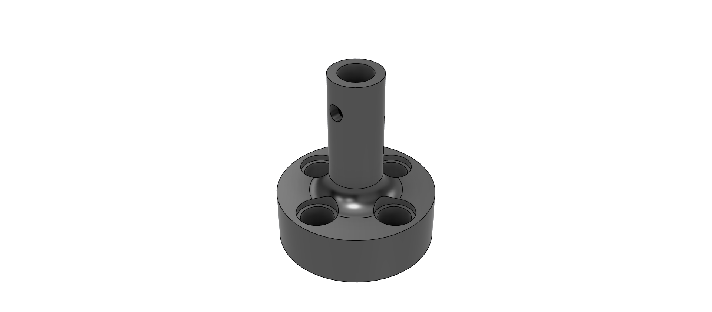
 
- Bottom chasis

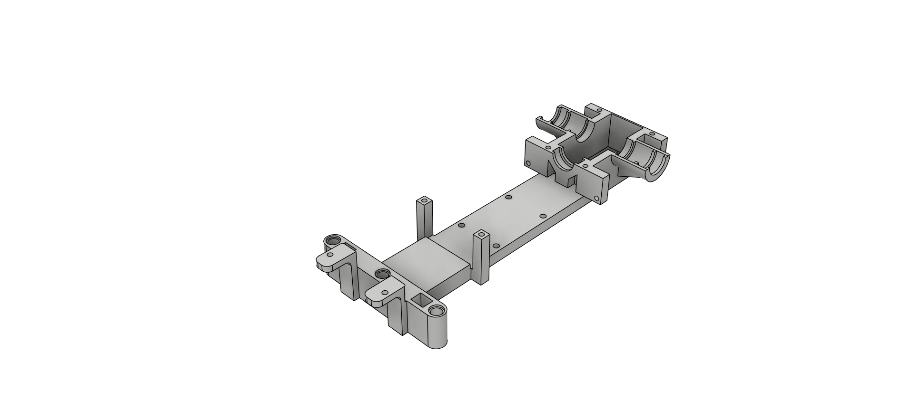
 
- Camera mount

- Diiferential Mount Top

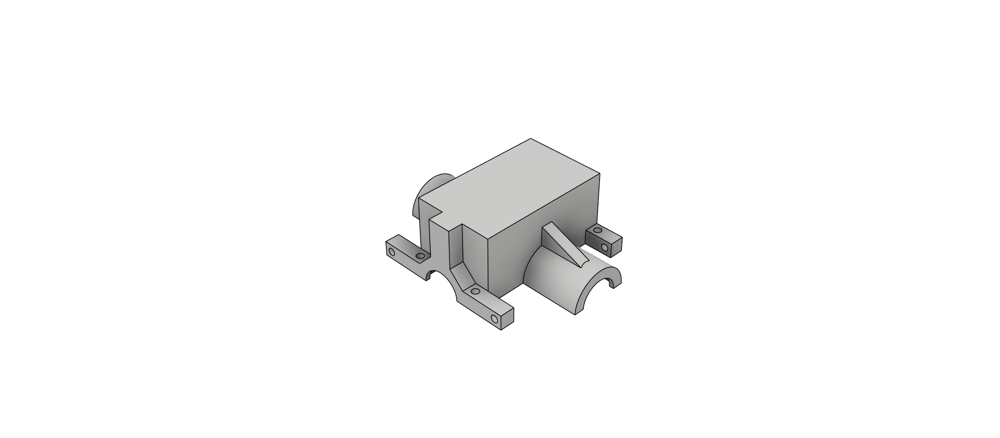

- Motor Shaft

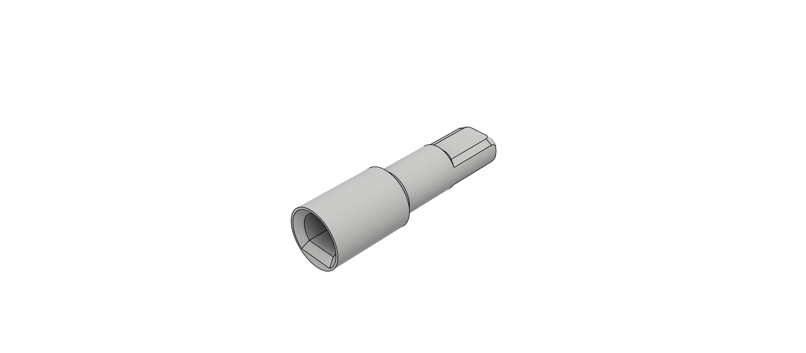

- Servo Mount

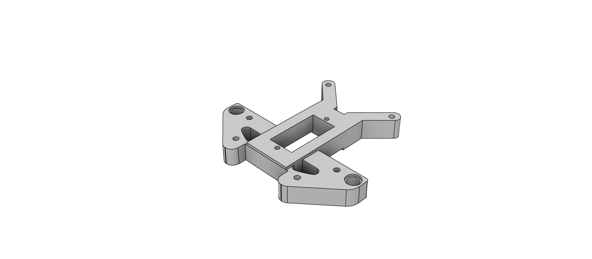

- Top Chasis

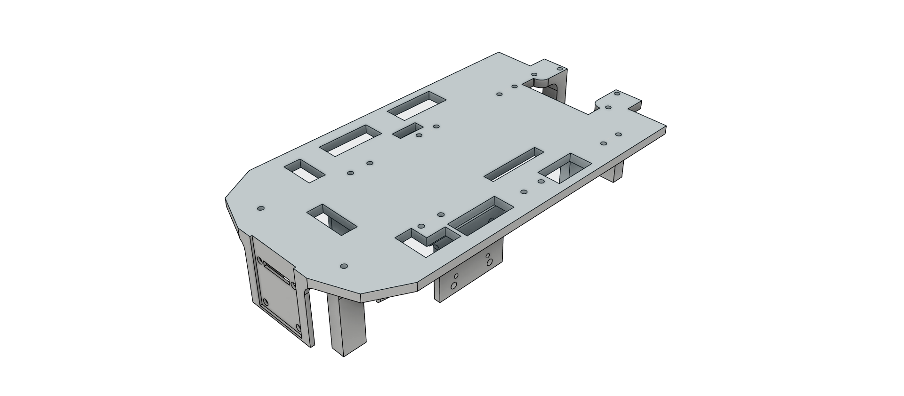

- TPU Bumper

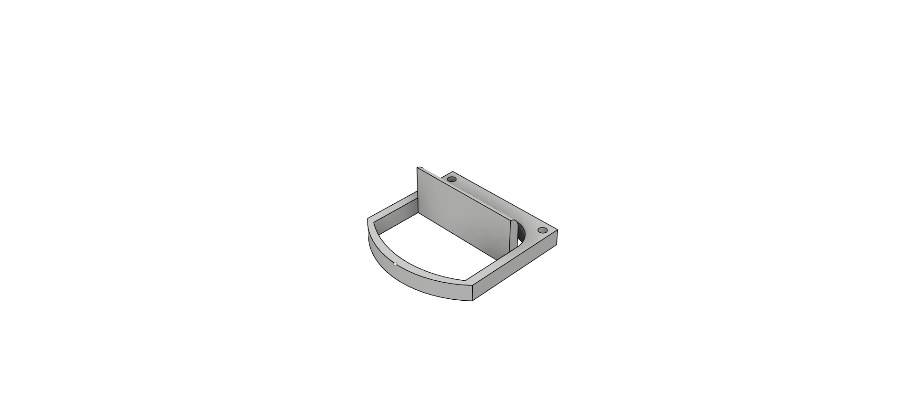

- Variable ServoHorn

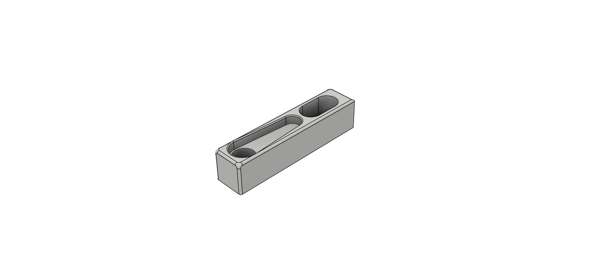

- Wheel Stabilizer

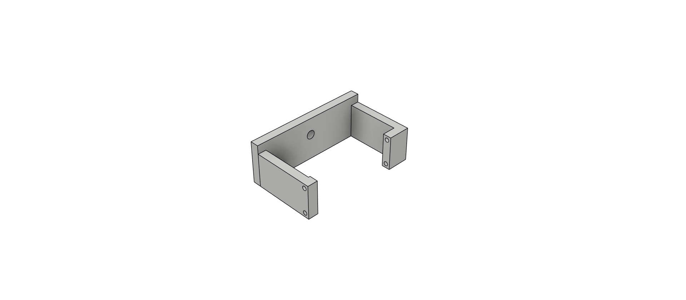

- Ackerman

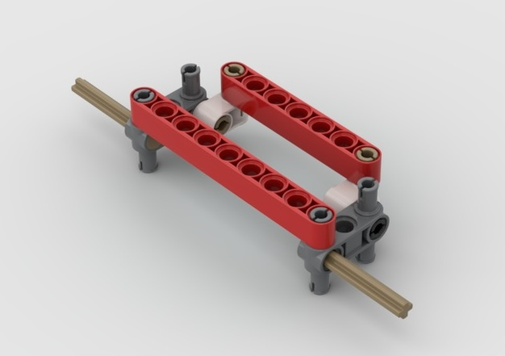

- Ackerman Assembly

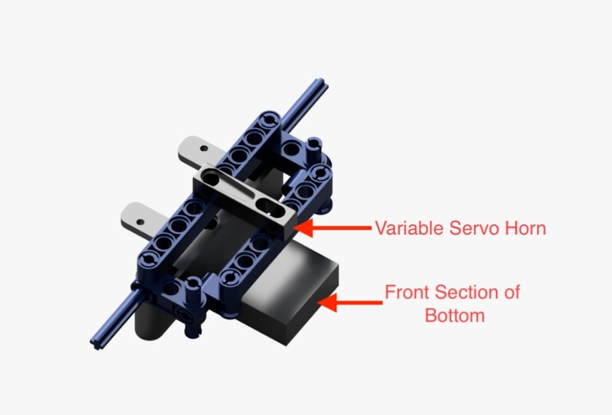

- Chassis step 1

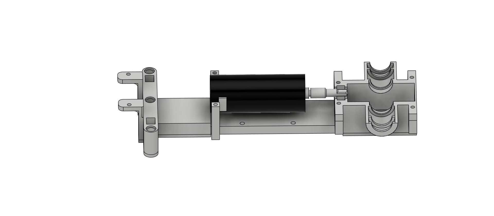

- Chassis step 2

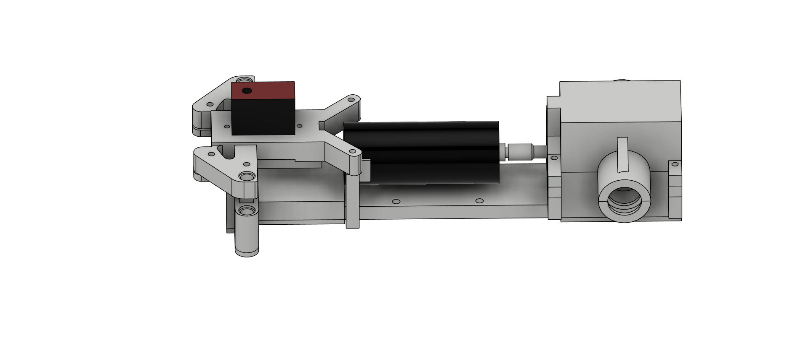

- Chassis step 3

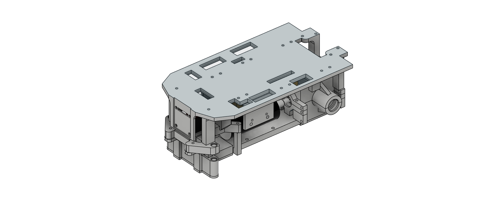

- Chassis step 4 (final)

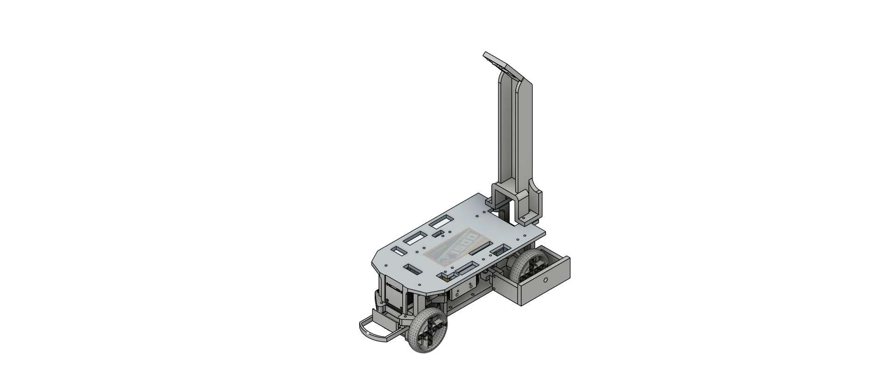

---

## Files in this folder

| File | Description |
|---|---|
| `CircuitDiagram.png` | Full circuit diagram — power and signal connections between battery, converters, RPi 5, motor driver, servo, camera, IMU, and ToF sensors. |
| `BearingToWheelShaft.png` | Bearing-to-wheel-shaft part render. |
| `BottomChasis.png` | Bottom chassis part render. |
| `CameraMount.png` | Camera mount part render. |
| `DiiferentialMountTop.png` | Differential mount (top) part render. |
| `MotorShaft.png` | Motor shaft part render. |
| `ServoMount.png` | Servo mount part render. |
| `TopChasis.png` | Top chassis part render. |
| `TPUBumper.png` | TPU bumper part render. |
| `VariableServoHorn.png` | Variable servo horn part render. |
| `WheelStabilizer.png` | Wheel stabilizer part render. |
| `Step1.png` | Chassis build step 1. |
| `Step2.png` | Chassis build step 2. |
| `Step3.png` | Chassis build step 3. |
| `WRO2026Chasisv1.1.png` | Chassis build step 4 (final) — current chassis version reference image. |
