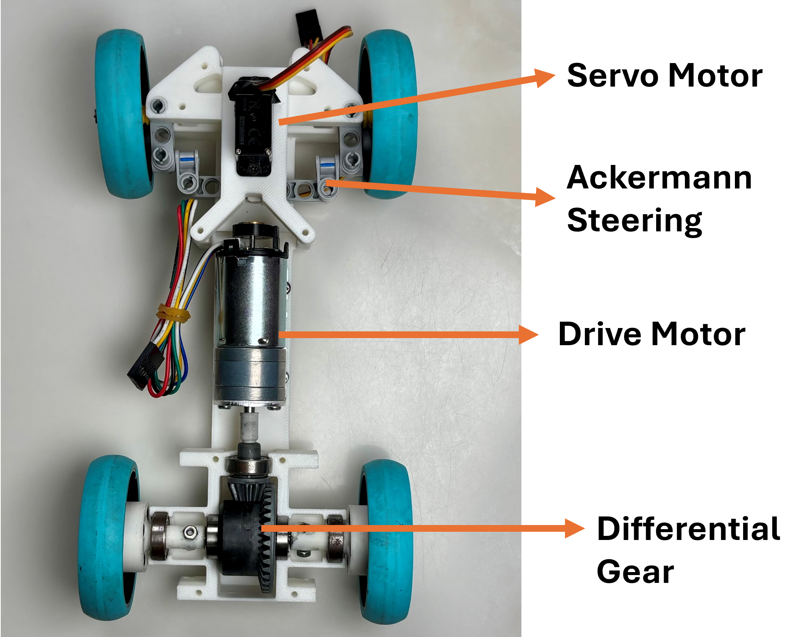

Vehicle's photos
====

This directory contains 7 photos of the vehicle

Top

Bottom

Front

Back

Left

Right

Base Plate

---

## Files in this folder

| File | Description |
|---|---|
| `Top.png` | Vehicle top view. |
| `Bottom.png` | Vehicle bottom view. |
| `Front.png` | Vehicle front view. |
| `Back.png` | Vehicle back view. |
| `Left.png` | Vehicle left view. |
| `Right.png` | Vehicle right view. |
| `BasePlate.png` | Base plate component layout photo (referenced in main README Section 1.9, Assembly photos). |

